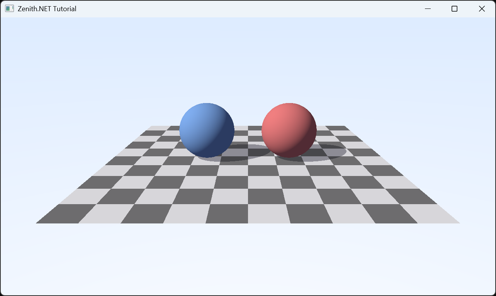

---
title: Zenith.NET - Explicit GPU Programming for .NET
description: A low-level, cross-platform rendering hardware interface with bindless resources and explicit synchronization for DirectX 12, Metal 4, and Vulkan 1.4.
_layout: landing
---

    <section class="render-hero">
        
        

        

        

            

                <h1>Explicit GPU control.One .NET RHI.</h1>
                
Build portable graphics and compute workloads without giving up command queues, resource states, bindless access, or timeline synchronization.

                

                    <a class="landing-button landing-button-primary" href="https://www.nuget.org/packages/Zenith.NET">
                        Install Zenith.NET
                    </a>
                    <a class="landing-button landing-button-secondary" href="docs/index.md">
                        Read the docs
                    </a>
                

                

                    GRAPHICS APIs
                    DirectX 12
                    Metal 4
                    Vulkan 1.4
                

            

        

    </section>
    <section class="features-section">
        

            <header class="section-heading">
                CORE FEATURES
                <h2>One explicit model formodern GPU workloads</h2>
                
Zenith.NET exposes the common low-level model of DirectX 12, Metal 4, and Vulkan 1.4, keeping renderer architecture portable while GPU work remains explicit.

            </header>
            

                <article class="feature-card">
                    
<i class="bi bi-globe2" aria-hidden="true"></i>

                    <h3>Cross-platform RHI</h3>
                    
Use one strongly typed RHI across DirectX 12, Metal 4, and Vulkan 1.4 while selecting the graphics API at startup.

                </article>
                <article class="feature-card">
                    
<i class="bi bi-cpu" aria-hidden="true"></i>

                    <h3>Explicit command model</h3>
                    
Record work on graphics, compute, and transfer queues, then coordinate completion through timeline values.

                </article>
                <article class="feature-card">
                    
<i class="bi bi-lightning-charge" aria-hidden="true"></i>

                    <h3>Bindless resource access</h3>
                    
Carry resource handles in constant data and resolve them in Slang shaders with <code>DescriptorHandle&lt;T&gt;</code>.

                </article>
                <article class="feature-card">
                    
<i class="bi bi-bounding-box-circles" aria-hidden="true"></i>

                    <h3>Modern pipeline coverage</h3>
                    
Combine rasterization, compute, indirect commands, RayQuery, and mesh shading when the device supports them.

                </article>
                <article class="feature-card">
                    
<i class="bi bi-boxes" aria-hidden="true"></i>

                    <h3>Predictable data and lifetime</h3>
                    
Control memory residency, transfer data with spans, define unmanaged GPU data, and release resources deterministically.

                </article>
                <article class="feature-card">
                    
<i class="bi bi-window-stack" aria-hidden="true"></i>

                    <h3>Application integrations</h3>
                    
Connect the RHI to .NET UI frameworks, ImageSharp, ImGui, and Skia through focused integration packages.

                </article>
            

        

    </section>
    <section class="architecture-section">
        

            

                

                    FrameCommands.cs
                    <button type="button" class="architecture-code-copy" aria-label="Copy code example" title="Copy code example">
                        <i class="bi bi-copy" aria-hidden="true"></i>
                    </button>
                

                <pre><code class="language-csharp nohighlight" data-highlighted="yes">using Zenith.NET;
using Zenith.NET.Vulkan;
&#10;using GraphicsContext context = GraphicsContext.CreateVulkan(useValidationLayer: true);
&#10;CommandBuffer commands = context.ComputeQueue.CommandBuffer();
&#10;// Prepare the output texture for storage writes.
commands.Transition(output, default, TextureLayout.Storage);
&#10;// Bind compute state and dispatch work.
commands.SetPipeline(computePipeline);
commands.SetConstantBuffer(constantBuffer, 0);
commands.Dispatch(groupCountX, groupCountY, 1);
&#10;// Prepare the output texture for sampled reads.
commands.Transition(output, default, TextureLayout.Sampled);
&#10;// Submit the recorded commands to the compute queue.
TimelineValue submission = commands.Submit();
&#10;// Wait for this submission to complete.
submission.Wait();</code></pre>
            

            

                RHI MODEL
                <h2>One renderer architecture. Explicit GPU work.</h2>
                
Zenith.NET keeps graphics API differences behind a compact RHI while leaving queues, synchronization, memory residency, and resource state under application control.

                

                    <a href="docs/concepts/command-model.md"><i class="bi bi-check-circle" aria-hidden="true"></i><strong>Explicit queue submission</strong><small>Record commands and synchronize completion with timeline values.</small></a>
                    <a href="docs/concepts/resource-binding.md"><i class="bi bi-check-circle" aria-hidden="true"></i><strong>Bindless shader ABI</strong><small>Pass typed resource handles through explicitly laid-out constant data.</small></a>
                    <a href="docs/platform/backend-selection.md"><i class="bi bi-check-circle" aria-hidden="true"></i><strong>Graphics API selection</strong><small>Choose DirectX 12, Metal 4, or Vulkan 1.4 without splitting the renderer architecture.</small></a>
                

            

        

    </section>
    <section class="install-section">
        

            <header class="install-heading">
                QUICK START
                <h2>Choose a graphics API.Build the renderer once.</h2>
                
Install the package for your target graphics API, then create the context and first frame.

            </header>
            

                <code>$ dotnet add package <strong>Zenith.NET.Vulkan</strong></code>
                <button type="button" class="install-copy" aria-label="Copy install command" title="Copy install command" data-copy-command="dotnet add package Zenith.NET.Vulkan"><i class="bi bi-copy" aria-hidden="true"></i></button>
            

            
Continue with <a href="tutorials/getting-started/prerequisites.md">Getting started</a> or browse the <a href="api/index.md">API reference</a>.

        

    </section>
    <section class="resources-section">
        

            <header class="resources-heading">
                RESOURCES
                <h2>Everything you need to build.</h2>
            </header>
            

                <a class="resource-card resource-card-docs" href="docs/index.md">
                    <i class="bi bi-book" aria-hidden="true"></i>
                    <strong class="resource-title">Documentation</strong>
                    
Concepts, graphics API guidance, workload details, and practical integration notes.

                    <strong>Browse docs</strong>
                </a>
                <a class="resource-card resource-card-nuget" href="https://www.nuget.org/packages/Zenith.NET">
                    <i class="bi bi-download" aria-hidden="true"></i>
                    <strong class="resource-title">NuGet packages</strong>
                    
Install the core RHI and your chosen graphics API package directly into your .NET project.

                    <strong>View packages</strong>
                </a>
                <a class="resource-card resource-card-community" href="https://github.com/qian-o/Zenith.NET">
                    <i class="bi bi-chat-square" aria-hidden="true"></i>
                    <strong class="resource-title">Open source</strong>
                    
Report issues, inspect graphics API implementations, and contribute on GitHub.

                    <strong>Visit GitHub</strong>
                </a>
            

        

    </section>
    <footer class="landing-footer">
        

            

                
                
An explicit, cross-platform rendering hardware interface for modern .NET applications.

                <a class="landing-footer-github" href="https://github.com/qian-o/Zenith.NET" aria-label="Zenith.NET on GitHub"><i class="bi bi-github" aria-hidden="true"></i></a>
            

            

                <strong class="landing-footer-heading">Explore</strong>
                <a href="docs/index.md">Core concepts</a>
                <a href="docs/features/graphics.md">Graphics workloads</a>
                <a href="api/index.md">API reference</a>
                <a href="tutorials/index.md">Tutorials</a>
            

            

                <strong class="landing-footer-heading">Project</strong>
                <a href="https://www.nuget.org/packages/Zenith.NET">NuGet</a>
                <a href="https://github.com/qian-o/Zenith.NET">Source code</a>
                <a href="https://github.com/qian-o/Zenith.NET/issues">Issues</a>
                <a href="https://github.com/qian-o/Zenith.NET/pulls">Pull requests</a>
            

        

        
© 2026 Zenith.NET. MIT License.<a href="https://github.com/qian-o/Zenith.NET">GitHub</a><a href="docs/index.md">Docs</a>

    </footer>

