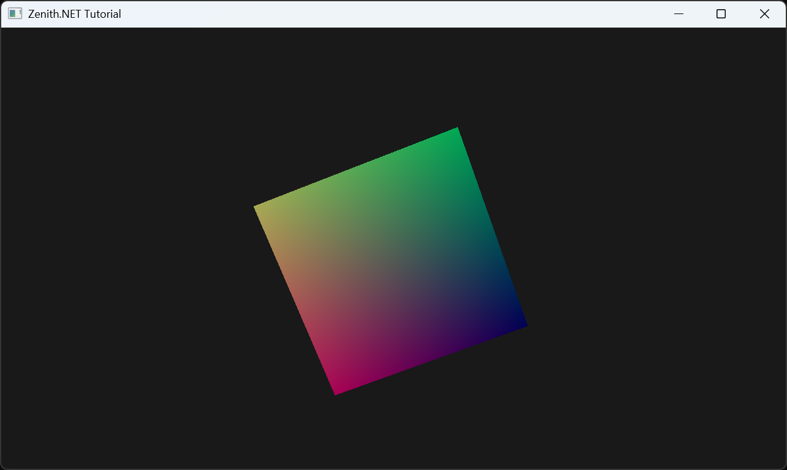

# Mesh Shader

In this tutorial, you'll learn how to use mesh shaders with Zenith.NET. We'll render a simple cube using the mesh shading pipeline, demonstrating the modern GPU-driven geometry processing approach.

> [!NOTE]
> This tutorial requires a GPU with mesh shader support. Check `Context.Capabilities.MeshShaderSupported` before using mesh shader features.

## Overview

We'll create a `MeshShaderRenderer` class that:

- Defines vertex and meshlet data structures
- Creates structured buffers for vertices, indices, and meshlets
- Builds a mesh shading pipeline with mesh and pixel shaders
- Dispatches mesh shader workgroups to render geometry

## Key Concepts

### What are Mesh Shaders?

Mesh shaders replace the traditional vertex processing pipeline (Input Assembler → Vertex Shader → optional tessellation/geometry) with a more flexible compute-like model:

| Traditional Pipeline | Mesh Shading Pipeline |
|---------------------|----------------------|
| Input Assembler | (removed) |
| Vertex Shader | (removed) |
| Hull/Domain Shader | (removed) |
| Geometry Shader | (removed) |
| - | Amplification Shader (optional) |
| - | Mesh Shader |
| Rasterizer | Rasterizer |
| Pixel Shader | Pixel Shader |

### Meshlet Architecture

Mesh shaders work with **meshlets** - small chunks of geometry that can be processed independently:

```
Mesh
├── Meshlet 0 (up to 64-256 vertices, 64-256 primitives)
├── Meshlet 1
├── Meshlet 2
└── ...
```

Each meshlet contains:
- **VertexOffset**: Starting index in the vertex buffer
- **VertexCount**: Number of vertices in this meshlet
- **PrimitiveOffset**: Starting index in the index buffer
- **PrimitiveCount**: Number of triangles in this meshlet

### Pipeline Stages

| Shader Stage | Description |
|--------------|-------------|
| **Amplification** (optional) | Determines how many mesh shader workgroups to spawn (LOD, culling) |
| **Mesh** | Outputs vertices and primitives directly to the rasterizer |
| **Pixel** | Standard fragment shading |

## The Renderer Class

Create a new file `Renderers/MeshShaderRenderer.cs`:

```csharp
namespace ZenithTutorials.Renderers;

internal unsafe class MeshShaderRenderer : IRenderer
{
    private const string ShaderSource = """
        static const uint MaxVertices = 64;
        static const uint MaxPrimitives = 126;

        struct Vertex
        {
            float3 Position;

            float3 Normal;

            float2 TexCoord;
        };

        struct Meshlet
        {
            uint VertexOffset;

            uint VertexCount;

            uint PrimitiveOffset;

            uint PrimitiveCount;
        };

        struct TransformConstants
        {
            float4x4 MVP;
        };

        struct VertexOutput
        {
            float4 Position : SV_Position;

            float3 Normal : NORMAL;

            float2 TexCoord : TEXCOORD0;
        };

        ConstantBuffer<TransformConstants> transform;
        StructuredBuffer<Vertex> vertices;
        StructuredBuffer<uint3> indices;
        StructuredBuffer<Meshlet> meshlets;

        [shader("mesh")]
        [numthreads(MaxPrimitives, 1, 1)]
        [outputtopology("triangle")]
        void MSMain(in uint groupId : SV_GroupID,
                    in uint groupThreadId : SV_GroupThreadID,
                    OutputVertices<VertexOutput, MaxVertices> outVertices,
                    OutputIndices<uint3, MaxPrimitives> outIndices)
        {
            Meshlet meshlet = meshlets[groupId];

            SetMeshOutputCounts(meshlet.VertexCount, meshlet.PrimitiveCount);

            if (groupThreadId < meshlet.VertexCount)
            {
                Vertex vertex = vertices[meshlet.VertexOffset + groupThreadId];

                VertexOutput output;
                output.Position = mul(float4(vertex.Position, 1.0), transform.MVP);
                output.Normal = vertex.Normal;
                output.TexCoord = vertex.TexCoord;

                outVertices[groupThreadId] = output;
            }

            if (groupThreadId < meshlet.PrimitiveCount)
            {
                outIndices[groupThreadId] = indices[meshlet.PrimitiveOffset + groupThreadId];
            }
        }

        [shader("pixel")]
        float4 PSMain(VertexOutput input) : SV_Target
        {
            // Simple directional lighting
            float3 lightDir = normalize(float3(1.0, 1.0, -1.0));
            float ndotl = max(dot(normalize(input.Normal), lightDir), 0.0);

            // Base color from texture coordinates
            float3 baseColor = float3(input.TexCoord, 0.5);

            // Ambient + diffuse lighting
            float3 ambient = baseColor * 0.2;
            float3 diffuse = baseColor * ndotl * 0.8;

            return float4(ambient + diffuse, 1.0);
        }
        """;

    private readonly Buffer vertexBuffer;
    private readonly Buffer indexBuffer;
    private readonly Buffer meshletBuffer;
    private readonly Buffer constantBuffer;
    private readonly ResourceLayout resourceLayout;
    private readonly ResourceSet resourceSet;
    private readonly MeshShadingPipeline pipeline;

    private readonly uint meshletCount;
    private float rotationAngle;

    public MeshShaderRenderer()
    {
        if (!App.Context.Capabilities.MeshShaderSupported)
        {
            throw new NotSupportedException("Mesh shaders are not supported on this device.");
        }

        Vertex[] cubeVertices =
        [
            // Front face
            new() { Position = new(-0.5f, -0.5f,  0.5f), Normal = new( 0,  0,  1), TexCoord = new(0, 1) },
            new() { Position = new( 0.5f, -0.5f,  0.5f), Normal = new( 0,  0,  1), TexCoord = new(1, 1) },
            new() { Position = new( 0.5f,  0.5f,  0.5f), Normal = new( 0,  0,  1), TexCoord = new(1, 0) },
            new() { Position = new(-0.5f,  0.5f,  0.5f), Normal = new( 0,  0,  1), TexCoord = new(0, 0) },

            // Back face
            new() { Position = new( 0.5f, -0.5f, -0.5f), Normal = new( 0,  0, -1), TexCoord = new(0, 1) },
            new() { Position = new(-0.5f, -0.5f, -0.5f), Normal = new( 0,  0, -1), TexCoord = new(1, 1) },
            new() { Position = new(-0.5f,  0.5f, -0.5f), Normal = new( 0,  0, -1), TexCoord = new(1, 0) },
            new() { Position = new( 0.5f,  0.5f, -0.5f), Normal = new( 0,  0, -1), TexCoord = new(0, 0) },

            // Left face
            new() { Position = new(-0.5f, -0.5f, -0.5f), Normal = new(-1,  0,  0), TexCoord = new(0, 1) },
            new() { Position = new(-0.5f, -0.5f,  0.5f), Normal = new(-1,  0,  0), TexCoord = new(1, 1) },
            new() { Position = new(-0.5f,  0.5f,  0.5f), Normal = new(-1,  0,  0), TexCoord = new(1, 0) },
            new() { Position = new(-0.5f,  0.5f, -0.5f), Normal = new(-1,  0,  0), TexCoord = new(0, 0) },

            // Right face
            new() { Position = new( 0.5f, -0.5f,  0.5f), Normal = new( 1,  0,  0), TexCoord = new(0, 1) },
            new() { Position = new( 0.5f, -0.5f, -0.5f), Normal = new( 1,  0,  0), TexCoord = new(1, 1) },
            new() { Position = new( 0.5f,  0.5f, -0.5f), Normal = new( 1,  0,  0), TexCoord = new(1, 0) },
            new() { Position = new( 0.5f,  0.5f,  0.5f), Normal = new( 1,  0,  0), TexCoord = new(0, 0) },

            // Top face
            new() { Position = new(-0.5f,  0.5f,  0.5f), Normal = new( 0,  1,  0), TexCoord = new(0, 1) },
            new() { Position = new( 0.5f,  0.5f,  0.5f), Normal = new( 0,  1,  0), TexCoord = new(1, 1) },
            new() { Position = new( 0.5f,  0.5f, -0.5f), Normal = new( 0,  1,  0), TexCoord = new(1, 0) },
            new() { Position = new(-0.5f,  0.5f, -0.5f), Normal = new( 0,  1,  0), TexCoord = new(0, 0) },

            // Bottom face
            new() { Position = new(-0.5f, -0.5f, -0.5f), Normal = new( 0, -1,  0), TexCoord = new(0, 1) },
            new() { Position = new( 0.5f, -0.5f, -0.5f), Normal = new( 0, -1,  0), TexCoord = new(1, 1) },
            new() { Position = new( 0.5f, -0.5f,  0.5f), Normal = new( 0, -1,  0), TexCoord = new(1, 0) },
            new() { Position = new(-0.5f, -0.5f,  0.5f), Normal = new( 0, -1,  0), TexCoord = new(0, 0) },
        ];

        uint[] cubeIndices =
        [
            0, 1, 2, 0, 2, 3,
            4, 5, 6, 4, 6, 7,
            8, 9, 10, 8, 10, 11,
            12, 13, 14, 12, 14, 15,
            16, 17, 18, 16, 18, 19,
            20, 21, 22, 20, 22, 23,
        ];

        Meshlet[] meshlets =
        [
            new()
            {
                VertexOffset = 0,
                VertexCount = (uint)cubeVertices.Length,
                PrimitiveOffset = 0,
                PrimitiveCount = (uint)cubeIndices.Length / 3
            }
        ];
        meshletCount = (uint)meshlets.Length;

        // Create vertex buffer
        vertexBuffer = App.Context.CreateBuffer(new()
        {
            SizeInBytes = (uint)(sizeof(Vertex) * cubeVertices.Length),
            StrideInBytes = (uint)sizeof(Vertex),
            Flags = BufferUsageFlags.ShaderResource
        });
        vertexBuffer.Upload(cubeVertices, 0);

        // Create index buffer (3 uints per triangle = uint3 in shader)
        indexBuffer = App.Context.CreateBuffer(new()
        {
            SizeInBytes = (uint)(sizeof(uint) * cubeIndices.Length),
            StrideInBytes = sizeof(uint) * 3,  // uint3 stride
            Flags = BufferUsageFlags.ShaderResource
        });
        indexBuffer.Upload(cubeIndices, 0);

        meshletBuffer = App.Context.CreateBuffer(new()
        {
            SizeInBytes = (uint)(sizeof(Meshlet) * meshlets.Length),
            StrideInBytes = (uint)sizeof(Meshlet),
            Flags = BufferUsageFlags.ShaderResource
        });
        meshletBuffer.Upload(meshlets, 0);

        constantBuffer = App.Context.CreateBuffer(new()
        {
            SizeInBytes = (uint)sizeof(TransformConstants),
            StrideInBytes = (uint)sizeof(TransformConstants),
            Flags = BufferUsageFlags.Constant | BufferUsageFlags.MapWrite
        });

        resourceLayout = App.Context.CreateResourceLayout(new()
        {
            Bindings = BindingHelper.Bindings
            (
                new() { Type = ResourceType.ConstantBuffer, Count = 1, StageFlags = ShaderStageFlags.Mesh },
                new() { Type = ResourceType.StructuredBuffer, Count = 1, StageFlags = ShaderStageFlags.Mesh },
                new() { Type = ResourceType.StructuredBuffer, Count = 1, StageFlags = ShaderStageFlags.Mesh },
                new() { Type = ResourceType.StructuredBuffer, Count = 1, StageFlags = ShaderStageFlags.Mesh }
            )
        });

        resourceSet = App.Context.CreateResourceSet(new()
        {
            Layout = resourceLayout,
            Resources = [constantBuffer, vertexBuffer, indexBuffer, meshletBuffer]
        });

        using Shader meshShader = App.Context.LoadShaderFromSource(ShaderSource, "MSMain", ShaderStageFlags.Mesh);
        using Shader pixelShader = App.Context.LoadShaderFromSource(ShaderSource, "PSMain", ShaderStageFlags.Pixel);

        pipeline = App.Context.CreateMeshShadingPipeline(new()
        {
            RenderStates = new()
            {
                RasterizerState = RasterizerStates.CullBack,
                DepthStencilState = DepthStencilStates.Default,
                BlendState = BlendStates.Opaque
            },
            Amplification = null,
            Mesh = meshShader,
            Pixel = pixelShader,
            ResourceLayouts = [resourceLayout],
            PrimitiveTopology = PrimitiveTopology.TriangleList,
            Output = App.SwapChain.FrameBuffer.Output
        });
    }

    public void Update(double deltaTime)
    {
        rotationAngle += (float)deltaTime;
    }

    public void Render()
    {
        Matrix4x4 model = Matrix4x4.CreateRotationY(rotationAngle) * Matrix4x4.CreateRotationX(rotationAngle * 0.5f);
        Matrix4x4 view = Matrix4x4.CreateLookAt(new(0, 0, 3), Vector3.Zero, Vector3.UnitY);
        Matrix4x4 projection = Matrix4x4.CreatePerspectiveFieldOfView(
            float.DegreesToRadians(45.0f),
            (float)App.Width / App.Height,
            0.1f,
            100.0f
        );

        constantBuffer.Upload([new TransformConstants { MVP = model * view * projection }], 0);

        CommandBuffer commandBuffer = App.Context.Graphics.CommandBuffer();

        commandBuffer.BeginRenderPass(App.SwapChain.FrameBuffer, new()
        {
            ColorValues = [new(0.1f, 0.1f, 0.1f, 1.0f)],
            Depth = 1.0f,
            Stencil = 0,
            Flags = ClearFlags.All
        }, resourceSet);

        commandBuffer.SetPipeline(pipeline);
        commandBuffer.SetResourceSet(resourceSet, 0);
        commandBuffer.DispatchMesh(meshletCount, 1, 1);

        commandBuffer.EndRenderPass();

        commandBuffer.Submit(waitForCompletion: true);
    }

    public void Resize(uint width, uint height)
    {
    }

    public void Dispose()
    {
        pipeline.Dispose();
        resourceSet.Dispose();
        resourceLayout.Dispose();
        constantBuffer.Dispose();
        meshletBuffer.Dispose();
        indexBuffer.Dispose();
        vertexBuffer.Dispose();
    }
}

/// <summary>
/// Vertex structure with position and normal.
/// </summary>
[StructLayout(LayoutKind.Sequential)]
file struct Vertex
{
    public Vector3 Position;

    public Vector3 Normal;

    public Vector2 TexCoord;
}

/// <summary>
/// Meshlet structure defining a chunk of geometry.
/// </summary>
[StructLayout(LayoutKind.Sequential)]
file struct Meshlet
{
    public uint VertexOffset;

    public uint VertexCount;

    public uint PrimitiveOffset;

    public uint PrimitiveCount;
}

/// <summary>
/// Transform constants for the mesh.
/// </summary>
[StructLayout(LayoutKind.Sequential)]
file struct TransformConstants
{
    public Matrix4x4 MVP;
}
```

## Running the Tutorial

Update your `Program.cs` to run the `MeshShaderRenderer`:

```csharp
using ZenithTutorials;
using ZenithTutorials.Renderers;

App.Run<MeshShaderRenderer>();

App.Cleanup();
```

Run the application:

```bash
dotnet run
```

## Result



## Code Breakdown

### Checking Mesh Shader Support

```csharp
if (!App.Context.Capabilities.MeshShaderSupported)
{
    throw new NotSupportedException("Mesh shaders are not supported on this device.");
}
```

Always check `Capabilities.MeshShaderSupported` before using mesh shader features.

### Meshlet Data Structure

```csharp
[StructLayout(LayoutKind.Sequential)]
private struct Meshlet
{
    public uint VertexOffset;

    public uint VertexCount;

    public uint PrimitiveOffset;

    public uint PrimitiveCount;
}
```

Each meshlet describes a chunk of geometry:
- **VertexOffset/Count**: Range of vertices in the vertex buffer
- **PrimitiveOffset/Count**: Range of triangles in the index buffer

### Mesh Shader Entry Point

```hlsl
[shader("mesh")]
[numthreads(MaxPrimitives, 1, 1)]
[outputtopology("triangle")]
void MSMain(in uint groupId : SV_GroupID,
            in uint groupThreadId : SV_GroupThreadID,
            OutputVertices<VertexOutput, MaxVertices> outVertices,
            OutputIndices<uint3, MaxPrimitives> outIndices)
```

Key attributes:
| Attribute | Description |
|-----------|-------------|
| `[shader("mesh")]` | Marks this as a mesh shader entry point |
| `[numthreads(X,Y,Z)]` | Thread group size (typically MaxPrimitives threads) |
| `[outputtopology("triangle")]` | Output primitive type |
| `OutputVertices<T, N>` | Output vertex array (max N vertices) |
| `OutputIndices<uint3, N>` | Output index array (max N triangles) |

### Setting Output Counts

```hlsl
SetMeshOutputCounts(meshlet.VertexCount, meshlet.PrimitiveCount);
```

This must be called once per workgroup to declare how many vertices and primitives will be output.

### Dispatching Mesh Shaders

```csharp
commandBuffer.DispatchMesh(meshletCount, 1, 1);
```

Unlike traditional `Draw` calls, mesh shaders use `DispatchMesh(X, Y, Z)` to launch workgroups:
- Each workgroup processes one meshlet
- Total workgroups = `meshletCount × 1 × 1`

### Creating the Pipeline

```csharp
pipeline = App.Context.CreateMeshShadingPipeline(new()
{
    RenderStates = new() { ... },
    Amplification = null,           // Optional task/amplification shader
    Mesh = meshShader,              // Required mesh shader
    Pixel = pixelShader,            // Required pixel shader
    ResourceLayouts = [resourceLayout],
    PrimitiveTopology = PrimitiveTopology.TriangleList,
    Output = App.SwapChain.FrameBuffer.Output
});
```

## Amplification Shader (Optional)

For more advanced scenarios, you can add an amplification shader to dynamically control meshlet dispatch:

```hlsl
struct AmplificationPayload
{
    uint MeshletIndices[32];
};

[shader("amplification")]
[numthreads(32, 1, 1)]
void ASMain(in uint groupId : SV_GroupID,
            in uint groupThreadId : SV_GroupThreadID)
{
    // Frustum culling, LOD selection, etc.
    bool visible = /* culling logic */;

    if (visible)
    {
        AmplificationPayload payload;
        payload.MeshletIndices[groupThreadId] = groupId * 32 + groupThreadId;

        // Dispatch mesh shader workgroups
        DispatchMesh(visibleCount, 1, 1, payload);
    }
}
```

## Best Practices

1. **Meshlet Size**: Keep meshlets within hardware limits (typically 64-256 vertices, 64-126 primitives)
2. **Thread Utilization**: Size `numthreads` to match your maximum primitive count
3. **Early Out**: Check thread bounds before writing to output arrays
4. **Preprocessing**: Generate meshlets offline for complex models
5. **Culling**: Use amplification shaders for GPU-driven culling

## Next Steps

Congratulations! You've completed all Zenith.NET tutorials.

For a complete rendering example combining multiple techniques, check out the [SponzaScene](https://github.com/qian-o/Zenith.NET/tree/master/sources/Experiments/SponzaScene) sample which demonstrates a deferred renderer with ray traced global illumination.

## Source Code

> [!TIP]
> View the complete source code on GitHub: [MeshShaderRenderer.cs](https://github.com/qian-o/ZenithTutorials/blob/master/ZenithTutorials/Renderers/MeshShaderRenderer.cs)
