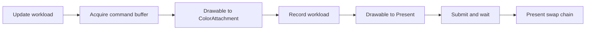

# Application Host

Every workload guide runs inside the same application host. The host owns the window and graphics context, creates the swap chain, records the outer frame transitions, and presents textures produced by compute workloads.

This page explains that contract before the guides begin creating workload resources. Platform integration is host infrastructure and remains in the complete reference source rather than the walkthrough.

## Responsibilities

The shared host is responsible for:

- selecting a supported graphics API for the current operating system;
- creating a window surface and swap chain;
- providing the active `GraphicsContext` and framebuffer dimensions;
- obtaining one graphics command buffer per frame;
- transitioning the swap-chain drawable into and out of attachment layout;
- forwarding update, render, and resize events to the active workload;
- submitting work, waiting for completion, and presenting the drawable;
- loading shared assets and presenting offscreen textures.

The workload renderer remains responsible for its own buffers, textures, pipelines, commands, transitions, and disposal.

## Renderer contract

Create `IRenderer.cs`:

```csharp
namespace ZenithTutorials;

internal interface IRenderer : IDisposable
{
    void Update(double deltaTime);

    void Render(CommandBuffer commandBuffer, Texture drawable);

    void Resize(uint width, uint height);
}
```

The host calls `Update` before rendering, passes the current swap-chain texture to `Render`, and reports framebuffer size changes through `Resize`. Extending `IDisposable` makes each guide state its GPU ownership explicitly.

## Create the graphics context

`App` exposes one shared graphics context. Its static constructor selects DirectX 12 on Windows, Metal 4 on macOS, or Vulkan 1.4 on Linux.

The complete `App.cs` contains the required imports and declares `App` as an `unsafe` static class because its upload helpers use pointers.

```csharp
static App()
{
    if (!OperatingSystem.IsWindows() && !OperatingSystem.IsMacOS() && !OperatingSystem.IsLinux())
    {
        throw new PlatformNotSupportedException("The tutorials support Windows, macOS, and Linux.");
    }

    if (OperatingSystem.IsWindows())
    {
        Context = GraphicsContext.CreateDirectX12(useValidationLayer: true);
    }
    else if (OperatingSystem.IsMacOS())
    {
        Context = GraphicsContext.CreateMetal(useValidationLayer: true);
    }
    else
    {
        Context = GraphicsContext.CreateVulkan(useValidationLayer: true);
    }

    Context.ValidationMessage += static (_, args) => Console.WriteLine($"[{args.Severity}] {args.Message}");
}
```

Validation remains enabled throughout the guides. Validation messages are written to the terminal and should remain free of errors when a workload is running correctly.

The host also publishes the shared color format and current framebuffer dimensions:

```csharp
public static GraphicsContext Context { get; }

public static PixelFormat ColorFormat => PixelFormat.B8G8R8A8UNorm;

public static uint Width => (uint)(window?.FramebufferSize.X ?? 0);

public static uint Height => (uint)(window?.FramebufferSize.Y ?? 0);
```

Framebuffer dimensions, rather than logical window dimensions, are used for textures, viewports, and projection aspect ratios. This matters on high-density displays.

## Create the window and swap chain

Silk.NET creates a window without an OpenGL context because Zenith.NET owns the native graphics API:

```csharp
window = Window.Create(WindowOptions.Default with
{
    API = GraphicsAPI.None,
    Title = "Zenith.NET Tutorials"
});

window.Initialize();
window.Center();
```

The host creates a Zenith.NET `Surface` from the window. That platform integration is contained in `App.cs` and `CocoaHelper.cs`; workload renderers depend only on the resulting swap chain. The surface and shared color format define that swap chain:

```csharp
swapChain = Context.CreateSwapChain(new()
{
    Surface = surface,
    Format = ColorFormat
});
```

## Follow one frame

The outer frame has the same shape for every workload:



The render callback records those operations in order:

```csharp
window.Render += _ =>
{
    if (Width is 0 || Height is 0)
    {
        return;
    }

    CommandBuffer commandBuffer = Context.GraphicsQueue.CommandBuffer();

    commandBuffer.Transition(swapChain.Drawable, default, TextureLayout.Undefined, TextureLayout.ColorAttachment);

    renderer.Render(commandBuffer, swapChain.Drawable);

    commandBuffer.Transition(swapChain.Drawable, default, TextureLayout.ColorAttachment, TextureLayout.Present);

    commandBuffer.Submit().Wait();

    swapChain.Present();
};
```

The workload starts with a drawable already in `ColorAttachment` layout and must leave it in that layout. The host performs the final transition to `Present`.

`Submit().Wait()` deliberately permits only one frame of work at a time. That makes resource lifetime and CPU uploads easier to follow, but it is not a production frame scheduler. Applications that keep multiple frames in flight need per-frame resources and explicit reuse synchronization.

## Update and resize

The update callback forwards elapsed seconds:

```csharp
window.Update += delta =>
{
    if (Width is 0 || Height is 0)
    {
        return;
    }

    renderer.Update(delta);
};
```

The resize callback lets the workload release size-dependent resources before resizing the swap chain:

```csharp
window.Resize += _ =>
{
    if (Width is 0 || Height is 0)
    {
        return;
    }

    renderer.Resize(Width, Height);
    swapChain.Resize(Width, Height);
};
```

Zero-size checks cover minimized windows. A workload normally sets a depth or output texture to `null` during `Resize`; its next `Render` call creates a replacement at the new framebuffer size.

## Upload shared data

The guides use one helper for small static and CPU-updated buffers:

```csharp
public static Buffer LoadBuffer<T>(T[] data, BufferUsages usages) where T : unmanaged
{
    Buffer buffer = Context.CreateBuffer(new()
    {
        SizeInBytes = (uint)(sizeof(T) * data.Length),
        StrideInBytes = (uint)sizeof(T),
        Usages = usages,
        Residency = MemoryResidency.CpuWriteOnly
    });

    fixed (T* pointer = data)
    {
        buffer.Upload(0, new()
        {
            Pointer = (nint)pointer,
            SizeInBytes = (uint)(sizeof(T) * data.Length)
        });
    }

    return buffer;
}
```

`SizeInBytes` controls allocation size, while `StrideInBytes` describes one array element. `BufferUsages` states how later commands or shaders consume the buffer. The helper uses `CpuWriteOnly` residency because these compact guides favor direct uploads over a staging system.

## Present offscreen textures

Compute Shader and Ray Tracing do not render directly into the swap-chain drawable. They write an offscreen texture, transition it to `Sampled`, and pass it to `App.PresentTexture`.

`TexturePresenter` owns a sampler, a two-handle constant buffer, and a fullscreen-triangle graphics pipeline:

The complete presenter is also declared `unsafe` because it uploads a pointer to its local `Constants` value.

| Resource | Role |
| --- | --- |
| Sampler | Samples the input texture with linear filtering and clamp addressing |
| Constant buffer | Carries sampled-texture and sampler handles to Slang |
| Graphics pipeline | Draws a fullscreen triangle into the current drawable |

The presenter calculates a destination rectangle, uploads the two handles, and records a small render pass:

```csharp
Constants constants = new()
{
    Image = texture.SampledHandle,
    Sampler = sampler.Handle
};

constantBuffer.Upload(0, new()
{
    Pointer = (nint)(&constants),
    SizeInBytes = (uint)sizeof(Constants)
});
```

```csharp
commandBuffer.BeginRenderPass([ColorAttachment.Clear(drawable, new(0.04f, 0.055f, 0.075f, 1.0f))], null);

commandBuffer.SetPipeline(pipeline);
commandBuffer.SetViewports([new() { X = x, Y = y, Width = width, Height = height, MaxDepth = 1.0f }]);
commandBuffer.SetScissors([new() { X = x, Y = y, Width = width, Height = height }]);
commandBuffer.SetConstantBuffer(constantBuffer, 0);

commandBuffer.Draw(3, 1, 0, 0);

commandBuffer.EndRenderPass();
```

Its vertex shader derives a fullscreen triangle from `SV_VertexID`, so no vertex buffer is required. Workload guides treat this presenter as host infrastructure and focus on producing the sampled texture correctly.

## Resource lifetime

The `using TRenderer renderer = new();` declaration scopes the active renderer to the `try` body, so it is disposed when that body exits. The `finally` block then releases the host-owned presenter, swap chain, window, and graphics context:

```csharp
finally
{
    texturePresenter?.Dispose();
    swapChain?.Dispose();
    window?.Dispose();

    Context.Dispose();
}
```

The sample disposes temporary shader objects after pipeline creation. Buffers and textures remain alive until every submitted GPU command that references them has completed. A top-level acceleration structure is a stronger ownership example: keep every BLAS it instances alive until the TLAS is no longer used.

## Complete source

Use the complete host implementation as the shared starting point for the workload guides:

- [App.cs](https://github.com/qian-o/ZenithTutorials/blob/master/ZenithTutorials/App.cs)
- [IRenderer.cs](https://github.com/qian-o/ZenithTutorials/blob/master/ZenithTutorials/IRenderer.cs)
- [CocoaHelper.cs](https://github.com/qian-o/ZenithTutorials/blob/master/ZenithTutorials/CocoaHelper.cs)
- [TexturePresenter.cs](https://github.com/qian-o/ZenithTutorials/blob/master/ZenithTutorials/TexturePresenter.cs)
- [PresentTexture.slang](https://github.com/qian-o/ZenithTutorials/blob/master/ZenithTutorials/Assets/Shaders/PresentTexture.slang)
- [Program.cs](https://github.com/qian-o/ZenithTutorials/blob/master/ZenithTutorials/Program.cs)

The reference `Program.cs` presents a menu for all six completed renderers. Continue with [Hello Triangle](../guides/hello-triangle.md) to create the first workload renderer and understand the first menu entry.
