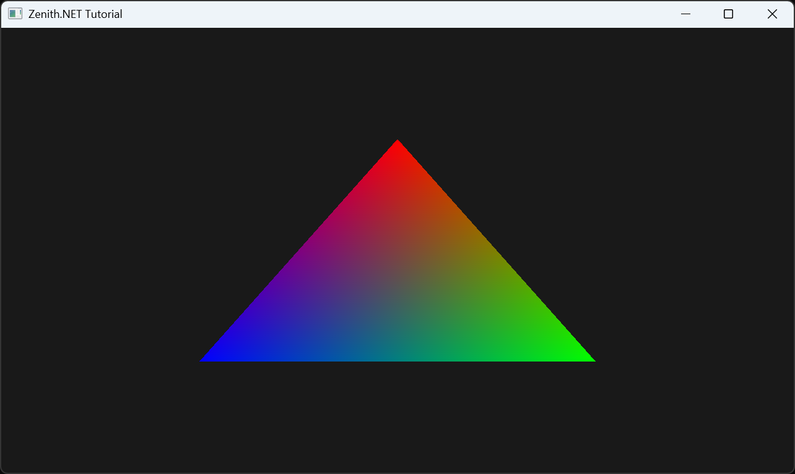

# Hello Triangle

In this tutorial, you'll learn how to render a colored triangle using Zenith.NET. This is the classic "Hello World" of graphics programming.

## Overview

We'll create a `HelloTriangleRenderer` class that:

- Creates vertex data and uploads it to a GPU buffer
- Compiles vertex and pixel shaders using Slang
- Builds a graphics pipeline
- Records and submits draw commands

This class-based approach makes it easy to extend for future tutorials.

## The Renderer Class

Create a new file `Renderers/HelloTriangleRenderer.cs`:

```csharp
namespace ZenithTutorials.Renderers;

internal unsafe class HelloTriangleRenderer : IRenderer
{
    private const string ShaderSource = """
        struct VSInput
        {
            float3 Position : POSITION0;

            float4 Color    : COLOR0;
        };

        struct PSInput
        {
            float4 Position : SV_POSITION;

            float4 Color    : COLOR0;
        };

        PSInput VSMain(VSInput input)
        {
            PSInput output;
            output.Position = float4(input.Position, 1.0);
            output.Color = input.Color;

            return output;
        }

        float4 PSMain(PSInput input) : SV_TARGET
        {
            return input.Color;
        }
        """;

    private readonly Buffer vertexBuffer;
    private readonly GraphicsPipeline pipeline;

    public HelloTriangleRenderer()
    {
        // Define triangle vertices (NDC coordinates: -1 to 1)
        Vertex[] vertices =
        [
            new(new( 0.0f,  0.5f, 0.0f), new(1.0f, 0.0f, 0.0f, 1.0f)), // Top    - Red
            new(new( 0.5f, -0.5f, 0.0f), new(0.0f, 1.0f, 0.0f, 1.0f)), // Right  - Green
            new(new(-0.5f, -0.5f, 0.0f), new(0.0f, 0.0f, 1.0f, 1.0f)), // Left   - Blue
        ];

        vertexBuffer = App.Context.CreateBuffer(new()
        {
            SizeInBytes = (uint)(sizeof(Vertex) * vertices.Length),
            StrideInBytes = (uint)sizeof(Vertex),
            Flags = BufferUsageFlags.Vertex | BufferUsageFlags.MapWrite
        });
        vertexBuffer.Upload(vertices, 0);

        // Define vertex input layout (must match shader VSInput)
        InputLayout inputLayout = new();
        inputLayout.Add(new() { Format = ElementFormat.Float3, Semantic = ElementSemantic.Position });
        inputLayout.Add(new() { Format = ElementFormat.Float4, Semantic = ElementSemantic.Color });

        using Shader vertexShader = App.Context.LoadShaderFromSource(ShaderSource, "VSMain", ShaderStageFlags.Vertex);
        using Shader pixelShader = App.Context.LoadShaderFromSource(ShaderSource, "PSMain", ShaderStageFlags.Pixel);

        pipeline = App.Context.CreateGraphicsPipeline(new()
        {
            RenderStates = new()
            {
                RasterizerState = RasterizerStates.CullNone,     // Disable back-face culling
                DepthStencilState = DepthStencilStates.Default,  // Enable depth testing
                BlendState = BlendStates.Opaque                  // No alpha blending
            },
            Vertex = vertexShader,
            Pixel = pixelShader,
            ResourceLayouts = [],
            InputLayouts = [inputLayout],
            PrimitiveTopology = PrimitiveTopology.TriangleList,
            Output = App.SwapChain.FrameBuffer.Output
        });
    }

    public void Update(double deltaTime)
    {
    }

    public void Render()
    {
        CommandBuffer commandBuffer = App.Context.Graphics.CommandBuffer();

        commandBuffer.BeginRenderPass(App.SwapChain.FrameBuffer, new()
        {
            ColorValues = [new(0.1f, 0.1f, 0.1f, 1.0f)],
            Depth = 1.0f,
            Stencil = 0,
            Flags = ClearFlags.All
        });

        commandBuffer.SetPipeline(pipeline);
        commandBuffer.SetVertexBuffer(vertexBuffer, 0, 0);
        commandBuffer.Draw(3, 1, 0, 0);

        commandBuffer.EndRenderPass();

        commandBuffer.Submit(waitForCompletion: true);
    }

    public void Resize(uint width, uint height)
    {
    }

    public void Dispose()
    {
        pipeline.Dispose();
        vertexBuffer.Dispose();
    }
}

/// <summary>
/// Vertex structure with position and color data.
/// </summary>
[StructLayout(LayoutKind.Sequential)]
file struct Vertex(Vector3 position, Vector4 color)
{
    public Vector3 Position = position;

    public Vector4 Color = color;
}
```

## Running the Tutorial

Update your `Program.cs` to run the `HelloTriangleRenderer`:

```csharp
using ZenithTutorials;
using ZenithTutorials.Renderers;

App.Run<HelloTriangleRenderer>();

App.Cleanup();
```

Run the application:

```bash
dotnet run
```

## Result



## Code Breakdown

### Vertex Structure

```csharp
[StructLayout(LayoutKind.Sequential)]
file struct Vertex(Vector3 position, Vector4 color)
{
    public Vector3 Position = position;

    public Vector4 Color = color;
}
```

The `Vertex` struct uses the `file` keyword to limit its visibility to the current source file. It uses a primary constructor and `LayoutKind.Sequential` ensures the memory layout matches what the GPU expects. The `unsafe` class modifier allows using `sizeof(Vertex)` for compile-time size calculation.

### Vertex Buffer

```csharp
vertexBuffer = App.Context.CreateBuffer(new()
{
    SizeInBytes = (uint)(sizeof(Vertex) * vertices.Length),
    StrideInBytes = (uint)sizeof(Vertex),
    Flags = BufferUsageFlags.Vertex | BufferUsageFlags.MapWrite
});

vertexBuffer.Upload(vertices, 0);
```

Create a GPU buffer to hold vertex data using `App.Context`. `BufferUsageFlags.Vertex` indicates it will be used as a vertex buffer.

### Shaders

The Slang shader defines:

- **Vertex Shader (`VSMain`)**: Transforms vertex positions and passes colors to the pixel shader
- **Pixel Shader (`PSMain`)**: Outputs the interpolated color for each pixel

### Graphics Pipeline

```csharp
pipeline = App.Context.CreateGraphicsPipeline(new()
{
    RenderStates = new() { ... },
    Vertex = vertexShader,
    Pixel = pixelShader,
    ResourceLayouts = [],
    InputLayouts = [inputLayout],
    PrimitiveTopology = PrimitiveTopology.TriangleList,
    Output = App.SwapChain.FrameBuffer.Output
});
```

The pipeline combines shaders, render states, and input layout into a complete rendering configuration.

### Render Method

```csharp
public void Render()
{
    CommandBuffer commandBuffer = App.Context.Graphics.CommandBuffer();

    commandBuffer.BeginRenderPass(App.SwapChain.FrameBuffer, new()
    {
        ColorValues = [new(0.1f, 0.1f, 0.1f, 1.0f)],
        Depth = 1.0f,
        Stencil = 0,
        Flags = ClearFlags.All
    });

    commandBuffer.SetPipeline(pipeline);
    commandBuffer.SetVertexBuffer(vertexBuffer, 0, 0);
    commandBuffer.Draw(3, 1, 0, 0);

    commandBuffer.EndRenderPass();

    commandBuffer.Submit(waitForCompletion: true);
}
```

Each frame:
1. `CommandBuffer()` - Get a command buffer from the graphics queue
2. `BeginRenderPass` - Clear and prepare for rendering (using `ColorValues` array and `ClearFlags`)
3. `SetPipeline` / `SetVertexBuffer` / `Draw` - Record draw commands
4. `EndRenderPass` - Finish the render pass
5. `Submit` - Submit commands to the GPU

## Next Steps

Congratulations! You've rendered your first triangle with Zenith.NET.

- [Textured Quad](textured-quad.md) - Load textures, create samplers, and use resource binding

## Source Code

> [!TIP]
> View the complete source code on GitHub: [HelloTriangleRenderer.cs](https://github.com/qian-o/ZenithTutorials/blob/master/ZenithTutorials/Renderers/HelloTriangleRenderer.cs)
