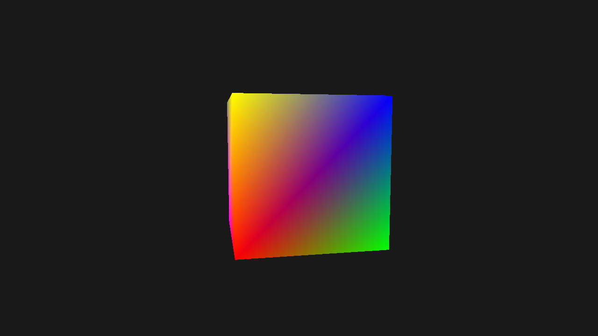

# Spinning Cube

In this tutorial, you'll learn how to render a rotating 3D cube using Zenith.NET. We'll introduce constant buffers for passing transformation matrices to the GPU.

## Overview

We'll create a `SpinningCubeRenderer` class that:

- Defines 3D cube geometry with vertex and index buffers
- Creates a constant buffer for MVP (Model-View-Projection) matrices
- Updates the rotation every frame
- Uses depth testing for correct 3D rendering

## The Renderer Class

Create a new file `Renderers/SpinningCubeRenderer.cs`:

```csharp
using System;
using System.Numerics;
using System.Runtime.InteropServices;
using Zenith.NET;
using Zenith.NET.Extensions.Slang;
using Buffer = Zenith.NET.Buffer;

namespace ZenithTutorials.Renderers;

internal class SpinningCubeRenderer : IRenderer
{
    private const string ShaderSource = """
        struct MVPConstants
        {
            float4x4 Model;

            float4x4 View;

            float4x4 Projection;
        };

        struct VSInput
        {
            float3 Position : POSITION0;

            float4 Color : COLOR0;
        };

        struct PSInput
        {
            float4 Position : SV_POSITION;

            float4 Color : COLOR0;
        };

        ConstantBuffer<MVPConstants> mvp;

        PSInput VSMain(VSInput input)
        {
            float4 worldPos = mul(float4(input.Position, 1.0), mvp.Model);
            float4 viewPos = mul(worldPos, mvp.View);
        
            PSInput output;
            output.Position = mul(viewPos, mvp.Projection);
            output.Color = input.Color;

            return output;
        }

        float4 PSMain(PSInput input) : SV_TARGET
        {
            return input.Color;
        }
        """;

    private readonly Buffer vertexBuffer;
    private readonly Buffer indexBuffer;
    private readonly Buffer constantBuffer;
    private readonly ResourceLayout resourceLayout;
    private readonly ResourceSet resourceSet;
    private readonly GraphicsPipeline pipeline;

    private float rotationAngle;

    public SpinningCubeRenderer()
    {
        Vertex[] vertices =
        [
            // Front face
            new(new(-0.5f, -0.5f,  0.5f), new(1.0f, 0.0f, 0.0f, 1.0f)),
            new(new( 0.5f, -0.5f,  0.5f), new(0.0f, 1.0f, 0.0f, 1.0f)),
            new(new( 0.5f,  0.5f,  0.5f), new(0.0f, 0.0f, 1.0f, 1.0f)),
            new(new(-0.5f,  0.5f,  0.5f), new(1.0f, 1.0f, 0.0f, 1.0f)),
            // Back face
            new(new(-0.5f, -0.5f, -0.5f), new(1.0f, 0.0f, 1.0f, 1.0f)),
            new(new( 0.5f, -0.5f, -0.5f), new(0.0f, 1.0f, 1.0f, 1.0f)),
            new(new( 0.5f,  0.5f, -0.5f), new(1.0f, 1.0f, 1.0f, 1.0f)),
            new(new(-0.5f,  0.5f, -0.5f), new(0.5f, 0.5f, 0.5f, 1.0f)),
        ];

        uint[] indices =
        [
            // Front
            0, 1, 2, 0, 2, 3,
            // Back
            5, 4, 7, 5, 7, 6,
            // Left
            4, 0, 3, 4, 3, 7,
            // Right
            1, 5, 6, 1, 6, 2,
            // Top
            3, 2, 6, 3, 6, 7,
            // Bottom
            4, 5, 1, 4, 1, 0
        ];

        vertexBuffer = App.Context.CreateBuffer(new()
        {
            SizeInBytes = (uint)(Marshal.SizeOf<Vertex>() * vertices.Length),
            StrideInBytes = (uint)Marshal.SizeOf<Vertex>(),
            Flags = BufferUsageFlags.Vertex | BufferUsageFlags.MapWrite
        });
        vertexBuffer.Upload(vertices, 0);

        indexBuffer = App.Context.CreateBuffer(new()
        {
            SizeInBytes = (uint)(sizeof(uint) * indices.Length),
            StrideInBytes = sizeof(uint),
            Flags = BufferUsageFlags.Index | BufferUsageFlags.MapWrite
        });
        indexBuffer.Upload(indices, 0);

        constantBuffer = App.Context.CreateBuffer(new()
        {
            SizeInBytes = (uint)Marshal.SizeOf<MVPConstants>(),
            StrideInBytes = (uint)Marshal.SizeOf<MVPConstants>(),
            Flags = BufferUsageFlags.Constant | BufferUsageFlags.MapWrite
        });

        resourceLayout = App.Context.CreateResourceLayout(new()
        {
            Bindings = BindingHelper.Bindings
            (
                new ResourceBinding() { Type = ResourceType.ConstantBuffer, Count = 1, StageFlags = ShaderStageFlags.Vertex }
            )
        });

        resourceSet = App.Context.CreateResourceSet(new()
        {
            Layout = resourceLayout,
            Resources = [constantBuffer]
        });

        InputLayout inputLayout = new();
        inputLayout.Add(new() { Format = ElementFormat.Float3, Semantic = ElementSemantic.Position });
        inputLayout.Add(new() { Format = ElementFormat.Float4, Semantic = ElementSemantic.Color });

        using Shader vertexShader = App.Context.LoadShaderFromSource(ShaderSource, "VSMain", ShaderStageFlags.Vertex);
        using Shader pixelShader = App.Context.LoadShaderFromSource(ShaderSource, "PSMain", ShaderStageFlags.Pixel);

        pipeline = App.Context.CreateGraphicsPipeline(new()
        {
            RenderStates = new()
            {
                RasterizerState = RasterizerStates.CullBack,
                DepthStencilState = DepthStencilStates.Default,
                BlendState = BlendStates.Opaque
            },
            Vertex = vertexShader,
            Pixel = pixelShader,
            ResourceLayouts = [resourceLayout],
            InputLayouts = [inputLayout],
            PrimitiveTopology = PrimitiveTopology.TriangleList,
            Output = App.SwapChain.FrameBuffer.Output
        });
    }

    public void Update(double deltaTime)
    {
        rotationAngle += (float)deltaTime;
    }

    public void Render()
    {
        Matrix4x4 model = Matrix4x4.CreateRotationY(rotationAngle) * Matrix4x4.CreateRotationX(rotationAngle * 0.5f);
        Matrix4x4 view = Matrix4x4.CreateLookAt(new(0, 0, 3), Vector3.Zero, Vector3.UnitY);
        Matrix4x4 projection = Matrix4x4.CreatePerspectiveFieldOfView(float.DegreesToRadians(45.0f), (float)App.Width / App.Height, 0.1f, 100.0f);

        constantBuffer.Upload([new MVPConstants { Model = model, View = view, Projection = projection }], 0);

        CommandBuffer commandBuffer = App.Context.Graphics.CommandBuffer();

        commandBuffer.BeginRenderPass(App.SwapChain.FrameBuffer, new()
        {
            ColorValues = [new(0.1f, 0.1f, 0.1f, 1.0f)],
            Depth = 1.0f,
            Stencil = 0,
            Flags = ClearFlags.All
        }, resourceSet);

        commandBuffer.SetPipeline(pipeline);
        commandBuffer.SetResourceSet(resourceSet, 0);
        commandBuffer.SetVertexBuffer(vertexBuffer, 0, 0);
        commandBuffer.SetIndexBuffer(indexBuffer, 0, IndexFormat.UInt32);
        commandBuffer.DrawIndexed(36, 1, 0, 0, 0);

        commandBuffer.EndRenderPass();

        commandBuffer.Submit(waitForCompletion: true);
    }

    public void Resize(uint width, uint height)
    {
    }

    public void Dispose()
    {
        pipeline.Dispose();
        resourceSet.Dispose();
        resourceLayout.Dispose();
        constantBuffer.Dispose();
        indexBuffer.Dispose();
        vertexBuffer.Dispose();
    }
}

/// <summary>
/// Vertex structure with position and color data.
/// </summary>
[StructLayout(LayoutKind.Sequential)]
file struct Vertex(Vector3 position, Vector4 color)
{
    public Vector3 Position = position;

    public Vector4 Color = color;
}

/// <summary>
/// MVP transformation matrices.
/// </summary>
[StructLayout(LayoutKind.Sequential)]
file struct MVPConstants
{
    public Matrix4x4 Model;

    public Matrix4x4 View;

    public Matrix4x4 Projection;
}
```

## Running the Tutorial

Update your `Program.cs` to run the `SpinningCubeRenderer`:

```csharp
using ZenithTutorials;
using ZenithTutorials.Renderers;

App.Run<SpinningCubeRenderer>();

App.Cleanup();
```

Run the application:

```bash
dotnet run
```

## Result



## Code Breakdown

### MVP Constants Structure

```csharp
[StructLayout(LayoutKind.Sequential)]
file struct MVPConstants
{
    public Matrix4x4 Model;

    public Matrix4x4 View;

    public Matrix4x4 Projection;
}
```

The `MVPConstants` struct uses the `file` keyword to limit its visibility to the current source file. The MVP (Model-View-Projection) matrices transform vertices from object space to screen space:

| Matrix | Purpose |
|--------|---------|
| **Model** | Object rotation, scale, and position in the world |
| **View** | Camera position and orientation |
| **Projection** | 3D to 2D projection (perspective or orthographic) |

### Constant Buffer

```csharp
constantBuffer = App.Context.CreateBuffer(new()
{
    SizeInBytes = (uint)Marshal.SizeOf<MVPConstants>(),
    StrideInBytes = (uint)Marshal.SizeOf<MVPConstants>(),
    Flags = BufferUsageFlags.Constant | BufferUsageFlags.MapWrite
});
```

Constant buffers pass data from the CPU to shaders. Use `BufferUsageFlags.Constant` and upload new data each frame as needed.

### Cube Geometry

```csharp
// 8 vertices for the cube corners
Vertex[] vertices = [ ... ];

// 36 indices (6 faces × 2 triangles × 3 vertices)
uint[] indices =
[
    // Front
    0, 1, 2, 0, 2, 3,
    // Back
    5, 4, 7, 5, 7, 6,
    // ... remaining faces
];
```

A cube has 8 unique vertices and 6 faces. Each face is made of 2 triangles, requiring 6 indices per face (36 total).

### Shader MVP Transformation

```slang
ConstantBuffer<MVPConstants> mvp;

PSInput VSMain(VSInput input)
{
    float4 worldPos = mul(float4(input.Position, 1.0), mvp.Model);
    float4 viewPos = mul(worldPos, mvp.View);

    PSInput output;
    output.Position = mul(viewPos, mvp.Projection);
    output.Color = input.Color;

    return output;
}
```

C# `Matrix4x4` and Slang (with `-matrix-layout-row-major`) both use row-major layout, so the multiplication order is `vector * matrix`. The vertex shader applies transformations in order: Model → View → Projection. Use `ConstantBuffer<T>` in Slang to access structured constant data.

### Frame Update

```csharp
public void Update(double deltaTime)
{
    rotationAngle += (float)deltaTime;
}
```

The `Update` method is called each frame with the elapsed time. Accumulating `deltaTime` creates smooth, frame-rate-independent rotation.

### Creating Matrices

```csharp
Matrix4x4 model = Matrix4x4.CreateRotationY(rotationAngle) * Matrix4x4.CreateRotationX(rotationAngle * 0.5f);
Matrix4x4 view = Matrix4x4.CreateLookAt(new(0, 0, 3), Vector3.Zero, Vector3.UnitY);
Matrix4x4 projection = Matrix4x4.CreatePerspectiveFieldOfView(float.DegreesToRadians(45.0f), (float)App.Width / App.Height, 0.1f, 100.0f);
```

| Method | Description |
|--------|-------------|
| `CreateRotationY/X` | Rotate around an axis |
| `CreateLookAt` | Position camera at (0,0,3) looking at origin |
| `CreatePerspectiveFieldOfView` | 45° FOV perspective projection |

### Back-Face Culling

```csharp
RasterizerState = RasterizerStates.CullBack
```

For closed 3D objects, enable back-face culling to skip rendering triangles facing away from the camera, improving performance.

## What You've Learned

Congratulations! You've completed the Getting Started tutorials. You now understand:

- Creating vertex and index buffers
- Compiling shaders with Slang
- Building graphics pipelines
- Loading textures and creating samplers
- Resource binding with `ResourceLayout` and `ResourceSet`
- Using constant buffers for per-frame data
- MVP transformations for 3D rendering

## Next Steps

Explore more advanced API topics:

- [Compute Shader](../intermediate/compute-shader.md) - GPU computing with ComputePipeline
- [Indirect Drawing](../intermediate/indirect-drawing.md) - DrawIndirect and DispatchIndirect
- [Ray Tracing](../advanced/ray-tracing.md) - Hardware-accelerated ray tracing (requires GPU support)
- [Mesh Shader](../advanced/mesh-shader.md) - Mesh shading pipeline (requires GPU support)

Check out the [SponzaScene](https://github.com/qian-o/Zenith.NET/tree/master/sources/Experiments/SponzaScene) sample for a complete deferred renderer example.

## Source Code

> [!TIP]
> View the complete source code on GitHub: [SpinningCubeRenderer.cs](https://github.com/qian-o/ZenithTutorials/blob/master/ZenithTutorials/Renderers/SpinningCubeRenderer.cs)
