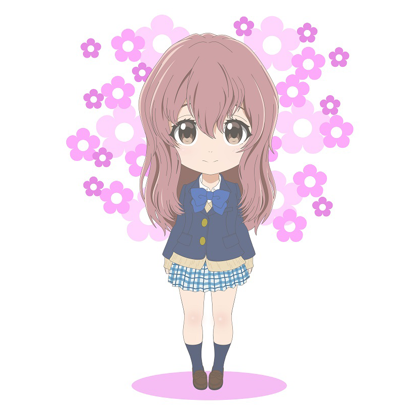

# Textured Quad

In this tutorial, you'll learn how to render a textured quad using Zenith.NET. We'll load an image, create a texture and sampler, and bind them to the shader using resource layouts.

## Overview

We'll create a `TexturedQuadRenderer` class that:

- Uses an index buffer to draw a quad with 4 vertices
- Loads an image and uploads it to a GPU texture
- Creates a sampler for texture filtering
- Binds texture and sampler using `ResourceLayout` and `ResourceSet`

## Required Packages

Add the ImageSharp extension for loading images:

```bash
dotnet add package Zenith.NET.Extensions.ImageSharp
```

## Project Setup

This tutorial uses the following sample image. Right-click to save it to your project's `Assets` folder:



Your project structure should look like this:

```
ZenithTutorials/
├── Assets/
│   └── shoko.png      # Save the image above as shoko.png
└── Renderers/
    └── TexturedQuadRenderer.cs
```

Update your `.csproj` to copy assets:

```xml
<ItemGroup>
  <None Update="Assets\**\*">
    <CopyToOutputDirectory>PreserveNewest</CopyToOutputDirectory>
  </None>
</ItemGroup>
```

## The Renderer Class

Create a new file `Renderers/TexturedQuadRenderer.cs`:

```csharp
using System;
using System.IO;
using System.Numerics;
using System.Runtime.InteropServices;
using Zenith.NET;
using Zenith.NET.Extensions.ImageSharp;
using Zenith.NET.Extensions.Slang;
using Buffer = Zenith.NET.Buffer;

namespace ZenithTutorials.Renderers;

internal class TexturedQuadRenderer : IRenderer
{
    /// <summary>
    /// Vertex structure with position and texture coordinates.
    /// </summary>
    [StructLayout(LayoutKind.Sequential)]
    private struct Vertex(Vector3 position, Vector2 texCoord)
    {
        public Vector3 Position = position;

        public Vector2 TexCoord = texCoord;
    }

    private const string shaderSource = """
        struct VSInput
        {
            float3 Position : POSITION0;

            float2 TexCoord : TEXCOORD0;
        };

        struct PSInput
        {
            float4 Position : SV_POSITION;

            float2 TexCoord : TEXCOORD0;
        };

        Texture2D shaderTexture;
        SamplerState samplerState;

        PSInput VSMain(VSInput input)
        {
            PSInput output;
            output.Position = float4(input.Position, 1.0);
            output.TexCoord = input.TexCoord;

            return output;
        }

        float4 PSMain(PSInput input) : SV_TARGET
        {
            return shaderTexture.Sample(samplerState, input.TexCoord);
        }
        """;

    private readonly Buffer vertexBuffer;
    private readonly Buffer indexBuffer;
    private readonly Texture texture;
    private readonly Sampler sampler;
    private readonly ResourceLayout resourceLayout;
    private readonly ResourceSet resourceSet;
    private readonly GraphicsPipeline pipeline;

    public TexturedQuadRenderer()
    {
        // Define quad vertices with texture coordinates
        // UV origin (0,0) is top-left, (1,1) is bottom-right
        Vertex[] vertices =
        [
            new(new(-0.5f,  0.5f, 0.0f), new(0.0f, 0.0f)), // Top-left
            new(new( 0.5f,  0.5f, 0.0f), new(1.0f, 0.0f)), // Top-right
            new(new( 0.5f, -0.5f, 0.0f), new(1.0f, 1.0f)), // Bottom-right
            new(new(-0.5f, -0.5f, 0.0f), new(0.0f, 1.0f)), // Bottom-left
        ];

        // Index buffer defines two triangles forming a quad
        uint[] indices = [0, 1, 2, 0, 2, 3];

        // Create vertex buffer
        vertexBuffer = App.Context.CreateBuffer(new()
        {
            SizeInBytes = (uint)(Marshal.SizeOf<Vertex>() * vertices.Length),
            StrideInBytes = (uint)Marshal.SizeOf<Vertex>(),
            Flags = BufferUsageFlags.Vertex | BufferUsageFlags.MapWrite
        });
        vertexBuffer.Upload(vertices, 0);

        // Create index buffer
        indexBuffer = App.Context.CreateBuffer(new()
        {
            SizeInBytes = (uint)(sizeof(uint) * indices.Length),
            StrideInBytes = sizeof(uint),
            Flags = BufferUsageFlags.Index | BufferUsageFlags.MapWrite
        });
        indexBuffer.Upload(indices, 0);

        // Load texture from file using ImageSharp extension
        texture = App.Context.LoadTextureFromFile(Path.Combine(AppContext.BaseDirectory, "Assets", "shoko.png"), generateMipMaps: true);

        // Create sampler with linear filtering
        sampler = App.Context.CreateSampler(new()
        {
            Filter = Filter.MinLinearMagLinearMipLinear,
            U = AddressMode.Clamp,
            V = AddressMode.Clamp,
            W = AddressMode.Clamp,
            MaxLod = uint.MaxValue
        });

        // Define resource layout using BindingHelper for cross-platform compatibility
        resourceLayout = App.Context.CreateResourceLayout(new()
        {
            Bindings = BindingHelper.Bindings
            (
                new() { Type = ResourceType.Texture, Count = 1, StageFlags = ShaderStageFlags.Pixel },
                new() { Type = ResourceType.Sampler, Count = 1, StageFlags = ShaderStageFlags.Pixel }
            )
        });

        // Create resource set (binds actual resources to the layout)
        resourceSet = App.Context.CreateResourceSet(new()
        {
            Layout = resourceLayout,
            Resources = [texture, sampler]
        });

        // Define vertex input layout
        InputLayout inputLayout = new();
        inputLayout.Add(new() { Format = ElementFormat.Float3, Semantic = ElementSemantic.Position });
        inputLayout.Add(new() { Format = ElementFormat.Float2, Semantic = ElementSemantic.TexCoord });

        // Compile shaders
        using Shader vertexShader = App.Context.LoadShaderFromSource(shaderSource, "VSMain", ShaderStageFlags.Vertex);
        using Shader pixelShader = App.Context.LoadShaderFromSource(shaderSource, "PSMain", ShaderStageFlags.Pixel);

        // Create graphics pipeline with resource layout
        pipeline = App.Context.CreateGraphicsPipeline(new()
        {
            RenderStates = new()
            {
                RasterizerState = RasterizerStates.CullNone,
                DepthStencilState = DepthStencilStates.Default,
                BlendState = BlendStates.Opaque
            },
            Vertex = vertexShader,
            Pixel = pixelShader,
            ResourceLayouts = [resourceLayout],  // Include resource layout
            InputLayouts = [inputLayout],
            PrimitiveTopology = PrimitiveTopology.TriangleList,
            Output = App.SwapChain.FrameBuffer.Output
        });
    }

    public void Update(double deltaTime)
    {
    }

    public void Render()
    {
        CommandBuffer commandBuffer = App.Context.Graphics.CommandBuffer();

        // Pass resourceSet to preprocessResourceSets to transition resources to optimal layout
        commandBuffer.BeginRenderPass(App.SwapChain.FrameBuffer, new()
        {
            ColorValues = [new(0.1f, 0.1f, 0.1f, 1.0f)],
            Depth = 1.0f,
            Stencil = 0,
            Flags = ClearFlags.All
        }, resourceSet);

        commandBuffer.SetPipeline(pipeline);
        commandBuffer.SetResourceSet(resourceSet, 0);  // Bind resource set at slot 0
        commandBuffer.SetVertexBuffer(vertexBuffer, 0, 0);
        commandBuffer.SetIndexBuffer(indexBuffer, 0, IndexFormat.UInt32);
        commandBuffer.DrawIndexed(6, 1, 0, 0, 0);  // 6 indices, 1 instance

        commandBuffer.EndRenderPass();

        commandBuffer.Submit(waitForCompletion: true);
    }

    public void Resize(uint width, uint height)
    {
    }

    public void Dispose()
    {
        pipeline.Dispose();
        resourceSet.Dispose();
        resourceLayout.Dispose();
        sampler.Dispose();
        texture.Dispose();
        indexBuffer.Dispose();
        vertexBuffer.Dispose();
    }
}
```

## Running the Tutorial

Update your `Program.cs` to run the `TexturedQuadRenderer`:

```csharp
using ZenithTutorials;
using ZenithTutorials.Renderers;

App.Run<TexturedQuadRenderer>();

App.Cleanup();
```

Run the application:

```bash
dotnet run
```

## Result


## Code Breakdown

### Vertex Structure

```csharp
[StructLayout(LayoutKind.Sequential)]
private struct Vertex(Vector3 position, Vector2 texCoord)
{
    public Vector3 Position = position;

    public Vector2 TexCoord = texCoord;
}
```

The `Vertex` struct is defined inside the renderer class as a private nested type. Unlike the triangle tutorial, we now use `Vector2 TexCoord` instead of color. Texture coordinates (UVs) range from `(0,0)` at the top-left to `(1,1)` at the bottom-right.

### Index Buffer

```csharp
uint[] indices = [0, 1, 2, 0, 2, 3];

indexBuffer = App.Context.CreateBuffer(new()
{
    SizeInBytes = (uint)(sizeof(uint) * indices.Length),
    StrideInBytes = sizeof(uint),
    Flags = BufferUsageFlags.Index | BufferUsageFlags.MapWrite
});
```

A quad requires 6 indices (2 triangles × 3 vertices). Using an index buffer reduces vertex data from 6 to 4 vertices by reusing shared vertices.

### Loading Textures

```csharp
texture = App.Context.LoadTextureFromFile(Path.Combine(AppContext.BaseDirectory, "Assets", "shoko.png"), generateMipMaps: true);
```

The `Zenith.NET.Extensions.ImageSharp` extension provides convenient methods to load images. Setting `generateMipMaps: true` creates smaller versions of the texture for better quality at different distances.

### Sampler

```csharp
sampler = App.Context.CreateSampler(new()
{
    Filter = Filter.MinLinearMagLinearMipLinear,
    U = AddressMode.Clamp,
    V = AddressMode.Clamp,
    W = AddressMode.Clamp,
    MaxLod = uint.MaxValue
});
```

Samplers control how textures are read:

| Property | Description |
|----------|-------------|
| `Filter` | Interpolation method (linear = smooth, point = pixelated) |
| `U/V/W` | How to handle coordinates outside 0-1 range |
| `MaxLod` | Maximum mipmap level to use |

### Resource Binding

```csharp
// 1. Define the layout using BindingHelper for cross-platform compatibility
resourceLayout = App.Context.CreateResourceLayout(new()
{
    Bindings = BindingHelper.Bindings
    (
        new() { Type = ResourceType.Texture, Count = 1, StageFlags = ShaderStageFlags.Pixel },
        new() { Type = ResourceType.Sampler, Count = 1, StageFlags = ShaderStageFlags.Pixel }
    )
});

// 2. Create the set (bind actual resources)
resourceSet = App.Context.CreateResourceSet(new()
{
    Layout = resourceLayout,
    Resources = [texture, sampler]
});

// 3. Bind during rendering
commandBuffer.SetResourceSet(resourceSet, 0);
```

This three-step process connects your GPU resources to shader variables:

1. **ResourceLayout** - Describes the structure (types and binding slots)
2. **ResourceSet** - Binds actual resources to the layout
3. **SetResourceSet** - Activates the binding during rendering

The `BindingHelper.Bindings()` method (defined in [Prerequisites](prerequisites.md)) automatically assigns the correct `Index` values based on the current backend, so you don't need to specify them manually.

### Resource Preprocessing

When beginning a render pass, you can pass resource sets to the `preprocessResourceSets` parameter:

```csharp
commandBuffer.BeginRenderPass(App.SwapChain.FrameBuffer, new()
{
    ColorValues = [new(0.1f, 0.1f, 0.1f, 1.0f)],
    Depth = 1.0f,
    Stencil = 0,
    Flags = ClearFlags.All
}, resourceSet);  // Preprocess resources
```

This allows Zenith.NET to optimize the resources in the set for shader access before the render pass begins, eliminating the need for manual resource management.

### Shader Texture Sampling

```hlsl
Texture2D shaderTexture;
SamplerState samplerState;

float4 PSMain(PSInput input) : SV_TARGET
{
    return shaderTexture.Sample(samplerState, input.TexCoord);
}
```

In Slang, resources are declared as global variables after the struct definitions, without explicit `register` bindings. The binding order is determined by declaration order and matches the order in `ResourceLayout.Bindings`. The pixel shader samples the texture at the interpolated UV coordinates.

## Next Steps

Now that you understand texturing and resource binding, the next tutorial covers 3D rendering:

- [Spinning Cube](spinning-cube.md) - Render a 3D cube with index buffers and MVP transformation matrices

## Source Code

> [!TIP]
> View the complete source code on GitHub: [TexturedQuadRenderer.cs](https://github.com/qian-o/ZenithTutorials/blob/master/ZenithTutorials/Renderers/TexturedQuadRenderer.cs)