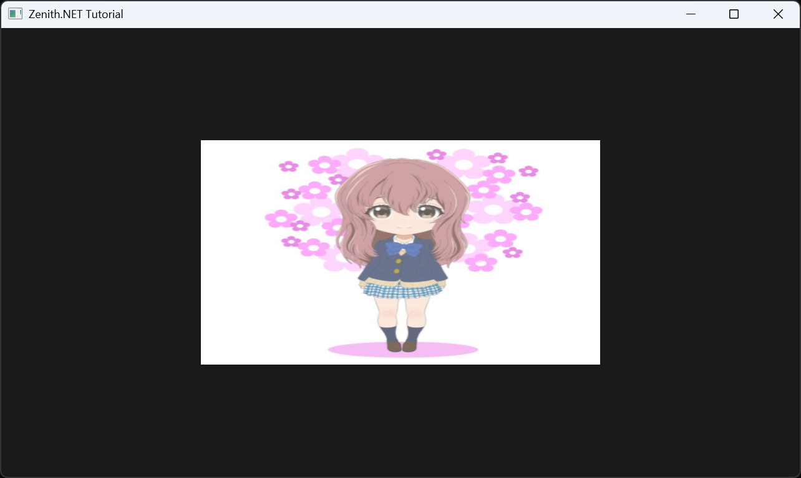

# Textured Quad

In this tutorial, you'll render a textured quad using an index buffer, a texture loaded from file, and a sampler. This introduces resource binding — connecting GPU resources like textures and samplers to shaders through resource bindings and tables.

## Overview

This tutorial covers:

- Using an **index buffer** to share vertices between triangles
- Loading a **texture** from an image file
- Creating a **sampler** with filtering and address modes
- Defining a **resource table** to bind resources to shaders

## The Renderer Class

Create the file `Renderers/TexturedQuadRenderer.cs`:

```csharp
namespace ZenithTutorials.Renderers;

internal unsafe class TexturedQuadRenderer : IRenderer
{
    private const string ShaderSource = """
        struct VSInput
        {
            float3 Position : POSITION0;

            float2 TexCoord : TEXCOORD0;
        };

        struct PSInput
        {
            float4 Position : SV_POSITION;

            float2 TexCoord : TEXCOORD;
        };

        Texture2D texture;
        SamplerState sampler;

        PSInput VSMain(VSInput input)
        {
            PSInput output;
            output.Position = float4(input.Position, 1.0);
            output.TexCoord = input.TexCoord;

            return output;
        }

        float4 PSMain(PSInput input) : SV_TARGET
        {
            return texture.Sample(sampler, input.TexCoord);
        }
        """;

    private static readonly ResourceBinding[] ResourceBindings =
    [
        new() { Type = ResourceType.Texture, Count = 1 },
        new() { Type = ResourceType.Sampler, Count = 1 }
    ];

    private readonly Buffer vertexBuffer;
    private readonly Buffer indexBuffer;
    private readonly Texture texture;
    private readonly Sampler sampler;
    private readonly ResourceTable resourceTable;
    private readonly GraphicsPipeline pipeline;

    public TexturedQuadRenderer()
    {
        Vertex[] vertices =
        [
            new(new(-0.5f,  0.5f, 0.0f), new(0.0f, 0.0f)),
            new(new( 0.5f,  0.5f, 0.0f), new(1.0f, 0.0f)),
            new(new( 0.5f, -0.5f, 0.0f), new(1.0f, 1.0f)),
            new(new(-0.5f, -0.5f, 0.0f), new(0.0f, 1.0f))
        ];

        uint[] indices = [0, 1, 2, 0, 2, 3];

        vertexBuffer = App.Context.CreateBuffer(new()
        {
            SizeInBytes = (uint)(sizeof(Vertex) * vertices.Length),
            StrideInBytes = (uint)sizeof(Vertex),
            Flags = BufferUsageFlags.Vertex | BufferUsageFlags.MapWrite
        });
        vertexBuffer.Upload(vertices, 0);

        indexBuffer = App.Context.CreateBuffer(new()
        {
            SizeInBytes = (uint)(sizeof(uint) * indices.Length),
            StrideInBytes = sizeof(uint),
            Flags = BufferUsageFlags.Index | BufferUsageFlags.MapWrite
        });
        indexBuffer.Upload(indices, 0);

        texture = App.Context.LoadTextureFromFile(Path.Combine(AppContext.BaseDirectory, "Assets", "shoko.png"), generateMipMaps: true);

        sampler = App.Context.CreateSampler(new()
        {
            U = AddressMode.Clamp,
            V = AddressMode.Clamp,
            W = AddressMode.Clamp,
            Filter = Filter.MinLinearMagLinearMipLinear,
            MaxLod = uint.MaxValue
        });

        resourceTable = App.Context.CreateResourceTable(new() { Bindings = ResourceBindings });
        resourceTable.Write(0, texture);
        resourceTable.Write(1, sampler);

        InputLayout inputLayout = new();
        inputLayout.Add(new() { Format = ElementFormat.Float3, Semantic = ElementSemantic.Position });
        inputLayout.Add(new() { Format = ElementFormat.Float2, Semantic = ElementSemantic.TexCoord });

        using Shader vertexShader = App.Context.LoadShaderFromSource(ShaderSource, "VSMain", ShaderStageFlags.Vertex);
        using Shader pixelShader = App.Context.LoadShaderFromSource(ShaderSource, "PSMain", ShaderStageFlags.Pixel);

        pipeline = App.Context.CreateGraphicsPipeline(new()
        {
            RenderStates = new()
            {
                RasterizerState = RasterizerStates.CullNone,
                DepthStencilState = DepthStencilStates.Default,
                BlendState = BlendStates.Opaque
            },
            Vertex = vertexShader,
            Pixel = pixelShader,
            ResourceBindings = ResourceBindings,
            InputLayouts = [inputLayout],
            PrimitiveTopology = PrimitiveTopology.TriangleList,
            Output = App.FrameBuffer.Output
        });
    }

    public void Update(double deltaTime)
    {
    }

    public void Render()
    {
        CommandBuffer commandBuffer = App.Context.Graphics.CommandBuffer();

        commandBuffer.BeginRenderPass(App.FrameBuffer, new()
        {
            ColorValues = [new(0.1f, 0.1f, 0.1f, 1.0f)],
            Depth = 1.0f,
            Stencil = 0,
            Flags = ClearFlags.All
        }, resourceTable);

        commandBuffer.SetPipeline(pipeline);
        commandBuffer.PushResourceTable(resourceTable);
        commandBuffer.SetVertexBuffer(vertexBuffer, 0, 0);
        commandBuffer.SetIndexBuffer(indexBuffer, 0, IndexFormat.UInt32);
        commandBuffer.DrawIndexed(6, 1, 0, 0, 0);

        commandBuffer.EndRenderPass();

        commandBuffer.Submit(waitForCompletion: true);
    }

    public void Resize(uint width, uint height)
    {
    }

    public void Dispose()
    {
        pipeline.Dispose();
        resourceTable.Dispose();
        sampler.Dispose();
        texture.Dispose();
        indexBuffer.Dispose();
        vertexBuffer.Dispose();
    }
}

[StructLayout(LayoutKind.Sequential)]
file struct Vertex(Vector3 position, Vector2 texCoord)
{
    public Vector3 Position = position;

    public Vector2 TexCoord = texCoord;
}
```

## Running the Tutorial

Run the application and select **2. Textured Quad** from the menu:

```bash
dotnet run
```

## Result



## Code Breakdown

### Shader

The pixel shader samples a texture using UV coordinates:

```csharp
private const string ShaderSource = """
    struct VSInput
    {
        float3 Position : POSITION0;

        float2 TexCoord : TEXCOORD0;
    };

    struct PSInput
    {
        float4 Position : SV_POSITION;

        float2 TexCoord : TEXCOORD;
    };

    Texture2D texture;
    SamplerState sampler;

    PSInput VSMain(VSInput input)
    {
        PSInput output;
        output.Position = float4(input.Position, 1.0);
        output.TexCoord = input.TexCoord;

        return output;
    }

    float4 PSMain(PSInput input) : SV_TARGET
    {
        return texture.Sample(sampler, input.TexCoord);
    }
    """;
```

`Texture2D` and `SamplerState` are declared as global resources. The pixel shader uses `texture.Sample(sampler, uv)` to fetch filtered texel colors.

### Index Buffer

Instead of duplicating vertices, an index buffer references shared vertices:

```csharp
Vertex[] vertices =
[
    new(new(-0.5f,  0.5f, 0.0f), new(0.0f, 0.0f)),
    new(new( 0.5f,  0.5f, 0.0f), new(1.0f, 0.0f)),
    new(new( 0.5f, -0.5f, 0.0f), new(1.0f, 1.0f)),
    new(new(-0.5f, -0.5f, 0.0f), new(0.0f, 1.0f))
];

uint[] indices = [0, 1, 2, 0, 2, 3];
```

Two triangles (indices `0,1,2` and `0,2,3`) share vertices 0 and 2 to form the quad.

### Texture and Sampler

The texture is loaded from a file with mipmaps generated automatically:

```csharp
texture = App.Context.LoadTextureFromFile(Path.Combine(AppContext.BaseDirectory, "Assets", "shoko.png"), generateMipMaps: true);

sampler = App.Context.CreateSampler(new()
{
    U = AddressMode.Clamp,
    V = AddressMode.Clamp,
    W = AddressMode.Clamp,
    Filter = Filter.MinLinearMagLinearMipLinear,
    MaxLod = uint.MaxValue
});
```

| Property | Value | Purpose |
|----------|-------|---------|
| `AddressMode.Clamp` | U, V, W | Clamp UVs to `[0,1]` — no texture wrapping |
| `Filter` | `MinLinearMagLinearMipLinear` | Trilinear filtering for smooth sampling |
| `MaxLod` | `uint.MaxValue` | Allow all mipmap levels |

### Resource Binding

Resources are exposed to shaders through a resource table:

```csharp
resourceTable = App.Context.CreateResourceTable(new() { Bindings = ResourceBindings });
resourceTable.Write(0, texture);
resourceTable.Write(1, sampler);
```

`ResourceTable.Write(binding, resource)` assigns actual GPU resources to each binding by index.

### Rendering

The render pass now receives the `resourceTable`, and uses indexed drawing:

```csharp
commandBuffer.BeginRenderPass(App.FrameBuffer, new()
{
    ColorValues = [new(0.1f, 0.1f, 0.1f, 1.0f)],
    Depth = 1.0f,
    Stencil = 0,
    Flags = ClearFlags.All
}, resourceTable);

commandBuffer.SetPipeline(pipeline);
commandBuffer.PushResourceTable(resourceTable);
commandBuffer.SetVertexBuffer(vertexBuffer, 0, 0);
commandBuffer.SetIndexBuffer(indexBuffer, 0, IndexFormat.UInt32);
commandBuffer.DrawIndexed(6, 1, 0, 0, 0);
```

`DrawIndexed(6, 1, 0, 0, 0)` draws 6 indices (2 triangles), 1 instance.

## Next Steps

- [Spinning Cube](spinning-cube.md) - Add 3D transformations with constant buffers

## Source Code

> [!TIP]
> View the complete source code on GitHub: [TexturedQuadRenderer.cs](https://github.com/qian-o/ZenithTutorials/blob/master/ZenithTutorials/Renderers/TexturedQuadRenderer.cs)
