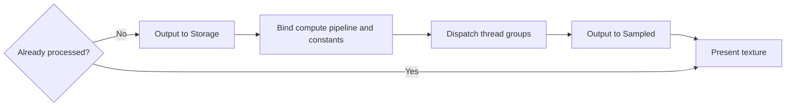

# Compute Shader

Compute Shader produces an image without a render pass. A compute pipeline reads a sampled texture, converts one pixel per thread to grayscale, and writes a storage texture. The host then presents that output with its shared fullscreen-triangle pipeline.

The grayscale conversion makes the result easy to inspect, but the guide focuses on Zenith.NET resource handles, compute dispatch, and texture layout transitions rather than color-science derivations.

## Result


The source image is processed once at its original dimensions. It is displayed at those dimensions while the framebuffer is at least as large as the image. Threads outside the image bounds are discarded when the dimensions are not exact multiples of the thread-group size.

## Frame overview



The output is static, so the compute pass runs only during the first frame. Later frames reuse the sampled result.

## Resource map

| Resource | Usage | Access |
| --- | --- | --- |
| Input texture | `Sampled` | Compute shader reads pixels |
| Output texture | `Storage` and `Sampled` | Compute shader writes; presenter reads |
| Constant buffer | `Constant` | Width, height, and two resource handles |
| Compute shader | `CSMain` | One thread per output pixel |
| Compute pipeline | Compute dispatch | Binds the shader executable |

The output texture needs both usages at creation time because it changes roles after the dispatch.

## Load the input texture

Place an image at `Assets/Textures/shoko.png`. The project configuration from Project Setup copies it next to the executable. The ImageSharp extension loads it into a sampled Zenith.NET texture:

```csharp
inputTexture = App.LoadTexture("shoko.png", false);
```

The final argument disables mipmap generation because this workload reads exact source pixels with `Texture2D.Load`.

`App.LoadTexture` completes the upload before returning and leaves the loaded mip in `Sampled` layout. The compute pass therefore needs no input-texture transition; only the output texture changes layout during `Render`.

## Create the output texture

Create a floating-point texture with the same dimensions as the source:

```csharp
outputTexture = App.Context.CreateTexture(new()
{
    Type = TextureType.Texture2D,
    Format = PixelFormat.R32G32B32A32Float,
    Width = inputTexture.Desc.Width,
    Height = inputTexture.Desc.Height,
    Depth = 1,
    MipLevels = 1,
    ArrayLayers = 1,
    SampleCount = SampleCount.Count1,
    Usages = TextureUsages.Sampled | TextureUsages.Storage
});
```

`R32G32B32A32Float` matches the shader's writable `float4` element type. `Storage` permits writes during compute; `Sampled` permits reads by `TexturePresenter` afterward.

## Data contract

The constant buffer passes image dimensions and descriptor handles:

```slang
struct Constants
{
    uint Width;

    uint Height;

    DescriptorHandle<Texture2D> Input;

    DescriptorHandle<RWTexture2D<float4>> Output;
};

ConstantBuffer<Constants> constants;
```

The declaration after the structure binds that contract as the constant-buffer view read by `CSMain`.

The C# layout matches the two four-byte integers followed by two eight-byte handles:

```csharp
[StructLayout(LayoutKind.Explicit, Size = 256)]
file struct Constants
{
    [FieldOffset(0)]
    public uint Width;

    [FieldOffset(4)]
    public uint Height;

    [FieldOffset(8)]
    public ResourceHandle Input;

    [FieldOffset(16)]
    public ResourceHandle Output;
}
```

| Offset | C# value | Slang view |
| ---: | --- | --- |
| 0 | `inputTexture.Desc.Width` | `uint Width` |
| 4 | `inputTexture.Desc.Height` | `uint Height` |
| 8 | `inputTexture.SampledHandle` | `DescriptorHandle<Texture2D>` |
| 16 | `outputTexture.StorageHandle` | `DescriptorHandle<RWTexture2D<float4>>` |

The structure reserves a 256-byte constant-buffer allocation while its semantic fields occupy the leading bytes. The offsets, rather than the C# field names, define the shared binary contract.

Initialize and upload one value:

```csharp
Constants constants = new()
{
    Width = inputTexture.Desc.Width,
    Height = inputTexture.Desc.Height,
    Input = inputTexture.SampledHandle,
    Output = outputTexture.StorageHandle
};

constantBuffer = App.LoadBuffer([constants], BufferUsages.Constant);
```

## Shader interface

The shader declares a $16 \times 16$ thread group:

```slang
[shader("compute")]
[numthreads(16, 16, 1)]
void CSMain(uint3 dispatchThreadID: SV_DispatchThreadID)
{
    uint2 pixel = dispatchThreadID.xy;

    if (pixel.x >= constants.Width || pixel.y >= constants.Height)
    {
        return;
    }

    float4 color = constants.Input.Load(int3(pixel, 0));
    float3 linear = pow(color.rgb, 2.2);
    float grayscale = dot(linear, float3(0.2126, 0.7152, 0.0722));
    grayscale = pow(grayscale, 1.0 / 2.2);

    constants.Output[pixel] = float4(grayscale, grayscale, grayscale, color.a);
}
```

`SV_DispatchThreadID` is the global thread coordinate across all dispatched groups. The bounds check is essential because group counts round up to cover partial groups at the image edges.

The middle lines approximate conversion to linear light, calculate luminance, and convert back for display. That effect can be replaced without changing the pipeline or resource flow; the important interface is one sampled read and one storage write at the same pixel coordinate.

## Create the compute pipeline

Compile the compute entry point and create its pipeline:

```csharp
using Shader computeShader = App.LoadShader("ComputeShader.slang", "CSMain");

computePipeline = App.Context.CreateComputePipeline(new() { ComputeShader = computeShader });
```

A compute pipeline has no attachment formats or rasterizer state. It executes outside a render pass.

## Dispatch the workload

Before the first dispatch, transition the output from its undefined initial contents into writable storage layout:

```csharp
commandBuffer.Transition(outputTexture, default, TextureLayout.Undefined, TextureLayout.Storage);

commandBuffer.SetPipeline(computePipeline);
commandBuffer.SetConstantBuffer(constantBuffer, 0);
commandBuffer.Dispatch((inputTexture.Desc.Width + ThreadGroupSize - 1) / ThreadGroupSize, (inputTexture.Desc.Height + ThreadGroupSize - 1) / ThreadGroupSize, 1);
```

For a dimension $D$ and group size $G$, integer ceiling division is:

$$
\left\lceil \frac{D}{G} \right\rceil = \frac{D + G - 1}{G}
$$

After all storage writes, transition the texture for sampled reads:

```csharp
commandBuffer.Transition(outputTexture, default, TextureLayout.Storage, TextureLayout.Sampled);

processed = true;
```

The command buffer preserves this order: transition, dispatch, then transition. The presenter consumes the texture only after it reaches `Sampled` layout.

## Present the output

Every frame, including the first, hands the sampled result to the shared presenter:

```csharp
App.PresentTexture(commandBuffer, drawable, outputTexture, false);
```

Passing `false` preserves the texture's original size and centers it when the framebuffer is at least as large in both dimensions. In a smaller framebuffer, the presenter clamps each viewport dimension to the available size. The presenter records the graphics render pass that writes the swap-chain drawable.

## Lifetime

This image does not depend on the framebuffer size, so `Resize` is empty. Dispose each renderer-owned resource after the final submitted frame has completed:

```csharp
public void Dispose()
{
    computePipeline.Dispose();
    constantBuffer.Dispose();
    outputTexture.Dispose();
    inputTexture.Dispose();
}
```

## Inspect the result

Run the host and select **Compute Shader**. Confirm that:

- the complete source image appears in grayscale;
- no unprocessed strip appears along the right or bottom edge;
- resizing to a framebuffer at least as large as the image preserves its original display size;
- validation reports no storage/sampled usage or layout errors.

An unprocessed edge usually indicates floor division or a missing bounds check. A blank result often indicates an incorrect descriptor handle or a missing `Storage` to `Sampled` transition.

## Explore further

1. Replace the grayscale calculation with `constants.Output[pixel] = color` to verify a direct copy.
2. Invert `color.rgb` while preserving alpha.
3. Change the declared thread-group size and update the C# `ThreadGroupSize` constant to match.
4. Set `fitToWindow` to `true` when presenting and compare the viewport behavior.

## Complete source

- [ComputeShaderRenderer.cs](https://github.com/qian-o/ZenithTutorials/blob/master/ZenithTutorials/Renderers/ComputeShaderRenderer.cs)
- [ComputeShader.slang](https://github.com/qian-o/ZenithTutorials/blob/master/ZenithTutorials/Assets/Shaders/ComputeShader.slang)
- [Input texture](https://github.com/qian-o/ZenithTutorials/blob/master/ZenithTutorials/Assets/Textures/shoko.png)

Continue with [Ray Tracing](ray-tracing.md) to reuse the compute-output flow for an image regenerated from inline ray queries every frame.
