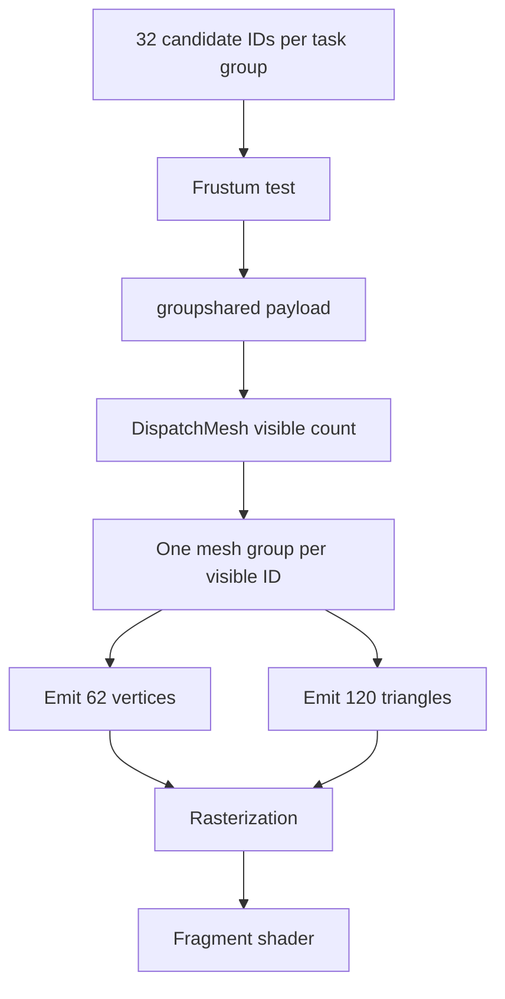

# Mesh Shading

Mesh Shading replaces fixed vertex and index fetch with programmable task and mesh stages. This workload renders a $10 \times 10 \times 10$ sphere grid. Task threads test candidate instances against the camera frustum, compact visible IDs into a payload, and launch one mesh workgroup for each surviving sphere.

This guide focuses on the Zenith.NET mesh-shading pipeline, structured geometry, C#/Slang layout, task payload, synchronization, and mesh dispatch. The UV-sphere construction and final diffuse-lighting calculation support the sample result but are not derived as general geometry or lighting algorithms.

## Result


The camera moves around 1,000 possible sphere instances. Only instances intersecting the view frustum produce mesh workgroups and rasterized geometry.

> [!IMPORTANT]
> Mesh shading is optional. Check `App.Context.Capabilities.MeshShadingSupported` before creating shaders, buffers, or a mesh-shading pipeline.

## Frame overview


No vertex or index buffer is bound through traditional command-buffer slots. The mesh shader reads source geometry through descriptor handles and writes pipeline outputs directly.

## Pipeline stages



Zenith.NET calls the first stage `TaskShader`; Slang declares the corresponding entry point with `[shader("task")]`. Other APIs may call this an amplification or object stage.

## Resource map

| Resource | Usage | Role |
| --- | --- | --- |
| Vertex buffer | `StorageReadOnly` | Source sphere positions and normals |
| Triangle buffer | `StorageReadOnly` | Source sphere index triplets |
| Constant buffer | `Constant` | View-projection, frustum, light, and two handles |
| Task shader | `ASMain` | Culls and compacts candidate instance IDs |
| Mesh shader | `MSMain` | Emits transformed vertices and primitive indices |
| Fragment shader | `FSMain` | Applies simple directional lighting |
| Mesh-shading pipeline | Task, mesh, and fragment stages | Rasterized output |
| Depth texture | Depth-stencil attachment | Recreated after resize |

The source geometry remains in structured buffers for the renderer lifetime. Each visible instance reuses the same 62 vertices and 120 triangles.

## Check device support

Reject unsupported devices before generating or uploading the source mesh:

```csharp
if (!App.Context.Capabilities.MeshShadingSupported)
{
    throw new PlatformNotSupportedException("Mesh Shading is not supported by the selected device.");
}
```

The capability controls creation and execution of the task/mesh pipeline. It is independent of the traditional graphics pipeline used by earlier guides.

## Create the source mesh

The CPU generates one compact UV sphere with 62 vertices and 120 triangles. It creates a north pole, five latitude rings, a south pole, and indices for both caps and the ring quads.

The complete generation loop is available in the renderer source. Its important output for this workload is two tightly defined arrays:

```csharp
vertexBuffer = App.LoadBuffer([.. sphereVertices], BufferUsages.StorageReadOnly);
triangleBuffer = App.LoadBuffer([.. sphereTriangles], BufferUsages.StorageReadOnly);
constantBuffer = App.LoadBuffer([new Constants()], BufferUsages.Constant);
```

These are structured shader inputs, not traditional vertex and index bindings. Their element strides come from the explicit C# structures described next.

## Geometry data contract

Three-component vectors can receive different alignment across shader targets. The C# vertex therefore places position and normal at separate 16-byte boundaries:

```csharp
[StructLayout(LayoutKind.Explicit, Size = 32)]
file struct Vertex
{
    [FieldOffset(0)]
    public Vector3 Position;

    [FieldOffset(16)]
    public Vector3 Normal;
}
```

The Slang side uses two `float4` backing values:

```slang
struct Vertex
{
    private float4 PositionAndPadding;

    private float4 NormalAndPadding;

    property float3 Position
    {
        get {
            return PositionAndPadding.xyz;
        }
    }

    property float3 Normal
    {
        get {
            return NormalAndPadding.xyz;
        }
    }
};
```

Triangle elements follow the same pattern. C# stores three indices in a 16-byte record:

```csharp
[StructLayout(LayoutKind.Explicit, Size = 16)]
file struct Triangle
{
    [FieldOffset(0)]
    public uint Index0;

    [FieldOffset(4)]
    public uint Index1;

    [FieldOffset(8)]
    public uint Index2;
}
```

Slang reads one `uint4` and exposes its first three lanes:

```slang
struct Triangle
{
    private uint4 IndicesAndPadding;

    property uint3 Indices
    {
        get {
            return IndicesAndPadding.xyz;
        }
    }
};
```

| Structured element | C# size | Slang backing storage |
| --- | ---: | --- |
| `Vertex` | 32 bytes | Two `float4` values |
| `Triangle` | 16 bytes | One `uint4` value |

Explicit backing storage keeps these strides consistent across the supported graphics APIs.

## Frame constants

The constant buffer supplies one view-projection matrix, six frustum planes, a light direction, and two structured-buffer handles:

```csharp
[StructLayout(LayoutKind.Explicit, Size = 256)]
file struct Constants
{
    [FieldOffset(0)]
    public Matrix4x4 ViewProjection;

    [FieldOffset(64)]
    public FrustumPlanes FrustumPlanes;

    [FieldOffset(160)]
    public Vector3 LightDirection;

    [FieldOffset(176)]
    public ResourceHandle Vertices;

    [FieldOffset(184)]
    public ResourceHandle Triangles;
}
```

`FrustumPlanes` is an inline array of six `Vector4` values, occupying 96 bytes from offset 64 through 159. Slang backs `LightDirection` with a `float4`, so the handles begin at byte 176 rather than immediately after the 12-byte C# `Vector3`.

```slang
struct Constants
{
    float4x4 ViewProjection;

    float4 FrustumPlanes[6];

    private float4 LightDirectionAndPadding;

    DescriptorHandle<StructuredBuffer<Vertex>> Vertices;

    DescriptorHandle<StructuredBuffer<Triangle>> Triangles;

    property float3 LightDirection
    {
        get {
            return LightDirectionAndPadding.xyz;
        }
    }
};
```

The renderer extracts and normalizes the six planes from the current view-projection matrix. That matrix extraction is supporting camera math; the mesh-shading interface only requires six consistently oriented `float4` plane equations.

## Create the pipeline

Compile all three stage entry points:

```csharp
using Shader taskShader = App.LoadShader("MeshShading.slang", "ASMain");
using Shader meshShader = App.LoadShader("MeshShading.slang", "MSMain");
using Shader fragmentShader = App.LoadShader("MeshShading.slang", "FSMain");
```

Create a mesh-shading pipeline with the same color, depth, culling, and blend configuration used by the spinning cube:

```csharp
pipeline = App.Context.CreateMeshShadingPipeline(new()
{
    TaskShader = taskShader,
    MeshShader = meshShader,
    FragmentShader = fragmentShader,
    PrimitiveTopology = PrimitiveTopology.TriangleList,
    AttachmentFormats = new()
    {
        ColorFormats = [App.ColorFormat],
        DepthStencilFormat = PixelFormat.D32FloatS8UInt,
        SampleCount = SampleCount.Count1
    },
    RenderState = new()
    {
        Rasterizer = RasterizerState.CullBack(),
        DepthStencil = DepthStencilState.DepthReadWrite(),
        Blend = BlendState.Opaque()
    }
});
```

There is no `InputLayouts` field because fixed vertex fetch is not part of this pipeline. `TaskShader` is optional at the API level, but this workload uses it to generate mesh work dynamically.

## Map instance IDs

A linear ID maps into the $10 \times 10 \times 10$ grid:

```slang
void DecomposeInstanceID(uint id, out uint x, out uint y, out uint z)
{
    x = id % GridSize;
    y = (id / GridSize) % GridSize;
    z = id / (GridSize * GridSize);
}
```

Helper functions convert those coordinates into world positions and colors. This arithmetic controls sample placement; it does not alter the task or mesh pipeline contract.

## Cull and compact in the task shader

The task stage declares 32 threads and two groupshared values:

```slang
groupshared Payload s_payload;
groupshared uint s_visibleCount;

[shader("task")]
[numthreads(ASGroupSize, 1, 1)]
void ASMain(uint groupID: SV_GroupID, uint groupThreadID: SV_GroupThreadID)
```

Each thread derives one candidate instance and tests its bounding sphere against all six frustum planes:

```slang
uint instanceIndex = groupID * ASGroupSize + groupThreadID;

bool visible = false;
if (instanceIndex < GridSize * GridSize * GridSize)
{
    float3 worldPos = InstancePosition(instanceIndex);
    visible = !IsFrustumCulled(worldPos, BoundingSphereRadius);
}
```

Thread zero resets the shared counter, then all threads synchronize:

```slang
if (groupThreadID == 0)
{
    s_visibleCount = 0;
}

GroupMemoryBarrierWithGroupSync();
```

Visible threads reserve unique payload slots with an atomic increment:

```slang
if (visible)
{
    uint offset;
    InterlockedAdd(s_visibleCount, 1, offset);
    s_payload.InstanceIndices[offset] = instanceIndex;
}

GroupMemoryBarrierWithGroupSync();

DispatchMesh(s_visibleCount, 1, 1, s_payload);
```

The second barrier ensures all payload writes are visible before the task group launches mesh work. A task group dispatches between zero and 32 mesh groups, one for each compacted instance ID.

## Emit geometry in the mesh shader

The mesh shader receives the payload, selects one instance, and declares its output capacity:

```slang
[shader("mesh")]
[numthreads(120, 1, 1)]
[outputtopology("triangle")]
void MSMain(uint groupID: SV_GroupID, uint groupThreadID: SV_GroupThreadID, in payload Payload meshPayload, OutputVertices<VertexOutput, 62> outVertices, OutputIndices<uint3, 120> outIndices)
{
    uint instanceIndex = meshPayload.InstanceIndices[groupID];
    float3 instancePos = InstancePosition(instanceIndex);
    float3 color = InstanceColor(instanceIndex);

    SetMeshOutputCounts(SphereVertexCount, SphereTriangleCount);
```

The group has 120 threads because the source sphere contains 120 triangles. Threads zero through 61 also transform and emit the 62 vertices:

```slang
if (groupThreadID < SphereVertexCount)
{
    Vertex v = constants.Vertices[groupThreadID];
    float3 worldPos = v.Position + instancePos;

    VertexOutput output;
    output.Position = mul(float4(worldPos, 1.0), constants.ViewProjection);
    output.WorldNormal = v.Normal;
    output.Color = color;

    outVertices[groupThreadID] = output;
}

if (groupThreadID < SphereTriangleCount)
{
    outIndices[groupThreadID] = constants.Triangles[groupThreadID].Indices;
}
```

`SetMeshOutputCounts` establishes the valid output ranges before writes occur. The fragment shader receives the emitted normal and color, then applies a compact ambient-plus-diffuse lighting calculation.

## Update frame data

Each update moves the camera, creates the view-projection matrix, extracts frustum planes, and supplies the two storage handles:

```csharp
Constants constants = new()
{
    ViewProjection = viewProjection,
    FrustumPlanes = new(viewProjection),
    LightDirection = -Vector3.Normalize(cameraPosition),
    Vertices = vertexBuffer.StorageReadOnlyHandle,
    Triangles = triangleBuffer.StorageReadOnlyHandle
};
```

The same matrix controls both emitted vertex positions and the planes used for culling, so visibility and rasterization share one camera definition.

## Record the mesh dispatch

Create the depth attachment on first use and transition it from `Undefined` to `DepthStencilAttachment`. Begin a color/depth render pass, bind the pipeline and constants, dispatch the task groups, and end the pass:

```csharp
if (depthTexture is null)
{
    depthTexture = App.Context.CreateTexture(TextureDesc.DepthStencilAttachment(PixelFormat.D32FloatS8UInt, App.Width, App.Height, SampleCount.Count1));

    commandBuffer.Transition(depthTexture, default, TextureLayout.Undefined, TextureLayout.DepthStencilAttachment);
}

commandBuffer.BeginRenderPass([ColorAttachment.Clear(drawable, new(0.05f, 0.05f, 0.08f, 1.0f))], DepthStencilAttachment.Clear(depthTexture, 1.0f, 0));

commandBuffer.SetPipeline(pipeline);
commandBuffer.SetConstantBuffer(constantBuffer, 0);

commandBuffer.DispatchMesh(32, 1, 1);

commandBuffer.EndRenderPass();
```

There are 1,000 candidate instances and 32 task threads per group:

$$
\left\lceil \frac{1000}{32} \right\rceil = 32
$$

The bounds check discards candidate IDs at or above 1,000 in the final task group. Frustum testing then determines how many mesh groups each task group launches.

## Resize and lifetime

Only the depth attachment depends on framebuffer dimensions. Dispose it during `Resize` and let the next frame create a replacement. The source mesh, pipeline, and constant-buffer allocation remain valid.

Release the optional depth texture, then the pipeline and its buffers:

```csharp
depthTexture?.Dispose();

pipeline.Dispose();
constantBuffer.Dispose();
triangleBuffer.Dispose();
vertexBuffer.Dispose();
```

## Inspect the result

Run the host and select **Mesh Shading** on a supported device. Confirm that:

- the camera moves around a colored sphere grid;
- visible spheres remain complete as they approach the viewport edges;
- resize preserves depth behavior and camera proportions;
- validation reports no structured-stride, payload, output-count, or attachment errors.

Missing spheres inside the view often indicate incorrect frustum-plane orientation or a missing groupshared barrier. Corrupted geometry points to a C#/Slang stride mismatch or output counts that disagree with the source mesh. A rejected pipeline usually indicates missing mesh-shading capability or mismatched shader stages.

## Explore further

1. Replace `IsFrustumCulled` with `false` and compare the number of generated mesh groups.
2. Visualize visibility by assigning a constant color per task group.
3. Change `InstanceSpacing` without modifying the source sphere buffers.
4. Add a mesh entry point with no payload parameter that selects instance zero, create a pipeline with `TaskShader = null`, and dispatch one mesh group to isolate geometry emission.
5. Replace the UV sphere with another mesh while keeping the vertex and triangle contracts unchanged.

## Complete source

- [MeshShadingRenderer.cs](https://github.com/qian-o/ZenithTutorials/blob/master/ZenithTutorials/Renderers/MeshShadingRenderer.cs)
- [MeshShading.slang](https://github.com/qian-o/ZenithTutorials/blob/master/ZenithTutorials/Assets/Shaders/MeshShading.slang)

This completes the guide set. Use the [Zenith.NET documentation](../../docs/index.md) and [API reference](../../api/index.md) to inspect the underlying resource and command types in more detail.
