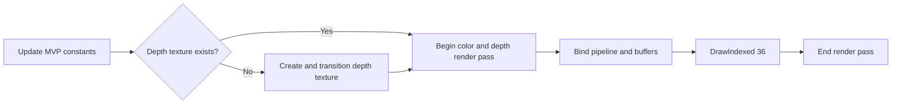

# Spinning Cube

Spinning Cube extends the first graphics workload into three dimensions. It reuses vertex input and a graphics pipeline, then adds indexed geometry, model-view-projection constants, back-face culling, a depth attachment, animation, and size-dependent resource handling.

The guide focuses on the Zenith.NET objects and their lifetime. Matrix construction uses `System.Numerics`; a full derivation of perspective projection is outside the workload boundary.

## Result


The cube rotates around two axes. Back faces are culled, and the depth attachment ensures that nearer fragments hide farther surfaces.

## Frame overview

Initialization uploads eight shared vertices and 36 indices, creates a constant buffer, and builds a depth-enabled pipeline. Per frame:



On resize, the renderer disposes only the depth texture. The next frame recreates it with the new framebuffer dimensions.

## Resource map

| Resource | Usage | Lifetime |
| --- | --- | --- |
| Vertex buffer | Eight cube positions and colors | Renderer |
| Index buffer | Twelve triangles sharing those vertices | Renderer |
| Constant buffer | Model, view, and projection matrices | Renderer; updated each frame |
| Graphics pipeline | Depth-tested indexed drawing | Renderer |
| Depth texture | `D32FloatS8UInt` attachment | Recreated after resize |
| Swap-chain drawable | Color attachment | Host-owned |

The depth format appears in both the pipeline attachment declaration and the texture description. Those values must agree.

## Geometry and indexed drawing

Eight vertices describe the unique corners of the cube. The index buffer selects them to build six faces, two triangles per face:

```csharp
uint[] indices =
[
    0, 1, 2, 0, 2, 3,
    5, 4, 7, 5, 7, 6,
    4, 0, 3, 4, 3, 7,
    1, 5, 6, 1, 6, 2,
    3, 2, 6, 3, 6, 7,
    4, 5, 1, 4, 1, 0
];

vertexBuffer = App.LoadBuffer(vertices, BufferUsages.Vertex);
indexBuffer = App.LoadBuffer(indices, BufferUsages.Index);
```

Using indices avoids duplicating a complete position-and-color record for every triangle corner. The element type is `uint`, so the render method binds it as `IndexFormat.UInt32`.

## Data contract

The Slang constant buffer contains three consecutive matrices:

```slang
struct Constants
{
    float4x4 Model;

    float4x4 View;

    float4x4 Projection;
};

ConstantBuffer<Constants> constants;
```

The C# structure fixes each 64-byte matrix at the corresponding offset:

```csharp
[StructLayout(LayoutKind.Explicit, Size = 192)]
file struct Constants
{
    [FieldOffset(0)]
    public Matrix4x4 Model;

    [FieldOffset(64)]
    public Matrix4x4 View;

    [FieldOffset(128)]
    public Matrix4x4 Projection;
}
```

| Offset | C# | Slang | Size |
| ---: | --- | --- | ---: |
| 0 | `Matrix4x4 Model` | `float4x4 Model` | 64 bytes |
| 64 | `Matrix4x4 View` | `float4x4 View` | 64 bytes |
| 128 | `Matrix4x4 Projection` | `float4x4 Projection` | 64 bytes |

Explicit offsets keep the shared binary contract visible. The total structure size is 192 bytes.

## Transform vertices

The vertex shader composes the three matrices and transforms each position:

```slang
[shader("vertex")]
FSInput VSMain(VSInput input)
{
    float4x4 modelView = mul(constants.Model, constants.View);
    float4x4 mvp = mul(modelView, constants.Projection);

    FSInput output;
    output.Position = mul(float4(input.Position, 1.0), mvp);
    output.Color = input.Color;

    return output;
}
```

`System.Numerics.Matrix4x4` and this shader use the same row-vector order: model, then view, then projection. The fragment shader simply returns the interpolated vertex color.

## Enable depth and culling

The graphics pipeline adds a depth format and enables both back-face culling and depth read/write:

```csharp
pipeline = App.Context.CreateGraphicsPipeline(new()
{
    VertexShader = vertexShader,
    FragmentShader = fragmentShader,
    InputLayouts = [inputLayout],
    PrimitiveTopology = PrimitiveTopology.TriangleList,
    AttachmentFormats = new()
    {
        ColorFormats = [App.ColorFormat],
        DepthStencilFormat = PixelFormat.D32FloatS8UInt,
        SampleCount = SampleCount.Count1
    },
    RenderState = new()
    {
        Rasterizer = RasterizerState.CullBack(),
        DepthStencil = DepthStencilState.DepthReadWrite(),
        Blend = BlendState.Opaque()
    }
});
```

Back-face culling removes triangles whose winding faces away from the camera. Depth testing compares overlapping fragments, while depth writes preserve the nearest accepted value for later triangles.

## Update transformation constants

`Update` advances a frame-rate-independent angle and constructs the three matrices:

```csharp
rotationAngle += (float)deltaTime;

Constants constants = new()
{
    Model = Matrix4x4.CreateRotationY(rotationAngle) * Matrix4x4.CreateRotationX(rotationAngle * 0.5f),
    View = Matrix4x4.CreateLookAt(new(0.0f, 0.0f, 3.0f), Vector3.Zero, Vector3.UnitY),
    Projection = Matrix4x4.CreatePerspectiveFieldOfView(float.DegreesToRadians(45.0f), (float)App.Width / App.Height, 0.1f, 100.0f)
};
```

The framebuffer aspect ratio keeps the projection proportional after a resize. Upload exactly one `Constants` value:

```csharp
constantBuffer.Upload(0, new()
{
    Pointer = (nint)(&constants),
    SizeInBytes = (uint)sizeof(Constants)
});
```

The teaching host waits for each submitted frame, so overwriting this single constant buffer does not race a previous frame. A multi-frame application needs separate per-frame storage or equivalent synchronization.

## Create the depth attachment

The depth texture is created lazily after the window has a valid framebuffer size:

```csharp
if (depthTexture is null)
{
    depthTexture = App.Context.CreateTexture(TextureDesc.DepthStencilAttachment(PixelFormat.D32FloatS8UInt, App.Width, App.Height, SampleCount.Count1));

    commandBuffer.Transition(depthTexture, default, TextureLayout.Undefined, TextureLayout.DepthStencilAttachment);
}
```

The first transition establishes `DepthStencilAttachment` layout. The texture remains in that layout while reused by later frames.

## Record the frame

Begin a render pass with both color and depth attachments, bind all inputs, and issue an indexed draw:

```csharp
commandBuffer.BeginRenderPass([ColorAttachment.Clear(drawable, new(0.04f, 0.055f, 0.075f, 1.0f))], DepthStencilAttachment.Clear(depthTexture, 1.0f, 0));

commandBuffer.SetPipeline(pipeline);
commandBuffer.SetVertexBuffer(vertexBuffer, 0, 0);
commandBuffer.SetIndexBuffer(indexBuffer, 0, IndexFormat.UInt32);
commandBuffer.SetConstantBuffer(constantBuffer, 0);

commandBuffer.DrawIndexed(36, 1, 0, 0, 0);

commandBuffer.EndRenderPass();
```

Depth is cleared to `1.0` for each frame. `DrawIndexed` consumes all 36 indices for one instance, starting at index and vertex offsets zero.

## Resize and lifetime

The depth attachment dimensions must match the drawable. Dispose it on resize and recreate it during the next render:

```csharp
public void Resize(uint width, uint height)
{
    depthTexture?.Dispose();
    depthTexture = null;
}
```

Release the optional depth texture first, then the pipeline and its input resources:

```csharp
public void Dispose()
{
    depthTexture?.Dispose();

    pipeline.Dispose();
    constantBuffer.Dispose();
    indexBuffer.Dispose();
    vertexBuffer.Dispose();
}
```

## Inspect the result

Run the host and select **Spinning Cube**. Confirm that:

- the cube rotates smoothly and hidden surfaces do not bleed through;
- resizing changes the projection without stretching the cube;
- the depth texture is recreated after resize;
- the validation layer reports no attachment-format or layout errors.

If faces disappear unexpectedly, inspect index winding and culling. If distant faces draw over near faces, confirm that the pipeline enables depth read/write and that a depth attachment is supplied to the render pass.

## Explore further

1. Replace `CullBack` with `CullNone` and compare the result.
2. Disable depth testing while leaving the depth attachment present.
3. Change the near and far projection planes and observe depth precision at different distances.
4. Give each face its own vertices and colors to see the tradeoff between shared indices and per-face attributes.

## Complete source

- [SpinningCubeRenderer.cs](https://github.com/qian-o/ZenithTutorials/blob/master/ZenithTutorials/Renderers/SpinningCubeRenderer.cs)
- [SpinningCube.slang](https://github.com/qian-o/ZenithTutorials/blob/master/ZenithTutorials/Assets/Shaders/SpinningCube.slang)

Continue with [Indirect Drawing](indirect-drawing.md) to reuse this depth-tested cube for 25 instances driven by one indirect argument record, or branch to [Compute Shader](compute-shader.md) to produce an image without rasterized geometry.
