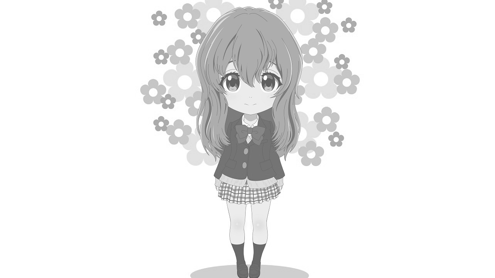

# Compute Shader

In this tutorial, you'll use a compute pipeline to process an image on the GPU — converting it from color to grayscale. This introduces compute shaders, read/write textures, and dispatching work groups.

## Overview

This tutorial covers:

- Creating a **compute pipeline** with thread group configuration
- Using `Texture2D` (read-only) and `RWTexture2D` (read-write) resources
- **Dispatching** compute work groups based on texture dimensions
- Performing **linearize → grayscale → gamma** color conversion
- Copying the processed texture to the frame buffer with centered placement

## The Renderer Class

Create the file `Renderers/ComputeShaderRenderer.cs`:

```csharp
namespace ZenithTutorials.Renderers;

internal class ComputeShaderRenderer : IRenderer
{
    private const uint ThreadGroupSize = 16;

    private const string ShaderSource = """
        Texture2D inputTexture;
        RWTexture2D outputTexture;

        [numthreads(16, 16, 1)]
        void CSMain(uint3 dispatchThreadID: SV_DispatchThreadID)
        {
            uint width, height;
            outputTexture.GetDimensions(width, height);

            if (dispatchThreadID.x >= width || dispatchThreadID.y >= height)
            {
                return;
            }

            float4 color = inputTexture[dispatchThreadID.xy];

            float3 linear = pow(color.rgb, 2.2);
            float gray = dot(linear, float3(0.2126, 0.7152, 0.0722));
            gray = pow(gray, 1.0 / 2.2);

            outputTexture[dispatchThreadID.xy] = float4(gray, gray, gray, color.a);
        }
        """;

    private readonly Texture inputTexture;
    private readonly Texture outputTexture;
    private readonly ResourceLayout resourceLayout;
    private readonly ResourceTable resourceTable;
    private readonly ComputePipeline pipeline;

    private bool processed;

    public ComputeShaderRenderer()
    {
        inputTexture = App.Context.LoadTextureFromFile(Path.Combine(AppContext.BaseDirectory, "Assets", "shoko.png"), generateMipMaps: false);

        outputTexture = App.Context.CreateTexture(new()
        {
            Type = TextureType.Texture2D,
            Format = PixelFormat.B8G8R8A8UNorm,
            Width = inputTexture.Desc.Width,
            Height = inputTexture.Desc.Height,
            Depth = 1,
            MipLevels = 1,
            ArrayLayers = 1,
            SampleCount = SampleCount.Count1,
            Flags = TextureUsageFlags.ShaderResource | TextureUsageFlags.UnorderedAccess
        });

        resourceLayout = App.Context.CreateResourceLayout(new()
        {
            Bindings = BindingHelper.Bindings
            (
                new() { Type = ResourceType.Texture, Count = 1, StageFlags = ShaderStageFlags.Compute },
                new() { Type = ResourceType.TextureReadWrite, Count = 1, StageFlags = ShaderStageFlags.Compute }
            )
        });

        resourceTable = App.Context.CreateResourceTable(new()
        {
            Layout = resourceLayout,
            Resources = [inputTexture, outputTexture]
        });

        using Shader computeShader = App.Context.LoadShaderFromSource(ShaderSource, "CSMain", ShaderStageFlags.Compute);

        pipeline = App.Context.CreateComputePipeline(new()
        {
            Compute = computeShader,
            ResourceLayout = resourceLayout,
            ThreadGroupSizeX = ThreadGroupSize,
            ThreadGroupSizeY = ThreadGroupSize,
            ThreadGroupSizeZ = 1
        });
    }

    public void Update(double deltaTime)
    {
    }

    public void Render()
    {
        CommandBuffer commandBuffer = App.Context.Graphics.CommandBuffer();

        if (!processed)
        {
            uint dispatchX = (inputTexture.Desc.Width + ThreadGroupSize - 1) / ThreadGroupSize;
            uint dispatchY = (inputTexture.Desc.Height + ThreadGroupSize - 1) / ThreadGroupSize;

            commandBuffer.SetPipeline(pipeline);
            commandBuffer.SetResourceTable(resourceTable);
            commandBuffer.Dispatch(dispatchX, dispatchY, 1);

            processed = true;
        }

        Texture colorTarget = App.FrameBuffer.Desc.ColorAttachments[0].Target;

        uint copyWidth = Math.Min(outputTexture.Desc.Width, App.Width);
        uint copyHeight = Math.Min(outputTexture.Desc.Height, App.Height);

        uint srcX = (outputTexture.Desc.Width - copyWidth) / 2;
        uint srcY = (outputTexture.Desc.Height - copyHeight) / 2;
        uint destX = (App.Width - copyWidth) / 2;
        uint destY = (App.Height - copyHeight) / 2;

        commandBuffer.CopyTexture(outputTexture,
                                  default,
                                  new() { X = srcX, Y = srcY, Z = 0 },
                                  colorTarget,
                                  default,
                                  new() { X = destX, Y = destY, Z = 0 },
                                  new() { Width = copyWidth, Height = copyHeight, Depth = 1 });

        commandBuffer.Submit(waitForCompletion: true);
    }

    public void Resize(uint width, uint height)
    {
    }

    public void Dispose()
    {
        pipeline.Dispose();
        resourceTable.Dispose();
        resourceLayout.Dispose();
        outputTexture.Dispose();
        inputTexture.Dispose();
    }
}
```

## Running the Tutorial

Run the application and select **4. Compute Shader** from the menu:

```bash
dotnet run
```

## Result



## Code Breakdown

### Shader

The compute shader processes each pixel independently in 16×16 thread groups:

```csharp
private const string ShaderSource = """
    Texture2D inputTexture;
    RWTexture2D outputTexture;

    [numthreads(16, 16, 1)]
    void CSMain(uint3 dispatchThreadID: SV_DispatchThreadID)
    {
        uint width, height;
        outputTexture.GetDimensions(width, height);

        if (dispatchThreadID.x >= width || dispatchThreadID.y >= height)
        {
            return;
        }

        float4 color = inputTexture[dispatchThreadID.xy];

        float3 linear = pow(color.rgb, 2.2);
        float gray = dot(linear, float3(0.2126, 0.7152, 0.0722));
        gray = pow(gray, 1.0 / 2.2);

        outputTexture[dispatchThreadID.xy] = float4(gray, gray, gray, color.a);
    }
    """;
```

The grayscale conversion follows three steps:

1. **Linearize**: `pow(color.rgb, 2.2)` removes sRGB gamma
2. **Luminance**: `dot(linear, float3(0.2126, 0.7152, 0.0722))` computes perceptual brightness using Rec. 709 coefficients
3. **Re-encode**: `pow(gray, 1.0 / 2.2)` applies gamma correction

### Compute Pipeline

Unlike the graphics pipeline, a compute pipeline has no vertex/pixel stages or render states:

```csharp
pipeline = App.Context.CreateComputePipeline(new()
{
    Compute = computeShader,
    ResourceLayout = resourceLayout,
    ThreadGroupSizeX = ThreadGroupSize,
    ThreadGroupSizeY = ThreadGroupSize,
    ThreadGroupSizeZ = 1
});
```

The thread group size (16×16×1) defines how many threads run per group. This must match the `[numthreads]` attribute in the shader.

### Output Texture

The output texture is created with `UnorderedAccess` to allow compute shader writes:

```csharp
outputTexture = App.Context.CreateTexture(new()
{
    Type = TextureType.Texture2D,
    Format = PixelFormat.B8G8R8A8UNorm,
    Width = inputTexture.Desc.Width,
    Height = inputTexture.Desc.Height,
    Depth = 1,
    MipLevels = 1,
    ArrayLayers = 1,
    SampleCount = SampleCount.Count1,
    Flags = TextureUsageFlags.ShaderResource | TextureUsageFlags.UnorderedAccess
});
```

| Flag | Purpose |
|------|---------|
| `ShaderResource` | Can be read as `Texture2D` in shaders |
| `UnorderedAccess` | Can be written as `RWTexture2D` in compute shaders |

### Dispatch and Copy

The compute shader runs once, then the result is copied centered to the frame buffer each frame:

```csharp
if (!processed)
{
    uint dispatchX = (inputTexture.Desc.Width + ThreadGroupSize - 1) / ThreadGroupSize;
    uint dispatchY = (inputTexture.Desc.Height + ThreadGroupSize - 1) / ThreadGroupSize;

    commandBuffer.SetPipeline(pipeline);
    commandBuffer.SetResourceTable(resourceTable);
    commandBuffer.Dispatch(dispatchX, dispatchY, 1);

    processed = true;
}
```

The dispatch count is computed as `ceil(dimension / threadGroupSize)` to ensure all pixels are covered.

The `CopyTexture` call copies the result centered within the swap chain's color target, handling cases where the image and window have different sizes.

## Next Steps

- [Indirect Drawing](indirect-drawing.md) - Draw multiple instances with GPU-driven indirect commands

## Source Code

> [!TIP]
> View the complete source code on GitHub: [ComputeShaderRenderer.cs](https://github.com/qian-o/ZenithTutorials/blob/master/ZenithTutorials/Renderers/ComputeShaderRenderer.cs)
