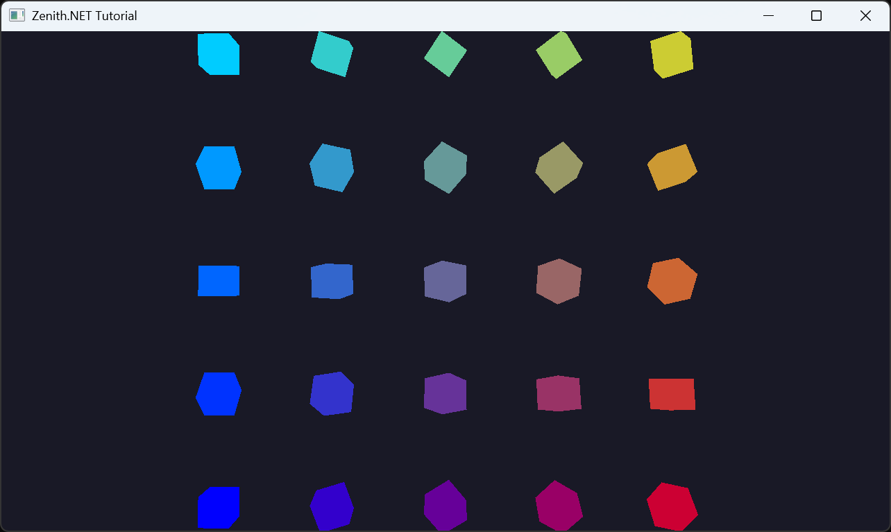

# Indirect Drawing

In this tutorial, you'll render a 5×5 grid of spinning cubes using indirect drawing and GPU instancing. This introduces indirect draw buffers, structured buffers for per-instance data, and shows how to drive draw calls from GPU-accessible memory.

## Overview

This tutorial covers:

- Creating an **indirect draw buffer** with `IndirectDrawIndexedArgs`
- Using a **structured buffer** to store per-instance transforms and colors
- Updating instance data per-frame for independent animations
- Issuing a single `DrawIndexedIndirect` call to render all instances
- Setting up view/projection matrices in `Resize` for window-independent rendering

## The Renderer Class

Create the file `Renderers/IndirectDrawingRenderer.cs`:

```csharp
namespace ZenithTutorials.Renderers;

internal unsafe class IndirectDrawingRenderer : IRenderer
{
    private const int InstanceCount = 25;

    private const string ShaderSource = """
        struct VSInput
        {
            float3 Position : POSITION0;

            float4 Color : COLOR0;

            uint InstanceID : SV_InstanceID;
        };

        struct PSInput
        {
            float4 Position : SV_POSITION;

            float4 Color : COLOR;
        };

        struct Constants
        {
            float4x4 View;

            float4x4 Projection;
        };

        struct Instance
        {
            float4x4 Model;

            float4 Color;
        };

        ConstantBuffer<Constants> constants;
        StructuredBuffer<Instance> instances;

        PSInput VSMain(VSInput input)
        {
            Instance instance = instances[input.InstanceID];

            float4 worldPos = mul(float4(input.Position, 1.0), instance.Model);
            float4 viewPos = mul(worldPos, constants.View);

            PSInput output;
            output.Position = mul(viewPos, constants.Projection);
            output.Color = input.Color * instance.Color;

            return output;
        }

        float4 PSMain(PSInput input) : SV_TARGET
        {
            return input.Color;
        }
        """;

    private static readonly ResourceBinding[] ResourceBindings =
    [
        new() { Type = ResourceType.ConstantBuffer, Count = 1 },
        new() { Type = ResourceType.StructuredBuffer, Count = 1 }
    ];

    private readonly Buffer vertexBuffer;
    private readonly Buffer indexBuffer;
    private readonly Buffer indirectBuffer;
    private readonly Buffer constantsBuffer;
    private readonly Buffer instanceBuffer;
    private readonly ResourceTable resourceTable;
    private readonly GraphicsPipeline pipeline;

    private float rotationAngle;

    public IndirectDrawingRenderer()
    {
        Vertex[] vertices =
        [
            new(new(-0.5f, -0.5f,  0.5f), new(1.0f, 1.0f, 1.0f, 1.0f)),
            new(new( 0.5f, -0.5f,  0.5f), new(1.0f, 1.0f, 1.0f, 1.0f)),
            new(new( 0.5f,  0.5f,  0.5f), new(1.0f, 1.0f, 1.0f, 1.0f)),
            new(new(-0.5f,  0.5f,  0.5f), new(1.0f, 1.0f, 1.0f, 1.0f)),
            new(new(-0.5f, -0.5f, -0.5f), new(1.0f, 1.0f, 1.0f, 1.0f)),
            new(new( 0.5f, -0.5f, -0.5f), new(1.0f, 1.0f, 1.0f, 1.0f)),
            new(new( 0.5f,  0.5f, -0.5f), new(1.0f, 1.0f, 1.0f, 1.0f)),
            new(new(-0.5f,  0.5f, -0.5f), new(1.0f, 1.0f, 1.0f, 1.0f))
        ];

        uint[] indices =
        [
            0, 1, 2, 0, 2, 3,
            5, 4, 7, 5, 7, 6,
            4, 0, 3, 4, 3, 7,
            1, 5, 6, 1, 6, 2,
            3, 2, 6, 3, 6, 7,
            4, 5, 1, 4, 1, 0
        ];

        vertexBuffer = App.Context.CreateBuffer(new()
        {
            SizeInBytes = (uint)(sizeof(Vertex) * vertices.Length),
            StrideInBytes = (uint)sizeof(Vertex),
            Flags = BufferUsageFlags.Vertex | BufferUsageFlags.MapWrite
        });
        vertexBuffer.Upload(vertices, 0);

        indexBuffer = App.Context.CreateBuffer(new()
        {
            SizeInBytes = (uint)(sizeof(uint) * indices.Length),
            StrideInBytes = sizeof(uint),
            Flags = BufferUsageFlags.Index | BufferUsageFlags.MapWrite
        });
        indexBuffer.Upload(indices, 0);

        indirectBuffer = App.Context.CreateBuffer(new()
        {
            SizeInBytes = (uint)sizeof(IndirectDrawIndexedArgs),
            StrideInBytes = (uint)sizeof(IndirectDrawIndexedArgs),
            Flags = BufferUsageFlags.Indirect | BufferUsageFlags.MapWrite
        });

        indirectBuffer.Upload([new IndirectDrawIndexedArgs()
        {
            IndexCount = (uint)indices.Length,
            InstanceCount = InstanceCount,
            FirstIndex = 0,
            VertexOffset = 0,
            FirstInstance = 0
        }], 0);

        constantsBuffer = App.Context.CreateBuffer(new()
        {
            SizeInBytes = (uint)sizeof(Constants),
            StrideInBytes = (uint)sizeof(Constants),
            Flags = BufferUsageFlags.Constant | BufferUsageFlags.MapWrite
        });
        Resize(App.Width, App.Height);

        instanceBuffer = App.Context.CreateBuffer(new()
        {
            SizeInBytes = (uint)(sizeof(Instance) * InstanceCount),
            StrideInBytes = (uint)sizeof(Instance),
            Flags = BufferUsageFlags.ShaderResource | BufferUsageFlags.MapWrite
        });

        resourceTable = App.Context.CreateResourceTable(new() { Bindings = ResourceBindings });
        resourceTable.Write(0, constantsBuffer);
        resourceTable.Write(1, instanceBuffer);

        InputLayout inputLayout = new();
        inputLayout.Add(new() { Format = ElementFormat.Float3, Semantic = ElementSemantic.Position });
        inputLayout.Add(new() { Format = ElementFormat.Float4, Semantic = ElementSemantic.Color });

        using Shader vertexShader = App.Context.LoadShaderFromSource(ShaderSource, "VSMain", ShaderStageFlags.Vertex);
        using Shader pixelShader = App.Context.LoadShaderFromSource(ShaderSource, "PSMain", ShaderStageFlags.Pixel);

        pipeline = App.Context.CreateGraphicsPipeline(new()
        {
            RenderStates = new()
            {
                RasterizerState = RasterizerStates.CullBack,
                DepthStencilState = DepthStencilStates.Default,
                BlendState = BlendStates.Opaque
            },
            Vertex = vertexShader,
            Pixel = pixelShader,
            ResourceBindings = ResourceBindings,
            InputLayouts = [inputLayout],
            PrimitiveTopology = PrimitiveTopology.TriangleList,
            Output = App.FrameBuffer.Output
        });
    }

    public void Update(double deltaTime)
    {
        rotationAngle += (float)deltaTime;

        Instance[] instances = new Instance[InstanceCount];

        int index = 0;
        int gridSize = (int)Math.Sqrt(InstanceCount);

        for (int y = 0; y < gridSize; y++)
        {
            for (int x = 0; x < gridSize; x++)
            {
                float offsetX = (x - (gridSize / 2)) * 1.5f;
                float offsetY = (y - (gridSize / 2)) * 1.5f;
                float rotation = rotationAngle * (1.0f + (index * 0.1f));

                instances[index] = new()
                {
                    Model = Matrix4x4.CreateScale(0.4f)
                            * Matrix4x4.CreateRotationY(rotation)
                            * Matrix4x4.CreateRotationX(rotation * 0.5f)
                            * Matrix4x4.CreateTranslation(offsetX, offsetY, 0),
                    Color = new((float)x / gridSize, (float)y / gridSize, 1.0f - ((float)x / gridSize), 1.0f)
                };

                index++;
            }
        }

        instanceBuffer.Upload(instances, 0);
    }

    public void Render()
    {
        CommandBuffer commandBuffer = App.Context.Graphics.CommandBuffer();

        commandBuffer.BeginRenderPass(App.FrameBuffer, new()
        {
            ColorValues = [new(0.1f, 0.1f, 0.15f, 1.0f)],
            Depth = 1.0f,
            Stencil = 0,
            Flags = ClearFlags.All
        }, resourceTable);

        commandBuffer.SetPipeline(pipeline);
        commandBuffer.SetResourceTable(resourceTable);
        commandBuffer.SetVertexBuffer(vertexBuffer, 0, 0);
        commandBuffer.SetIndexBuffer(indexBuffer, 0, IndexFormat.UInt32);
        commandBuffer.DrawIndexedIndirect(indirectBuffer, 0, 1);

        commandBuffer.EndRenderPass();

        commandBuffer.Submit(waitForCompletion: true);
    }

    public void Resize(uint width, uint height)
    {
        Matrix4x4 view = Matrix4x4.CreateLookAt(new(0, 0, 8), Vector3.Zero, Vector3.UnitY);
        Matrix4x4 projection = Matrix4x4.CreatePerspectiveFieldOfView(float.DegreesToRadians(45.0f), (float)width / height, 0.1f, 100.0f);

        constantsBuffer.Upload([new Constants() { View = view, Projection = projection }], 0);
    }

    public void Dispose()
    {
        pipeline.Dispose();
        resourceTable.Dispose();
        instanceBuffer.Dispose();
        constantsBuffer.Dispose();
        indirectBuffer.Dispose();
        indexBuffer.Dispose();
        vertexBuffer.Dispose();
    }
}

[StructLayout(LayoutKind.Sequential)]
file struct Vertex(Vector3 position, Vector4 color)
{
    public Vector3 Position = position;

    public Vector4 Color = color;
}

[StructLayout(LayoutKind.Explicit, Size = 128)]
file struct Constants
{
    [FieldOffset(0)]
    public Matrix4x4 View;

    [FieldOffset(64)]
    public Matrix4x4 Projection;
}

[StructLayout(LayoutKind.Explicit, Size = 80)]
file struct Instance
{
    [FieldOffset(0)]
    public Matrix4x4 Model;

    [FieldOffset(64)]
    public Vector4 Color;
}
```

## Running the Tutorial

Run the application and select **5. Indirect Drawing** from the menu:

```bash
dotnet run
```

## Result



## Code Breakdown

### Shader

The vertex shader reads per-instance data from a `StructuredBuffer`:

```csharp
ConstantBuffer<Constants> constants;
StructuredBuffer<Instance> instances;

PSInput VSMain(VSInput input)
{
    Instance instance = instances[input.InstanceID];

    float4 worldPos = mul(float4(input.Position, 1.0), instance.Model);
    float4 viewPos = mul(worldPos, constants.View);

    PSInput output;
    output.Position = mul(viewPos, constants.Projection);
    output.Color = input.Color * instance.Color;

    return output;
}
```

`SV_InstanceID` provides the instance index, used to look up the per-instance model matrix and color from the structured buffer.

### Indirect Draw Buffer

The draw arguments are stored in a GPU buffer instead of being passed as CPU parameters:

```csharp
indirectBuffer = App.Context.CreateBuffer(new()
{
    SizeInBytes = (uint)sizeof(IndirectDrawIndexedArgs),
    StrideInBytes = (uint)sizeof(IndirectDrawIndexedArgs),
    Flags = BufferUsageFlags.Indirect | BufferUsageFlags.MapWrite
});

indirectBuffer.Upload([new IndirectDrawIndexedArgs()
{
    IndexCount = (uint)indices.Length,
    InstanceCount = InstanceCount,
    FirstIndex = 0,
    VertexOffset = 0,
    FirstInstance = 0
}], 0);
```

`IndirectDrawIndexedArgs` mirrors the standard GPU indirect draw structure. Using `DrawIndexedIndirect` instead of `DrawIndexed` allows the GPU to read draw parameters from a buffer, enabling GPU-driven rendering scenarios.

### Structured Buffer

Per-instance data (model matrix + color) is uploaded to a structured buffer each frame:

```csharp
instanceBuffer = App.Context.CreateBuffer(new()
{
    SizeInBytes = (uint)(sizeof(Instance) * InstanceCount),
    StrideInBytes = (uint)sizeof(Instance),
    Flags = BufferUsageFlags.ShaderResource | BufferUsageFlags.MapWrite
});
```

The `Instance` struct is 80 bytes — a 64-byte `Matrix4x4` plus a 16-byte `Vector4`:

```csharp
[StructLayout(LayoutKind.Explicit, Size = 80)]
file struct Instance
{
    [FieldOffset(0)]
    public Matrix4x4 Model;

    [FieldOffset(64)]
    public Vector4 Color;
}
```

### Per-Instance Animation

Each cube gets a unique rotation speed and color based on its grid position:

```csharp
instances[index] = new()
{
    Model = Matrix4x4.CreateScale(0.4f)
            * Matrix4x4.CreateRotationY(rotation)
            * Matrix4x4.CreateRotationX(rotation * 0.5f)
            * Matrix4x4.CreateTranslation(offsetX, offsetY, 0),
    Color = new((float)x / gridSize, (float)y / gridSize, 1.0f - ((float)x / gridSize), 1.0f)
};
```

### View/Projection in Resize

View and projection matrices are set in `Resize` rather than `Update`, since the camera is static and only the aspect ratio changes:

```csharp
public void Resize(uint width, uint height)
{
    Matrix4x4 view = Matrix4x4.CreateLookAt(new(0, 0, 8), Vector3.Zero, Vector3.UnitY);
    Matrix4x4 projection = Matrix4x4.CreatePerspectiveFieldOfView(float.DegreesToRadians(45.0f), (float)width / height, 0.1f, 100.0f);

    constantsBuffer.Upload([new Constants() { View = view, Projection = projection }], 0);
}
```

## Next Steps

- [Ray Tracing](../advanced/ray-tracing.md) - Cast rays with hardware acceleration structures

## Source Code

> [!TIP]
> View the complete source code on GitHub: [IndirectDrawingRenderer.cs](https://github.com/qian-o/ZenithTutorials/blob/master/ZenithTutorials/Renderers/IndirectDrawingRenderer.cs)
