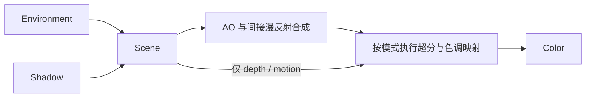

# Sponza 超分展示实验开发文档

**状态：v1.0 已封板（2026-09-06）。** 本文作为本轮开发基线；封板确认目标、架构、执行边界与验收标准，不代表代码、画质或跨平台运行已经验收。后续按第 1 节区分自主调优与需用户决定的方案变更，不能自行改写基线来扩大授权。

## 1. 目标与边界

做一个画质出色、复杂度适中、Pass 耦合低的 Sponza 光栅化 PBR 场景，用来展示 Zenith.NET 的空间和时域超分。材质、阳光、环境反射与程序化天空应有良好观感，并提供丰富的纹理、边缘和运动细节。无需严格物理真实，但不能用模糊、过曝或过强后期掩盖问题。

按画质收益、实现成本和依赖数量选择效果，不限制必须只有四个 Pass。本轮完成前向 PBR、稳定的过滤阴影、程序化天空与预过滤环境镜面、接触 AO、色调映射和三种超分路径。每个模块职责单一，允许内部有少量绘制/计算步骤，外部依赖必须明确且单向。

禁止光追。本轮不扩展到 CSM/PCSS、局部反射探针、实时 GI、SSR、体积雾、Bloom 或独立 TAA；先把所选效果和超分做完整。效果是否成功由实际截图、运动稳定性与 GPU 耗时判断，文档不承诺画质上限或未经验证的平台支持。

保留现有实验结构和调用方式：

- `RenderSettings` 是普通结构体，Renderer 通过 `public RenderSettings Settings;` 持有，由 App 初始化并直接编辑。
- 控件继续放在 App 的 `ImGuiHelper.Settings(Action)` 回调中；不修改 ImGuiHelper、CameraHandler、窗口、输入、交换链和提交逻辑。
- 保留 Color 的直接绑定，以及现有 `renderer.Update(camera)` / `Render(commandBuffer)` / `Resize(width, height)` 调用位置和签名。
- 保留 App 初值 `RenderScale=1`、`UpscalingMode=None`、`TimeOfDay=12`。不修改原始资产或共享框架，不为本实验复制或重写整套超分算法。

**Agent 执行边界：以下约束优先于后文所有效果和验收要求。**

| 项目 | 强制约束 |
| --- | --- |
| 可修改范围 | 仅本实验的 Renderer.cs、Models/、Passes/、Assets/Shaders/、必要的新增 Helpers 和文档；新建文件可在后续阶段继续修改，可删除 Pass/Shader 占位文件。App.cs 仅可调整现有 Settings 回调中的约定控件和统计显示；本设计基线的修订遵循封板规则 |
| 只读范围 | 封板时已有的 Helpers/CocoaHelper.cs、Helpers/ImGuiHelper.cs、Handlers/CameraHandler.cs、Handlers/ImGuiHandler.cs、Program.cs、原始模型/字体，以及实验目录外的所有代码；包括 RHI、各后端、共享扩展和其他实验。项目文件、依赖与构建配置也不得修改 |
| 统一路径 | 新增 C# 与 Slang 使用同一套公共 RHI 路径；禁止按图形 API、OS、设备或厂商选择不同算法、格式、资源或 shader，禁止相应条件编译。保留 App 既有平台初始化；可将 `Context.GraphicsApi` 传给现有 `ZenithCompiler`，不能自行分支或替换编译链 |
| 禁止旁路 | 仅调用现有 RHI/扩展的公共功能入口；禁止原生图形 API/句柄互操作、后端类型强转、反射、P/Invoke、复制后端或扩展实现来补能力。即使 RHI 公开了 `GetNativeObject` 或原生纹理导入接口，本实验也不得使用 |
| 固定依赖 | 不新增、升级、替换包或项目引用，不通过 DLL、第三方源码、外部工具或脚本引入替代运行能力。已有传递依赖不等于获准直接调用；模型和图片只走第 2 节指定入口 |

Agent 可在上述范围内自主实现、调参和验证。正文的阴影/环境分辨率、效果采样数、曝光、bias、AO 半径和强度是调优起点；保持算法、数据契约及适中复杂度，可根据实测共同调整并记录最终值，三模式对比时固定同一组画质参数。无需为实现细节或这类调参逐项询问。

新增/删除效果、改变 Pass 职责与依赖或公共数据语义、扩大修改/平台/依赖边界，须先提出具体方案由用户决定。开始每阶段前核对实际公共 API；若接口缺失、共享实现有缺陷或平台不支持，停止该受阻项，报告目标、缺口和最小复现，继续独立可做部分。不得自行修框架、加兼容分支、换库或静默关闭功能后宣称完成；平台差异不能搬进实验代码。

每阶段结束审查实际 diff：修改路径、依赖/命名空间、新增平台判断和 shader 条件编译均需符合本节；最后单独报告未完成项。此文档是执行契约，不能代替文件权限隔离或实际 diff 审查。

当前设置和模型已经到位，Renderer/Pass/Shader 仍是骨架。以下是待开发规格，不能把资产存在或 C# 编译成功当作渲染已完成。

## 2. 使用当前模型

从 `Path.Combine(AppContext.BaseDirectory, "Assets", "Models", "Sponza.gltf")` 加载，模型与 accessor 由现有 SharpGLTF.Core 读取，bin 和贴图按 glTF 相对 URI 定位，不另写 glTF 解析器。图片统一调用 `Zenith.NET.Extensions.ImageSharp` 的 `LoadTextureFromFile` / `LoadTextureFromStream`，沿用扩展的解码、上传与 mip 处理；禁止实验直接调用 `SixLabors.ImageSharp` 或其他图像库，也不自制解码、预转换或替代加载链。

当前模型有 103 个 primitive、25 个材质，引用 65 张图像。只保留这些会影响实现的约定：

- 根节点 scale 约为 `0.008`，只应用一次；处理后场景约为 `30 × 12 × 18 m`。沿用 App 的现有相机，阴影和光照使用变换后的世界坐标。
- 按 primitive 建立绘制记录并保留材质索引；输入索引是 UInt16，合并缓冲区时正确处理局部索引或 baseVertex。通过 accessor 接口读取，不能假定 buffer 紧密排列。
- 保留原有 NORMAL/TANGENT/UV。`plain_white` 没有法线贴图，其 primitive 缺少切线，可以直接使用几何法线。
- 当前三个 MASK 材质为 `ivy_leaves`、`flowers_and_leaves`、`hanging_chain`，均为双面、cutoff=0.5；其余为 OPAQUE，没有 BLEND。
- baseColorFactor 约为 `(0.588, 0.588, 0.588, 1)`，需要保留。按 glTF 默认值补齐缺失参数；`plain_white` 的 metallicFactor=0。当前没有 AO 或 emissive 贴图，不从其他通道猜测。
- base color 是 sRGB 数据，进入 PBR 前转为线性，alpha 不做 gamma 转换；normal/metallic-roughness 是线性数据，roughness 在 G、metallic 在 B，法线采样后归一化。当前加载扩展固定返回 `R8G8B8A8UNorm`，本轮在通用材质 shader 中转换 base color，接受其现有过滤/mip 的近似并记录画质限制；不要求线性空间重建 mip 或按材质改造加载器。若新增 TextureHelper，只封装 URI、缓存与公开参数。
- 只加载 glTF 实际引用的图像并缓存复用。模型更新后目录中可能保留旧贴图，不能扫描整个目录或靠文件名猜材质映射。

数量和材质名称用于当前资产核对，不写死到加载器。来源记录简要放入最终 README，只填写可核实的信息。

## 3. 职责、数据流与画质方案

下表是本轮六个职责模块的划分；一个逻辑 Pass 可以包含几个固定的 GPU 子步骤。无需通用 Pass 基类、RenderGraph 或依赖注入框架。

| Pass | 显式输入 | 输出 / 更新时机 |
| --- | --- | --- |
| `EnvironmentPass` | 太阳/天空参数 | 预过滤环境 cubemap；首次及天空参数变化时更新 |
| `ShadowPass` | 场景绘制数据、太阳参数 | 阴影图和光照矩阵；首次及太阳/场景变化时更新 |
| `ScenePass` | 场景、相机帧数据、阴影数据、环境数据 | HDR、IndirectDiffuse、DeviceDepth、EncodedMotion；每帧 |
| `AmbientOcclusionPass` | HDR、IndirectDiffuse、DeviceDepth、相机帧数据 | 合成 AO 后的新 HDR；内部完成求解、滤波、合成，无历史 |
| `ToneMappingPass` | HDR、曝光 | 编码后的 LDR；每帧 |
| `UpscalingPass` | 颜色、输入/输出尺寸，Temporal 另需 depth/motion/帧数据 | 放大结果；只封装现有扩展和 None 双线性输出 |



Renderer 统一准备只读的 `FrameData`、太阳参数和资源记录，并显式传给 Pass。Pass 不持有或调用其他 Pass，不读取其他 Pass 的私有状态，不自行访问或修改 `renderer.Settings`。每帧使用同一份参数快照；只有 Renderer 管理帧序号、jitter 和上一帧相机，只有现有 Temporal 扩展保有重建历史。

文件继续放在 `Models/`、`Passes/`、`Helpers/`、`Assets/Shaders/`；新增数据结构只表达实际输入输出。Renderer 持有 Color、场景和 Pass，资源由创建者释放，输出只借给下游使用。跨 Pass 的纹理以 Sampled 布局交接，各 Pass 负责本次读写和内部子步骤的转换。PBR、天空和 MASK 裁剪使用共享 Slang 函数。

**阴影与直射光。** 对约 30 m 的静态场景使用单张 4096² 正交深度图，以世界 AABB 拟合视锥并留边界；固定光照时不跟随相机。采用固定 5×5 PCF、少量 slope/normal bias，处理太阳接近参考 up 向量时的退化。与 Scene 共用 alpha cutoff，双面材质保持一致；分辨率和滤波核在超分对比中固定。目标是稳定、清楚且边缘柔和的阴影，不追求距离相关半影。

**天空与环境光。** 同一个程序化天空函数包含天顶/地平线渐变、近地薄霾感、太阳盘和光晕，TimeOfDay=6..18 同时控制方向、颜色与亮度。Renderer 生成同一份太阳/天空参数给三个相关 Pass；Scene 直接绘制天空，不因相机移动重建环境图，也不做云动画或大气散射系统。

EnvironmentPass 直接对天空函数做 GGX 重要性采样，生成 128²、完整 roughness mip 的 HDR cubemap；每个 mip 独立求值，无源天空图和多级预计算依赖。以 128 个确定性样本起步，mip 0 直接求值，按 `roughness = mip / (mipCount - 1)` 对应运行时 LOD。通过现有 RHI 的 cube、逐面/逐 mip 颜色附件绘制；同一帧更新完整结果再供 Scene 使用，预过滤排除锐利太阳盘。它是 GPU 程序化渲染资源，不是替代图片加载器生成的材质 mip。

环境漫反射保留天空/地面半球近似；环境镜面使用预过滤 cube 和解析环境 BRDF，避免再建设 irradiance cube、BRDF LUT 或局部探针。解析近似依据 [Epic 的环境 BRDF 说明](https://www.unrealengine.com/blog/physically-based-shading-on-mobile)，只参考算法，不引入引擎代码或依赖。此方案没有室内局部反射和真实间接遮挡，环境强度应克制。

**PBR 与材质。** 使用 GGX、Smith visibility、Schlick Fresnel 的 metallic-roughness 模型；roughness 的材质值与 GGX 参数平方关系保持一致，设置很小的数值下限避免奇点。正确处理 TBN、tangent.w、双面法线与 glTF 因子，石材/布料/金属应有明显区别。纹理采样状态三模式一致；先用现有线性 mip 采样完成基线，再在公共能力内统一调整。

**接触 AO。** 用半 R 尺寸、固定 12 样本的 SSAO 加强柱脚、墙角和接缝，初始半径约 0.3 m，强度保守。以当前含 jitter 的逆投影从 device depth 重建 view position；横纵轴分别选 view depth 更连续的单侧差分，并统一叉乘朝向以重建几何法线，不增加 normal MRT。深度生成法线的可行路径可参考 [GPUOpen 的说明](https://gpuopen.com/manuals/fidelityfx_sdk/techniques/combined-adaptive-compute-ambient-occlusion/)，本实验自行实现上述小型 SSAO，不接入 CACAO 或复制其管线。

AO 内部固定为求解、一次深度感知滤波、合成三个步骤；使用确定性采样、边界检查和距离衰减，背景 AO=1，合成时按全分辨率深度引导上采样。仅衰减间接漫反射：`result = HDR - IndirectDiffuse * (1 - AO)`；天空的 IndirectDiffuse=0，太阳和镜面不被乘黑。无深度金字塔、额外几何预通道或 AO 时域去噪。接受屏外遮挡缺失的近似，重点检查薄叶、柱边光晕和运动稳定性。

**色调映射。** 线性 HDR 乘固定曝光，采用 ACES fitted 近似，最后只做一次 sRGB 编码。先调好太阳/环境比例，再调曝光，避免用曝光补偿错误的颜色空间或材质。三种模式共用相同设置。

## 4. 超分接入是主线

| 模式 | 顺序 | 定位 |
| --- | --- | --- |
| None | AO 合成 HDR → ToneMapping → 必要时双线性放大 → Color | scale=1 为原生对照，低 scale 为双线性基线 |
| Spatial | AO 合成 HDR → ToneMapping → SGSR 1 → Color | 与相同 scale 的 None 比较空间重建效果 |
| Temporal | AO 合成 HDR + Scene depth/motion → SGSR 2 Quality → ToneMapping → Color | 同时提供时域抗锯齿与放大；scale=1 也可对照 |

SGSR 1 的现有 shader 有 0..1 clamp，因此放在 LDR 阶段；SGSR 2 接收 HDR，在色调映射之前执行。None/Spatial 不加 jitter 或 FXAA，Temporal 不叠加另一套 TAA。这样模式差异来自相应重建路径，而不是额外后期。

使用 `CreateSpatialUpscaler` / `CreateTemporalUpscaler`，Temporal 选择 `TemporalUpscalerMode.Quality`。以本地 `sources/Extensions/Zenith.NET.Extensions.Upscaling/` 下的 Args、Desc 和 Slang 为准；Desc 尺寸改变时重建实例。

时域输入必须正确：

| 输入 | 约定 |
| --- | --- |
| Input / OpaqueInput | 当前无 BLEND，两者使用同一张 AO 合成后的线性 HDR 纹理，无需额外复制 |
| Depth | 普通 device depth：near=0、far=1；不传线性米深度或 reversed-Z |
| MotionVectors | 当前到上一渲染帧的运动，按现有 SGSR shader 编码，不能直接填原始 UV velocity |
| JitterOffsetX/Y | 当前帧输入像素单位偏移；与实际投影一致 |
| PreExposure | 本轮固定为 1，曝光在 ToneMapping 中处理 |
| CameraFovAngleHor | 实际为 `tan(fovYRadians / 2) * projectionAspect`，即水平半视角的正切；aspect 使用实际投影比例，不传角度值 |
| MinLerpContribution / SameCamera | 当前 Quality shader 未使用这两个字段；前者显式设 0，后者按未 jitter 的相机是否静止填写 |
| Reset | 首帧与历史不兼容时为 true；当前 Quality 路径会使用此字段 |

ScenePass 直接写编码后的 motion，不额外增加打包 Pass。定义 `motion = currentUnjitteredNdc.xy - previousUnjitteredNdc.xy`，按当前解码函数的逆编码：`encoded = motion * 0.2495 + 32767.0 / 65535.0`。有效静止表面编码约为 0.5，不是 0；背景天空输出只含相机旋转的 motion。使用 `R16G16UNorm` 保存编码，避免 RG16F 在 0.5 偏置附近损失亚像素精度；超出可编码范围时使用矩阵回退，不能依赖 UNorm 饱和后的错误运动。

重投影检查应满足 `previousUv = currentUv + (-0.5 * motion.x, 0.5 * motion.y)`。使用 Halton(2,3) 的 8 帧序列减 0.5，投影 NDC 偏移为 `(2*jx/renderWidth, -2*jy/renderHeight)`。每个实际渲染帧只推进一次序列和上一帧矩阵，不能在未渲染的 Update 中推进。

优先显式提供几何和天空的 motion；零编码会触发扩展的矩阵回退。若需要回退，令 C/P 为当前/上一帧未 jitter 的 ViewProjection，J 为当前 clip jitter，`ClipToPrevClip = inverse(C * J) * (P * J)`，使静止相机的回退运动也为零。FOV 字段含义见 [SGSR 2 参数约定](https://github.com/SnapdragonGameStudios/snapdragon-gsr/tree/main/sgsr/v2#uniform-buffer-considerations)；本实验仍以本地 shader 的坐标与字段使用为准，不照搬外部的后端分支。

首次使用、尺寸/模式改变、相机 cut、FOV 变化、时间大幅调整时重置历史；普通连续移动不重置。切回 None/Spatial 时恢复无 jitter 投影。

**已知共享扩展风险：** 当前 Quality shader 无 dispatch 尺寸 guard，且存在边缘 `Load(pos + 1)`；history/luma 首次仅转换布局，Reset 路径仍会读取历史。非 8 倍数尺寸的越界 invocation、边缘采样和首帧历史均须实际验证，不能假设尺寸对齐或 Reset 已解决。若出现错误或无法确认正确性，按第 1 节报告受阻项，不复制/修改 SGSR、不添加平台分支，也不通过暗改 R/D 尺寸或跳过验收掩盖问题。

## 5. 必须保持的数据与生命周期约定

- 输出尺寸 D 使用 framebuffer 像素，内部尺寸 R 为 `max(1, floor(D * RenderScale))`，宽高分别计算；Color 始终为 D。相机比例使用输出比例，UI 使用逻辑尺寸。
- C# 与 Slang 沿用 row-major、行向量：`ViewProjection = View * Projection`，shader 使用 `mul(position, matrix)`；普通 Z、clear=1、LessEqual。GPU 常量显式对齐，不额外转置矩阵。
- ScenePass 的 R 尺寸 MRT 为 HDR `RGBA16F`、IndirectDiffuse `RGBA16F`、DeviceDepth `R32Float`、EncodedMotion `R16G16UNorm`，另有硬件深度附件。IndirectDiffuse 是已乘材质系数的线性间接漫反射，已包含在 HDR 中。天空写 depth=1、旋转 motion、IndirectDiffuse=0，所有输入首帧有效。
- AO 中间图为 `R16Float`、尺寸 `max(1, ceil(R/2))`，合成输出为另一张 R 尺寸 `RGBA16F`；不原地修改输入 HDR。环境 cube 使用 `RGBA16F`，阴影使用 `D32Float`；这两类资源独立于 RenderScale 和窗口尺寸，缓存失效只由相关场景/天空数据决定。
- `Color` 为 `R8G8B8A8UNorm`、已编码的 LDR。保持现有 `ImGuiColorSpace.Legacy` 和 UNorm 交换链，避免重复 gamma。Temporal 的中间输出为 D 尺寸 RGBA16F。
- Renderer 构造时 App 尚未通过对象初始化器赋值 Settings。构造先创建 D 尺寸 Color；首个 `Update(camera)` 才依据有效 Settings 创建 R 资源/upscaler。不加空 Color 判断，不移动 App 的 Binding/Update。
- Scale 变化只重建内部资源和 upscaler；Color 仅随输出尺寸改变。保持原有 Resize 入口，确保旧资源仍被 UI/GPU 引用时不会提前销毁。最小化期间不推进渲染历史。
- 保留 App 的单队列 `Submit().Wait()`；帧内 Pass 不自行提交/等待，已有加载扩展保留其内部流程。显式处理实际 layout、逐 mip/layer 转换和写后读依赖，不采样未初始化资源，不在同一子资源上边读边写。纹理及视图随 Resize/Dispose 正确释放。

## 6. 如何展示超分

先保留现有三个控件：RenderScale、UpscalingMode、TimeOfDay。曝光、环境光、阴影和 AO 先在实现中调好，不铺设高级面板。App 的现有 Settings 回调增加实际输入/输出尺寸、模式、场景总计（含超分）和超分 GPU 耗时即可；UI 值必须对应当前实际生效的资源与模式。

展示固定一组相机和光照，对比：

1. `None + scale=1`：原生分辨率对照。
2. `None + scale=0.5/0.75`：相同低分辨率输入的双线性基线。
3. `Spatial + 相同 scale`：观察纹理与边缘重建。
4. `Temporal + 相同 scale`：观察细节稳定性、运动和新显露区域；另测 scale=1 以区分抗锯齿与放大的收益。

选择栏杆/细柱、叶片镂空、布料纹理三个观察区域，另用墙角/柱脚检查 AO，用不同粗糙度的表面检查环境反射。超分对比固定曝光、材质采样、环境图、阴影质量和 AO 的世界半径/样本数；AO 分辨率随 R 变化应明确记录。不针对某个模式额外锐化或更换光照。原生图只是对照，不当作无锯齿的像素级真值。

静态截图等待时域至少稳定 32 帧；再检查缓慢平移、快速转头和停止后的收敛。截图可按需读取 Color 或使用外部截图工具，不必开发分屏双渲染、录制回放或对比编辑器。

计时预热至少 60 帧，记录至少 120 帧平均 GPU 时间。使用同一队列的 timestamp 和 `GetElapsedNanoseconds`，在有效的渲染/计算作用域内写入，上一帧完成后读取并检查结果有效性；不能按后端改变计时路径，也不能用受 VSync 限制的 FPS 代替 GPU 收益。记录设备/API、D/R、模式及 AO/超分/场景总耗时；排除 ImGui 和等待时间。静态比较中缓存策略一致，环境/阴影重建的时间单独记录，不混入稳定帧平均值或隐瞒时间切换卡顿。

## 7. 开发顺序与完成标准

| 阶段 | 工作 | 通过条件 |
| --- | --- | --- |
| 0. 能力核对 | 只读核对 RHI/扩展入口、加载路径与第 1 节修改范围 | 明确 MRT、cube 逐面/mip 附件、采样和计时的现有入口；记录第 4 节已知风险，枚举存在不代表平台已验证 |
| 1. 场景与空间超分基线 | 资产、Scene/ToneMapping、Color、None 双线性与 SGSR 1 | 材质、比例、MASK 正确；0.5/0.75/1 均铺满输出，控件真实生效 |
| 2. 时域超分闭环 | motion、jitter、SGSR 2、history reset | 静态稳定，移动/新显露区域无持续拖影，切模式/尺寸不闪黑；此时再完善画质 |
| 3. 光照与环境 | Shadow、天空、Environment 预过滤及 PBR 调整 | 阴影稳定，cube 无接缝，粗糙度变化合理，时间切换同步；相机移动不触发环境/阴影重建 |
| 4. 接触层次 | AO、滤波与间接漫反射合成 | 柱脚/墙角改善，太阳和镜面亮度不被 AO 压暗，薄叶/柱边无明显光晕，三模式运动稳定 |
| 5. 展示验证 | 固定画质参数，截图、GPU 计时、生命周期与边界审查 | 能说明画质变化、效果成本及超分收益，提交可运行实验及简短 README |

按表顺序推进，临时直射/半球环境基线可用于先验证超分，但完整交付必须包含第 3、4 阶段。新增效果先在 None 下验证，再回归 Spatial/Temporal；用同镜头前后截图和耗时判断收益，先调整现有效果，新增效果或改变约定按第 1 节处理。

每阶段构建并执行对应运行检查，审查修改路径和调用入口。最终覆盖三模式、scale=0.5/0.75/1、奇数尺寸、连续 Resize、最小化恢复和时间切换；无越界、NaN、资源泄漏或失效句柄。对矩阵、motion、AO 重建/合成和缓存失效做针对性验证；motion 至少回读验证静止、±0.25 和 ±1 像素位移的编码精度，不建设庞大的测试或基准框架。

从仓库根目录构建和运行：

```sh
dotnet build sources/Experiments/Sponza/Sponza.csproj -c Release
dotnet run --project sources/Experiments/Sponza/Sponza.csproj -c Release --no-build
```

最终 README 只需说明运行方式、控制项、渲染/超分顺序、代表性截图、实测耗时、已知画质限制和未验证平台。同一实现按可用设备分别验证 D3D12/Metal/Vulkan；未运行的平台明确注明，差异或失败按第 1 节处理，不增加平台专用修复。代码能编译、模型已入库或某个模式只有界面选项，都不能当作整个实验完成。
