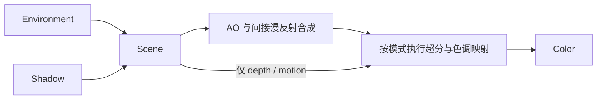

# Sponza 超分展示实验开发文档

**状态：v1.2 开发基线，替代 v1.1。** 本轮只开发渲染和完善既有 UI 内的展示；窗口、输入、相机与操作功能已经完成。文档规定工作边界、代码与数据设计和验收要求，不代表实际画质或跨平台运行已通过验收。

## 1. 目标与边界

做一个画质出色、复杂度适中、Pass 耦合低的 Sponza 光栅化 PBR 场景，用来展示 Zenith.NET 的空间和时域超分。材质、阳光、环境反射与程序化天空应有良好观感，并提供丰富的纹理、边缘和运动细节。无需严格物理真实，但不能用模糊、过曝或过强后期掩盖问题。

本轮完成前向 PBR、稳定的过滤阴影、程序化天空与预过滤环境镜面、接触 AO、色调映射和三种超分路径。每个模块职责单一，允许内部有少量绘制/计算步骤，外部依赖明确且单向。先在原生分辨率证明材质和光照合格，再比较超分；不能用算法名称、Pass 数量或编译成功代替画质验收。

禁止光追。本轮不扩展到 CSM/PCSS、局部反射探针、实时 GI、SSR、体积雾、Bloom 或独立 TAA；先把所选效果和超分做完整。效果是否成功由实际画面、运动稳定性与 GPU 耗时判断，文档不承诺画质上限或未经验证的平台支持。

保留现有实验结构和调用方式：

- `RenderSettings` 是普通结构体，Renderer 通过 `public RenderSettings Settings;` 持有，由 App 初始化并直接编辑。
- 现有三个控件已经完成，其范围、默认值、绑定和行为保持原样；App 的 `ImGuiHelper.Settings(Action)` 回调末尾只可追加约定的只读统计。
- 保留 Color 的直接绑定，以及现有 `renderer.Update(camera)` / `Render(commandBuffer)` / `Resize(width, height)` 调用位置和签名。
- 保留 App 初值 `RenderScale=1`、`UpscalingMode=None`、`TimeOfDay=12`。不修改原始资产或共享框架，不为本实验复制或重写整套超分算法。

**Agent 执行边界：以下约束优先于后文所有效果和验收要求。**

| 项目 | 强制约束 |
| --- | --- |
| 可修改范围 | 仅本实验的 Renderer.cs、Passes/、Assets/Shaders/、新增的渲染 Models/Helpers；可删除 Pass/Shader 占位文件，新建文件后续仍可编辑。App.cs 的唯一例外是上述只读统计追加 |
| 文件边界 | 仓库内只添加实验运行所需的实现文件，不新增临时测试项目、探针、验证脚本、额外文档/README、报告、日志、截图归档目录或其他过程产物。现有 DEVELOPMENT.md 是已授权的开发文档；验证结果、问题和完成情况直接在对话中说明，不落成仓库文件 |
| 只读范围 | App.cs 除该追加位置外全部只读；Program.cs、整个 Handlers/、已有 Helpers/CocoaHelper.cs 与 ImGuiHelper.cs、已有 Models/RenderSettings.cs 与 UpscalingMode.cs、原始模型/字体均不改。实验外代码、RHI、各后端、共享扩展、项目/依赖/构建配置均不改；实施任务不得改写本文扩大授权 |
| 统一路径 | 新增 C# 与 Slang 使用同一套公共 RHI 路径；禁止按图形 API、OS、设备或厂商选择不同算法、格式、资源或 shader，禁止相应条件编译。保留 App 既有平台初始化；可将 `Context.GraphicsApi` 传给现有 `ZenithCompiler`，不能自行分支或替换编译链 |
| 禁止旁路 | 仅调用现有 RHI/扩展的公共功能入口；禁止原生图形 API/句柄互操作、后端类型强转、反射、P/Invoke、复制后端或扩展实现来补能力。即使 RHI 公开了 `GetNativeObject` 或原生纹理导入接口，本实验也不得使用 |
| 固定依赖 | 不新增、升级、替换包或项目引用，不通过 DLL、第三方源码、外部工具或脚本引入替代运行能力。已有传递依赖不等于获准直接调用；模型和图片只走第 2 节指定入口 |

**行为边界同样适用于可修改文件：**

- Renderer、Pass、Models 和新增 Helper 只处理渲染数据/资源，不注册窗口或键鼠事件、不轮询输入、不改变焦点/鼠标捕获，不增加控制热键、镜头预设、自动漫游、自动构图、fit-to-scene 或替代相机控制器。
- `Update(CameraHandler camera)` 只读取当帧数据，Pass 只接收数据快照。不得写回相机、额外调用 `camera.Update`，也不得在渲染侧替换位置/朝向、FOV、near/far、速度、初始镜头或移动/旋转规则。未抖动基准直接取 `camera.View` 和 `camera.Projection`；Temporal 只修改 Renderer 自己的 GPU 投影副本，相机对象始终不变。
- 画面和运动验证使用现有操作，首先检查原始启动镜头；其他视角通过现有 WASDQE 和右键拖动到达。不得为画面好看或方便验收改相机、额外调整模型变换，或添加隐藏的测试控制器。

Agent 可在上述范围内自主实现、调参和验证。正文的阴影/环境分辨率、效果采样数、曝光、bias、AO 半径和强度是调优起点；保持算法、数据契约及适中复杂度，可根据实测共同调整，最终值保留在实现中，三模式对比时固定同一组画质参数。无需为实现细节或这类调参逐项询问。

**调用方责任。** 实验负责输入参数、资源类型/用途、格式、视图、子资源范围、管线配置及命令顺序的合法性，不要求框架替不规范用法兜底。本任务使用现有 RHI 和高通超分实现，不承担后端或第三方算法的审计、修补和维护，也不将这类工作列为开发前置条件。

新增/删除效果、改变 Pass 职责与依赖或公共数据语义、扩大修改/平台/依赖边界，须先提出具体方案由用户决定。实际链路出现问题时，先检查并修正实验自己的输入、资源/视图、管线和前后命令；正确用法仍无法满足目标时，再报告具体受阻项，继续独立可做部分。不能从孤立探针或内部源码推测直接推出“必须修框架”。不得自行修框架、加兼容分支、换库或静默关闭功能后宣称完成。

开始时记录基准提交与已有工作区改动。每阶段检查相对起点的完整 diff（包括已暂存和新增文件），确认只读文件未改、App 只有统计追加；同时检查所有新增输入访问、相机赋值/Update 调用、替代矩阵、平台判断与依赖。通过原有操作回归确认启动镜头、按键和右键拖动行为一致，不能只看 CameraHandler 文件是否改过。只撤销本任务的越界改动，不覆盖用户已有改动或改变比较基准来隐藏问题。

Agent 的执行指令统一存放在本项目的 DEVELOPMENT.md 中。开始任务时完整读取本文，按工作边界、数据契约和阶段验收执行；不另建工具专属指令文件。遇到未验证或受阻项必须报告，不得自认通过。

当前设置和模型已经到位，Renderer/Pass/Shader 仍是骨架。以下是待开发规格，不能把资产存在或 C# 编译成功当作渲染已完成。

## 2. 使用当前模型

从 `Path.Combine(AppContext.BaseDirectory, "Assets", "Models", "Sponza.gltf")` 加载，模型与 accessor 由现有 SharpGLTF.Core 读取，bin 和贴图按 glTF 相对 URI 定位，不另写 glTF 解析器。图片统一调用 `Zenith.NET.Extensions.ImageSharp` 的 `LoadTextureFromFile` / `LoadTextureFromStream`，沿用扩展的解码、上传与 mip 处理；禁止实验直接调用 `SixLabors.ImageSharp` 或其他图像库，也不自制解码、预转换或替代加载链。

当前模型有 103 个 primitive、25 个材质，引用 65 张图像。只保留这些会影响实现的约定：

- 根节点 scale 约为 `0.008`，只应用一次；处理后场景约为 `30 × 12 × 18 m`。沿用 App 的现有相机，阴影和光照使用变换后的世界坐标。
- 按 primitive 建立绘制记录并保留材质索引；输入索引是 UInt16，合并缓冲区时正确处理局部索引或 baseVertex。通过 accessor 接口读取，不能假定 buffer 紧密排列。
- 保留原有 NORMAL/TANGENT/UV。`plain_white` 没有法线贴图，其 primitive 缺少切线，可以直接使用几何法线。
- 当前三个 MASK 材质为 `ivy_leaves`、`flowers_and_leaves`、`hanging_chain`，均为双面、cutoff=0.5；其余为 OPAQUE，没有 BLEND。
- baseColorFactor 约为 `(0.588, 0.588, 0.588, 1)`，需要保留。按 glTF 默认值补齐缺失参数；`plain_white` 的 metallicFactor=0。当前没有 AO 或 emissive 贴图，不从其他通道猜测。
- base color 是 sRGB 数据，进入 PBR 前转为线性，alpha 不做 gamma 转换；normal/metallic-roughness 是线性数据，roughness 在 G、metallic 在 B，法线采样后归一化。当前加载扩展固定返回 `R8G8B8A8UNorm`，本轮在通用材质 shader 中转换 base color，接受其现有过滤/mip 的近似并记录画质限制；不要求线性空间重建 mip 或按材质改造加载器。若新增 TextureHelper，只封装 URI、缓存与公开参数。
- 只加载 glTF 实际引用的图像并缓存复用。模型更新后目录中可能保留旧贴图，不能扫描整个目录或靠文件名猜材质映射。

数量和材质名称用于当前资产核对，不写死到加载器。资产来源仅在交付说明中简要提及可核实的信息，不另建文档。

## 3. 职责、数据流与画质方案

### 3.1 代码组织与风格

以下规则只约束允许修改的实现代码，不授权整理受保护文件、全仓格式化或新增配置。沿用本实验和现有核心库的写法，不照搬其他实验或共享扩展的后端分支。

- 新 C# 文件使用 UTF-8 BOM、LF、4 空格、Allman 大括号及文件作用域 namespace。私有字段 camelCase 且无下划线前缀，类型、公开字段和成员 PascalCase；字段 → 构造函数 → 属性 → 方法，方法体按逻辑段留空行。
- 调用、声明和表达式优先保持单行，不按固定列宽自动拆行。只有特别长时才换行；参数续行与首个参数所在列对齐，表达式续行与对应表达式起始列对齐，不采用额外缩进 4 空格的悬挂排版。链式调用和三元表达式保持单行；代码块和多字段初始化器仍沿用 Allman 结构换行。
- 局部变量显式声明类型，不用 `var`；目标类型明确时使用 `new()` / `new(...)`，集合用 `[]`，不捕获的 lambda 加 `static`。优先模式匹配；方法使用块体。注释简短，新增代码注释用英文说明单位、约定或原因，不复述代码。
- Renderer、Pass 和资源所有者使用 `internal class`；CPU 参数、绘制记录和 Pass 输入输出使用 `internal struct` 与公开字段，用对象初始化器组装。纯数据不加属性包装，不使用 `record` 或 `in/scoped` 参数。“只读”表示组装后只读使用，不要求另建不可变对象体系。
- 跨文件数据类型放在 `Models/`，文件名与类型名一致；Pass 放在 `Passes/`，Slang 放在 `Assets/Shaders/`。单个 Pass 私有的 GPU 常量使用该 C# 文件末尾的 `file struct XxxConstants`，不放进共享 FrameData。
- Renderer 负责快照、模式选择、缓存失效及调用顺序；Pass 负责自己的 GPU 工作；Helper 只提取实际重复的加载、资源创建或计算操作。不得把渲染流程藏进 Helper，也不引入通用 Pass 基类、接口体系、RenderGraph、资源注册表或依赖注入框架。
- 实验资源类沿用 `IDisposable` 与明确的释放清单，不改 Renderer 基类，不另造终结器或自动释放框架。避免逐层 Guard、Assert、try/catch 包装及吞错；算法所需的边界检查、数值下限和真实失败报告仍必须保留。修复新增诊断，不通过改配置或整理范围外代码清零。

### 3.2 Pass 数据契约

下表是本轮六个职责模块；一个逻辑 Pass 可以包含几个固定的 GPU 子步骤。所有命令记录方法以 `CommandBuffer` 为第一参数；输入按值传递具名 Args，小量单一参数可直接传入。构造时传入现有 `GraphicsContext` 等长期依赖；Pass 不持有或调用其他 Pass，不访问 App 的设置、尺寸或相机，不保存 CommandBuffer。

| Pass | 显式输入 | 输出 / 更新时机 |
| --- | --- | --- |
| `EnvironmentPass.Record` | `SkyData` | 返回 `EnvironmentData`；首次及天空参数变化时更新，否则借用有效缓存 |
| `ShadowPass.Record` | `SceneData`、`SkyData` | 返回 `ShadowData`；首次及太阳/场景变化时更新，否则借用有效缓存 |
| `ScenePass.Record` | `SceneData`、`FrameData`、`SkyData`、`ShadowData`、`EnvironmentData` | 返回 `SceneOutput`；每帧 |
| `AmbientOcclusionPass.Record` | HDR、IndirectDiffuse、DeviceDepth、`FrameData`、AO 参数 | 返回合成后的新 HDR Texture；内部求解、滤波、合成，无历史 |
| `ToneMappingPass.Record` | HDR、曝光、借用的 LDR 输出目标及其当前 layout | 写满目标，不分配另一张输出纹理 |
| `UpscalingPass` | Bilinear/Spatial 接收 LDR 和借用输出目标及其当前 layout；Temporal 接收 HDR、depth/motion、`FrameData` | `RecordBilinear` / `RecordSpatial` 写目标；`RecordTemporal` 返回本 Pass 自有的 D 尺寸 HDR；只封装现有扩展和双线性输出 |



跨 Pass 数据只分为以下几类，不把所有内容塞进一个 FrameContext：

| 类型 | 内容与语义 |
| --- | --- |
| `FrameData` | 同一渲染帧的相机值、明确区分的未 jitter / 已 jitter 矩阵及所需逆矩阵、上一渲染帧矩阵、R/D、像素单位 jitter、帧序号及历史 reset；不含设置对象、场景资源、Pass 或相机引用 |
| `SkyData` | Renderer 从当帧 TimeOfDay 计算的太阳世界方向、线性辐射颜色及天空参数；阴影、场景和环境共用，不分别计算 |
| `SceneData` | 借用的顶点/索引/材质资源、纹理及绘制记录；记录明确索引范围、材质索引和世界变换。加载后复用，Pass 不改材质、数组内容或模型变换 |
| `ShadowData` / `EnvironmentData` | 借用阴影 Texture、光照 ViewProjection 和所需采样参数 / 借用预过滤环境 Texture；缓存状态留在 Renderer/所有者，不暴露 Pass 对象 |
| `SceneOutput` | 具名字段 `HdrColor`、`IndirectDiffuse`、`DeviceDepth`、`EncodedMotion`，均为借用 Texture；格式、颜色域及深度/motion 语义见第 4、5 节，硬件深度附件不对下游暴露 |
| `XxxPassArgs` | 只组合该次调用需要的上述数据、算法参数和资源；不放 Renderer、CameraHandler、其他 Pass、回调、`object`、字符串资源表或靠下标约定含义的 Texture 数组 |

例如 Renderer 组装场景输入，再把明确的输出交给 AO；下游不接收整个 ScenePass，也不为了拿深度而接收无关资源：

```csharp
ScenePassArgs sceneArgs = new()
{
    Scene = sceneData,
    Frame = frameData,
    Sky = skyData,
    Shadow = shadowData,
    Environment = environmentData
};

SceneOutput sceneOutput = scenePass.Record(commandBuffer, sceneArgs);

AmbientOcclusionPassArgs aoArgs = new()
{
    HdrColor = sceneOutput.HdrColor,
    IndirectDiffuse = sceneOutput.IndirectDiffuse,
    DeviceDepth = sceneOutput.DeviceDepth,
    Frame = frameData,
    RadiusInMeters = aoRadiusInMeters,
    Strength = aoStrength
};

Texture hdrColor = ambientOcclusionPass.Record(commandBuffer, aoArgs);
```

Args 不强求每个标量另包一层；按本表语义补齐实际消费的字段，不预建空类型或可空的“全模式参数包”。坐标空间、颜色域和单位通过具名字段表达，例如 `CameraPositionWorld`、`JitterInPixels`、`RadiusInMeters`，避免含糊的 `Matrix`、`Texture1`。纹理格式和实际尺寸读取 `Texture.Desc`，不建立另一套可独立修改的描述信息。

`Update(camera)` 在 Renderer 内复制 Settings 和相机值，组装同帧快照；Pass 不修改输入或重新读取活动状态。只有完整记录一帧后才推进帧序号、jitter 和上一帧矩阵，跳过渲染时不推进。只有现有 Temporal 扩展持有重建历史，其他 Pass 不另存一份上一帧相机或历史。

跨 Pass 传递 Texture/Buffer 引用，不能只传 ResourceHandle 丢失布局转换所需的对象。struct 复制只复制引用，不复制 GPU 资源、不转移所有权。下游只在当前记录流程借用，不缓存上游纹理、视图或句柄；Renderer 每帧重新取得输出，Resize/重建后旧记录失效。`Record` 返回表示命令已记录，不代表 GPU 已完成；下游通过同一 command buffer 的顺序和同步读取。

### 3.3 画质实现

PBR、天空和 MASK 裁剪使用共享 Slang 函数，避免 Scene、Shadow 和 Environment 各写一份不同实现。

**阴影与直射光。** 对约 30 m 的静态场景使用单张 4096² 正交深度图，以世界 AABB 拟合视锥并留边界；固定光照时不跟随相机。采用固定 5×5 PCF、少量 slope/normal bias，处理太阳接近参考 up 向量时的退化。片段着色器是必填项，不能省略或传 null；仅写深度时，OPAQUE 使用无颜色输出的空实现，MASK 保留与 Scene 一致的 alpha 裁剪。双面材质保持一致；分辨率和滤波核在超分对比中固定。目标是稳定、清楚且边缘柔和的阴影，不追求距离相关半影。

**天空与环境光。** 同一个程序化天空函数包含天顶/地平线渐变、近地薄霾感、太阳盘和光晕，TimeOfDay=6..18 同时控制方向、颜色与亮度。Renderer 生成同一份太阳/天空参数给三个相关 Pass；Scene 直接绘制天空，不因相机移动重建环境图，也不做云动画或大气散射系统。

EnvironmentPass 直接对天空函数做 GGX 重要性采样，生成 128²、完整 roughness mip 的 HDR cubemap；每个 mip 独立求值，无源天空图和多级预计算依赖。以 128 个确定性样本起步，mip 0 直接求值，按 `roughness = mip / (mipCount - 1)` 对应运行时 LOD。按现有公共 RHI 支持的合法资源、附件和视图配置生成各 face/mip，不假定任意 cube 视图都可直接作为单面附件；同一帧更新完整结果再供 Scene 使用，预过滤排除锐利太阳盘。它是 GPU 程序化渲染资源，不是替代图片加载器生成的材质 mip。

环境漫反射保留天空/地面半球近似；环境镜面使用预过滤 cube 和解析环境 BRDF，避免再建设 irradiance cube、BRDF LUT 或局部探针。解析近似依据 [Epic 的环境 BRDF 说明](https://www.unrealengine.com/blog/physically-based-shading-on-mobile)，只参考算法，不引入引擎代码或依赖。此方案没有室内局部反射和真实间接遮挡，环境强度应克制。

**PBR 与材质。** 使用 GGX、Smith visibility、Schlick Fresnel 的 metallic-roughness 模型；roughness 的材质值与 GGX 参数平方关系保持一致，设置很小的数值下限避免奇点。正确处理 TBN、tangent.w、双面法线与 glTF 因子，石材/布料/金属应有明显区别。纹理采样状态三模式一致；先用现有线性 mip 采样完成基线，再在公共能力内统一调整。

**接触 AO。** 用半 R 尺寸、固定 12 样本的 SSAO 加强柱脚、墙角和接缝，初始半径约 0.3 m，强度保守。以当前含 jitter 的逆投影从 device depth 重建 view position；横纵轴分别选 view depth 更连续的单侧差分，并统一叉乘朝向以重建几何法线，不增加 normal MRT。深度生成法线的可行路径可参考 [GPUOpen 的说明](https://gpuopen.com/manuals/fidelityfx_sdk/techniques/combined-adaptive-compute-ambient-occlusion/)，本实验自行实现上述小型 SSAO，不接入 CACAO 或复制其管线。

AO 内部固定为求解、一次深度感知滤波、合成三个步骤；使用确定性采样、边界检查和距离衰减，背景 AO=1，合成时按全分辨率深度引导上采样。仅衰减间接漫反射：`result = HDR - IndirectDiffuse * (1 - AO)`；天空的 IndirectDiffuse=0，太阳和镜面不被乘黑。无深度金字塔、额外几何预通道或 AO 时域去噪。接受屏外遮挡缺失的近似，重点检查薄叶、柱边光晕和运动稳定性。

**色调映射。** 线性 HDR 乘固定曝光，采用 ACES fitted 近似，最后只做一次 sRGB 编码。先调好太阳/环境比例，再调曝光，避免用曝光补偿错误的颜色空间或材质。三种模式共用相同设置。

## 4. 超分接入是主线

| 模式 | 顺序 | 定位 |
| --- | --- | --- |
| None | AO 合成 HDR → ToneMapping → 必要时双线性放大 → Color | scale=1 为原生对照，低 scale 为双线性基线 |
| Spatial | AO 合成 HDR → ToneMapping → SGSR 1 → Color | 与相同 scale 的 None 比较空间重建效果 |
| Temporal | AO 合成 HDR + Scene depth/motion → SGSR 2 Quality → ToneMapping → Color | 同时提供时域抗锯齿与放大；scale=1 也可对照 |

SGSR 1 的现有 shader 有 0..1 clamp，因此放在 LDR 阶段；SGSR 2 接收 HDR，在色调映射之前执行。None/Spatial 不加 jitter 或 FXAA，Temporal 不叠加另一套 TAA。这样模式差异来自相应重建路径，而不是额外后期。

使用现有 `CreateSpatialUpscaler` / `CreateTemporalUpscaler` 公共入口，Temporal 选择 `TemporalUpscalerMode.Quality`。按现有 Args、Desc 和本文约定提供输入；Desc 尺寸改变时重建实例。不另行审计、重写或补强高通算法。

时域输入必须正确：

| 输入 | 约定 |
| --- | --- |
| Input / OpaqueInput | 当前无 BLEND，两者使用同一张 AO 合成后的线性 HDR 纹理，无需额外复制 |
| Depth | 普通 device depth：near=0、far=1；不传线性米深度或 reversed-Z |
| MotionVectors | 当前到上一渲染帧的运动，按现有 SGSR shader 编码，不能直接填原始 UV velocity |
| JitterOffsetX/Y | 当前帧输入像素单位偏移；与实际投影一致 |
| PreExposure | 本轮固定为 1，曝光在 ToneMapping 中处理 |
| CameraFovAngleHor | 实际为 `tan(fovYRadians / 2) * projectionAspect`，即水平半视角的正切；aspect 使用实际投影比例，不传角度值 |
| MinLerpContribution / SameCamera | 当前 Quality shader 未使用这两个字段；前者显式设 0，后者按未 jitter 的相机是否静止填写 |
| Reset | 首帧与历史不兼容时为 true；当前 Quality 路径会使用此字段 |

ScenePass 直接写编码后的 motion，不额外增加打包 Pass。定义 `motion = currentUnjitteredNdc.xy - previousUnjitteredNdc.xy`，按当前解码函数的逆编码：`encoded = motion * 0.2495 + 32767.0 / 65535.0`。有效静止表面编码约为 0.5，不是 0；背景天空输出只含相机旋转的 motion。使用 `R16G16UNorm` 保存编码，避免 RG16F 在 0.5 偏置附近损失亚像素精度；超出可编码范围时使用矩阵回退，不能依赖 UNorm 饱和后的错误运动。

重投影检查应满足 `previousUv = currentUv + (-0.5 * motion.x, 0.5 * motion.y)`。使用 Halton(2,3) 的 8 帧序列减 0.5，投影 NDC 偏移为 `(2*jx/renderWidth, -2*jy/renderHeight)`。每个实际渲染帧只推进一次序列和上一帧矩阵，不能在未渲染的 Update 中推进。

优先显式提供几何和天空的 motion；零编码会触发扩展的矩阵回退。若需要回退，令 C/P 为当前/上一帧未 jitter 的 ViewProjection，J 为当前 clip jitter，`ClipToPrevClip = inverse(C * J) * (P * J)`，使静止相机的回退运动也为零。FOV 字段含义见 [SGSR 2 参数约定](https://github.com/SnapdragonGameStudios/snapdragon-gsr/tree/main/sgsr/v2#uniform-buffer-considerations)；本实验仍以本地 shader 的坐标与字段使用为准，不照搬外部的后端分支。

首次使用、尺寸/模式改变、检测到相机数据不连续或时间大幅调整时重置历史；普通连续移动不重置。切回 None/Spatial 时，Renderer 使用未扰动的投影副本，不向 CameraHandler 写入任何数据。相机 cut/FOV 检测不授权新增相机切换或调节功能。

**接入验收。** 检查实际三模式输出、尺寸切换、运动稳定性和历史重置效果；出现异常时先核对颜色、depth/motion、jitter、Reset、资源及命令顺序。不以证明第三方内部实现完全正确作为开工或交付前提，不增加补丁 Pass、替代历史系统或额外算法。未完成的实际运行验证仍须如实记录。

## 5. 必须保持的数据与生命周期约定

**唯一所有者。** 创建资源的对象负责重建和释放；Args/输出结构不实现 IDisposable，借用者不得释放输入、替换其对象或改变其内容。只有显式输出目标允许写入。

| 所有者 | 自有资源 |
| --- | --- |
| Renderer | 最终 Color、None/Spatial 需要的 R 尺寸 LDR 中间图、场景资源对象和六个 Pass；不额外持有相同结果的副本 |
| 场景资源对象 | 顶点/索引/材质缓冲及去重后的材质纹理；多个材质引用同一纹理时只释放一次 |
| 各 Pass | 自己的管线、常量缓冲和采样器；Environment/Shadow 的缓存、Scene 的 MRT/硬件深度、AO 的中间图/合成 HDR、Upscaling 的扩展实例/Temporal 输出；ToneMapping 不拥有外部目标 |

None 且 R=D 时 ToneMapping 直接写 Color；低分辨率 None 和 Spatial 先写 Renderer 的 R/LDR，再由 Upscaling 写 Color；Temporal 先写 Upscaling 自有的 D/HDR，再由 ToneMapping 写 Color。只为当前路径创建所需中间图，不能让两个 Pass 各创建一个最终 Color。

- CPU 数据与 GPU 布局分开：FrameData、Args 和资源记录不能整体上传。每个 Pass 将所需字段写入自己的 `file struct XxxConstants`，使用 `StructLayout(LayoutKind.Explicit, Size=...)` 和 `FieldOffset` 与 Slang 逐项对应，初始化全部字段及 padding；GPU 标志使用 uint，不直接放 C# bool、Texture/Buffer、数组或其他托管引用。ResourceHandle 仅在组装实际 GPU 数据（包括常量、材质缓冲）或现有扩展 Args 时提取，并核对大小、偏移和绑定用途；不作为跨 Pass 的资源所有权凭据。
- 常量缓冲上传不是 GPU 命令的值快照。同一帧多个 primitive、cube face/mip 或子步骤读取不同参数时，使用独立缓冲或符合公共 RHI 对齐要求的不同区域，不能多次覆盖同一地址后连续 Draw/Dispatch。常量区直到本帧提交完成前保持有效，单队列 Wait 只保证跨帧复用。
- 输出尺寸 D 使用 framebuffer 像素，内部尺寸 R 为 `max(1, floor(D * RenderScale))`，宽高分别计算；Color 始终为 D，UI 使用逻辑尺寸。未抖动投影沿用 `camera.Projection`；R/D 只决定纹理尺寸和 jitter 换算，不重新定义相机视场或控制逻辑，SGSR 的 FOV 系数依据实际基准投影计算。
- C# 与 Slang 沿用 row-major、行向量：`ViewProjection = View * Projection`，shader 使用 `mul(position, matrix)`；普通 Z、clear=1、LessEqual。GPU 常量显式对齐，不额外转置矩阵。
- ScenePass 的 R 尺寸 MRT 为 HDR `RGBA16F`、IndirectDiffuse `RGBA16F`、DeviceDepth `R32Float`、EncodedMotion `R16G16UNorm`，另有硬件深度附件。IndirectDiffuse 是已乘材质系数的线性间接漫反射，已包含在 HDR 中。天空写 depth=1、旋转 motion、IndirectDiffuse=0，所有输入首帧有效。
- AO 中间图为 `R16Float`、尺寸 `max(1, ceil(R/2))`，合成输出为另一张 R 尺寸 `RGBA16F`；不原地修改输入 HDR。环境 cube 使用 `RGBA16F`，阴影使用 `D32Float`；这两类资源独立于 RenderScale 和窗口尺寸，缓存失效只由相关场景/天空数据决定。
- `Color` 为 `R8G8B8A8UNorm`、已编码的 LDR，创建时包含三种路径所需的 Sampled/ColorAttachment/Storage 用途，不因模式切换替换对象。保持现有 `ImGuiColorSpace.Legacy` 和 UNorm 交换链，避免重复 gamma。Temporal 的中间输出为 D 尺寸 RGBA16F。
- Renderer 构造时 App 尚未通过对象初始化器赋值 Settings。构造先创建 D 尺寸 Color；首个 `Update(camera)` 才依据有效 Settings 创建 R 资源/upscaler。不加空 Color 判断，不移动 App 的 Binding/Update。
- Scale 变化只重建内部资源和 upscaler；Color 仅随输出尺寸改变。保持原有 Resize 入口，确保旧资源仍被 UI/GPU 引用时不会提前销毁。最小化期间不推进渲染历史。
- 跨 Pass 的采样纹理输入必须有效并处于 Sampled，生产者完成写入和依赖转换后再交接；纯读取的下游不改输入 layout。自有目标的实际 layout 由所有者跟踪；写借用目标时由 Args 显式传入 Texture 和当前 layout，写入 Pass 返回时恢复 Sampled，所有者据此更新状态。新资源初始为 Undefined，不能假报 Sampled；ToneMapping/Upscaling 不各存一份 Color 的状态。
- 保留 App 的单队列 `Submit().Wait()`；帧内 Pass 不自行提交/等待，不释放借用 CommandBuffer，已有加载扩展保留其内部流程。调用方按真实用途配置资源、视图、附件与子资源范围；Transition/Barrier 根据实际前后命令及读写依赖放置，不机械使用 All，也不为没有后续依赖的尾部添加屏障。Upscaling 在扩展 Dispatch 外处理外部输入/输出布局。不采样未初始化资源，不在同一子资源上边读边写。
- 资源创建/重建放在构造、初始化或 Resize/缓存失效处理，不在稳定帧逐次分配纹理、创建管线或复制场景数组。Resize/Dispose 共用清楚的自有目标释放方法，先释放依赖视图再释放纹理；临时 Shader 用 using 声明，不增加通用资源池来代替明确所有权。

## 6. 原生画质门槛与展示

先以 `None + RenderScale=1 + TimeOfDay=12` 在原始启动镜头检查原生画面。目标是清晰的自然日光、可辨认的材质颜色和建筑层次，不能把整体发灰、过曝或死黑解释为风格。原生路径通过以下检查后，才进入正式超分对比：

| 观察对象 | 必须能看到的结果 | 不合格时先检查 |
| --- | --- | --- |
| 默认启动画面 | 几何完整，朝向/比例正确；受光区保留纹理，阴影区保留结构 | glTF 变换、遮挡/裁剪、颜色空间，再检查光照；不移动镜头补救 |
| 石材、布料、金属 | 原始颜色和纹理清楚，粗糙度与高光响应可区分，不全部像塑料 | base color 解码与因子、MR 通道、TBN/法线、BRDF，不能统一覆盖材质参数 |
| 叶片、链条 | 镂空与双面正确，颜色和阴影轮廓一致 | alpha cutoff、共享裁剪、双面法线和采样，不靠模糊消除问题 |
| 柱脚、墙角 | 阴影无明显条纹/悬浮，AO 加强接触但无黑晕，不压黑直射和镜面 | bias、深度重建、AO 半径/滤波及间接漫反射合成 |
| 天空、环境镜面 | 与太阳方向/颜色一致，无 cube 接缝、粗糙表面过亮或运动时明显闪烁 | 天空参数同步、面方向、roughness/LOD、环境强度与缓存更新 |

排错顺序固定为：资产/变换 → 颜色空间/材质 → 法线/PBR → 直射/阴影 → 环境 → 曝光 → AO → 超分。可临时输出 base color、法线、roughness、阴影或 AO 来定位源头，确认后恢复正常渲染，不残留调试文件或代码；不为调试增加操作控件或热键。None 缺少抗锯齿产生的边缘锯齿属于对照性质，不能因此跳过原生材质/光照验收，或擅自加入另一套 AA。

每个画质阶段查看实际运行画面，新增效果在同镜头下比较前后结果，并在对话中说明问题和处理结果。首先检查未操作相机的启动画面；补充视角通过已有操作到达。按需截图仅用于当次检查，不在仓库中保存截图、日志或报告。不得使用 AI 图、离线渲染或修改过的截图冒充运行结果；无法运行或查看画面时，该阶段只能标为未验证。

**展示工作仅限**现有 RenderScale、UpscalingMode、TimeOfDay 控件的真实接入，以及 Settings 回调末尾追加的只读尺寸/模式/GPU 统计。不新增菜单、快捷键、镜头功能、分屏、录制回放或交互重构，不另做文档或报告。曝光、环境、阴影和 AO 在实现中调优；统计标明对应已完成帧，不显示假数据。

展示固定一组相机和光照，对比：

1. `None + scale=1`：原生分辨率对照。
2. `None + scale=0.5/0.75`：相同低分辨率输入的双线性基线。
3. `Spatial + 相同 scale`：观察纹理与边缘重建。
4. `Temporal + 相同 scale`：观察细节稳定性、运动和新显露区域；另测 scale=1 以区分抗锯齿与放大的收益。

选择栏杆/细柱、叶片镂空、布料纹理三个观察区域，另用墙角/柱脚检查 AO，用不同粗糙度的表面检查环境反射。超分对比固定曝光、材质采样、环境图、阴影质量和 AO 的世界半径/样本数；AO 分辨率随 R 变化应明确记录。不针对某个模式额外锐化或更换光照。原生图只是对照，不当作无锯齿的像素级真值。

检查静态画面时等待时域至少稳定 32 帧；使用现有操作检查缓慢平移、快速转头和停止后的收敛。按需查看完整视口及同一位置的局部对比，不建设截图归档流程。

计时预热至少 60 帧，记录至少 120 帧平均 GPU 时间。使用同一队列的 timestamp 和 `GetElapsedNanoseconds`，在有效的渲染/计算作用域内写入，上一帧完成后读取并检查结果有效性；不能按后端改变计时路径，也不能用受 VSync 限制的 FPS 代替 GPU 收益。记录设备/API、D/R、模式及 AO/超分/场景总耗时；排除 ImGui 和等待时间。静态比较中缓存策略一致，环境/阴影重建的时间单独记录，不混入稳定帧平均值或隐瞒时间切换卡顿。

## 7. 开发顺序与完成标准

| 阶段 | 工作 | 通过条件 |
| --- | --- | --- |
| 0. 用法与边界 | 完整读取本文，记录起始状态，核对公共 API 用法、代码惯例和原有相机操作 | 确认可写位置、Pass 参数/输出/所有者以及 MRT/cube/采样/计时入口；不审计框架或高通内部实现，不修改操作功能 |
| 1. 原生材质基线 | None/scale=1：资产、Scene/ToneMapping、Color 和基础光照 | CPU/GPU 数据分离，输入输出符合第 3、5 节；实际检查默认镜头下几何、颜色、因子、法线、MASK 正确 |
| 2. 原生光照 | Shadow、程序化天空、Environment 预过滤及 PBR 调整 | 同镜头验证明暗层次、材质区分、稳定阴影/反射及时间变化 |
| 3. 原生画质完成 | AO 求解/滤波/合成，整体调参 | 第 6 节原生检查全部通过；操作行为不变，此后冻结超分对比用画质参数 |
| 4. 超分接入 | None 双线性、SGSR 1，再完成 SGSR 2 的 motion/jitter/history | 0.5/0.75/1 尺寸和颜色正确，静态/运动/新显露区域稳定；不回改镜头或材质迎合某种模式 |
| 5. 展示交付 | 只读统计、GPU 计时、生命周期与边界审查 | 实际验证原生画质、超分收益和既有操作，在对话中说明结果；仓库只保留项目实现 |

按表顺序推进，每阶段自主构建、运行、查看画面和修正；未通过画质门槛时继续定位该阶段问题，不叠效果或用超分遮掩。无需每阶段等待用户批准，未经实际验证不得宣称通过；独立工作可在受阻时继续，最终在对话中明确区分已完成、未验证和受阻。

每阶段同时审查代码设计：Pass 不引用其他 Pass/活动设置/相机；Args 无无关资源，CPU 数据不直接上传；每个目标只有一个所有者；Resize 后不使用旧绑定；帧内多次绘制不会覆盖仍待读取的常量。完成前检查新增文件，清除非项目实现所需的过程产物。

最终覆盖三模式、scale=0.5/0.75/1、奇数尺寸、连续 Resize、最小化恢复及时间切换；实验自身代码不引入越界、NaN、资源泄漏或失效句柄，实际画面没有明显异常，原始镜头与操作不变。对矩阵、motion、AO 重建/合成和缓存失效做针对性验证；motion 编码精度用独立数值或小型 GPU 回读校验静止、±0.25 和 ±1 像素，实际重投影通过已有操作验证。校验不得替换正式帧相机或新增控制器，不建设庞大的测试/基准框架，也不扩展为第三方内部实现的完整正确性证明。

从仓库根目录构建和运行：

```sh
dotnet build sources/Experiments/Sponza/Sponza.csproj -c Release
dotnet run --project sources/Experiments/Sponza/Sponza.csproj -c Release --no-build
```

最终在对话中说明实现内容、运行方式、实测耗时、操作回归、已知限制和未验证平台，不为交付新增项目文件。同一实现按可用设备验证 D3D12/Metal/Vulkan；差异或失败按第 1 节处理。功能代码齐全、只看远景、编译成功或界面选项存在，都不能当作画质与整个实验完成。

Agent 启动指令：`先完整读取 sources/Experiments/Sponza/DEVELOPMENT.md，按 v1.2 实施。遵守文件边界及第 3、5 节的代码风格、Pass 数据契约和资源所有权。任务仅为渲染与约定展示，已有操作功能不在范围内；先通过原生画质门槛，再接入超分。逐阶段在对话中说明实际运行和边界/设计检查结果，不新增临时测试项目、额外文档、报告或验证归档，不自行扩大授权。`
